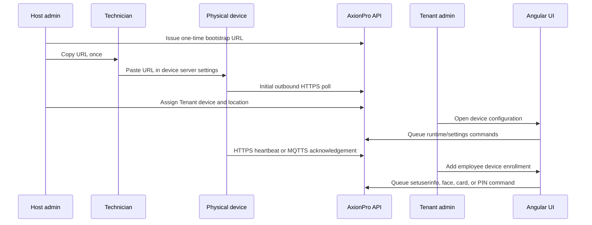

# AxionPro Device Angular Integration Handoff

**Audience:** Angular UI developer or an AI coding assistant working with the Angular repository.

**Last reviewed:** 2026-09-09

**Purpose:** Build the Host and Tenant device-management screens using the existing AxionPro APIs. This is an API-integration contract, not a request to invent new backend routes or send vendor JSON directly from Angular.

## Read this before building

- Send `Authorization: Bearer <access token>` on every secured request.
- Every secured device request also requires the user's permitted `moduleId` and `operationId`. Obtain these from the authenticated user's menu/module-operation data. Do not hard-code IDs in the UI.
- Treat every identifier exactly as it is returned. In particular, `employeeId`, `tenantDeviceId`, `enrollmentId`, card IDs, and some configuration IDs are opaque strings. Angular must never decode, construct, or cast them to a database ID.
- A raw device LAN URL, device gateway token, current password, new password, employee PIN, card number, face image, and app token must never be placed in application state, logs, browser storage, or a screen response.
- Typed configuration endpoints create a durable `DeviceCommand` queue item. A HTTP `200` / `isSucceeded: true` means **queued**, not necessarily applied by the physical device.
- Do not use `POST /api/device-commands/submit` for normal Tenant forms. It is a controlled Host diagnostic endpoint. Tenant forms must use the typed endpoints in this guide.

## API response contract

Every endpoint returns the standard response envelope.

```ts
export interface ApiResponse<T> {
  isSucceeded: boolean;
  message: string;
  data: T | null;
  errors: string[];
  errorCode?: string | null;
  pageNumber?: number | null;
  pageSize?: number | null;
  totalRecords?: number | null;
  totalPages?: number | null;
}
```

On `isSucceeded: false`, show `message` plus `errors`. Do not assume an HTTP error is the only failure shape.

## UI ownership boundaries

| Area | Actor that sees the screen | What the screen does |
|---|---|---|
| DeviceMaster | Host only | Maintains the physical device catalogue and capabilities. Never show this catalogue name/model to a Tenant. |
| Initial device bootstrap | Host only | Generates a one-time URL for a technician to paste in an unpacked device. The URL is shown once only. |
| Tenant device assignment | Host only | Assigns a physical device to a Tenant and initial Tenant location. |
| Card inventory | Host only | Purchases/issues cards for a selected Tenant. A Tenant cannot create card stock. |
| Tenant connection and device settings | Tenant admin and authorized Host user | Manages the Tenant's assigned device, gateway, runtime configuration, local web access, screen PIN, and typed settings. |
| Employee device enrollment | Tenant admin | Maps an existing employee to one or more Tenant devices; queues user, face, PIN, or card credential operations. |
| Employee work location | Tenant admin / authorized manager | Records the employee's location eligibility. It is required before enrollment on a device at that location. |
| Attendance decision | Not yet a production UI | Do not build a duplicate-IN / attendance-success UI against a non-existent endpoint. See [Attendance boundary](#attendance-boundary-and-required-next-backend-module). |

## Overall build sequence



## Suggested Angular feature structure

Use the existing application conventions. The route names below are suggestions only; they are not backend endpoints.

```text
features/
  host/device-master/
  host/tenant-devices/
  host/tenant-card-inventory/
  tenant/devices/
    device-list/
    device-connection/
    device-settings/
    device-location/
  tenant/employees/employee-device-enrollment/
  tenant/employees/employee-work-location/
core/api/
  tenant-device.api.ts
  tenant-device-configuration.api.ts
  device-ddl-options.api.ts
  employee-device-enrollment.api.ts
  employee-location-assignment.api.ts
  tenant-card-master.api.ts
```

Keep passwords, PINs, tokens, card input, and `FormData` face files inside the component submit flow. Clear them in `finalize()` whether the request succeeds or fails.

## 1 Host device onboarding

### 1.1 Issue a one-time HTTPS bootstrap URL

`POST /api/TenantDeviceConfiguration/issue-bootstrap-url`

Call only for an active, unassigned, HTTPS-capable `DeviceMaster`. Copy `data.initialGatewayUrl` into a one-time modal. Do not put it in a device list, details page, browser storage, or audit response.

```json
{
  "deviceMasterId": 1,
  "lifetimeMinutes": 120,
  "moduleId": 49,
  "operationId": 4
}
```

Relevant response data:

```json
{
  "deviceSerialNumber": "AYUC24030780",
  "initialGatewayUrl": "https://api.example.com/api/initial/SERIAL/ONE_TIME_TOKEN",
  "heartbeatIntervalSeconds": 20,
  "expiresDateTime": "2026-09-09T15:30:00Z"
}
```

### 1.2 Assign a physical device to a Tenant

`POST /api/TenantDevice/create`

Host-only. This creates the Tenant-owned physical-device row. `tenantId` is the Host-selected opaque Tenant identifier. `tenantLocationId` and `deviceMasterId` are Host catalogue/location IDs.

```json
{
  "tenantId": "TENANT_OPAQUE_ID",
  "tenantLocationId": 12,
  "deviceMasterId": 1,
  "deviceCode": "DELHI-GATE-01",
  "deviceName": "Main Gate Face Terminal",
  "installedDateTime": "2026-09-09T09:00:00Z",
  "isAttendanceDevice": true,
  "description": "Delhi office entry terminal",
  "remark": null,
  "isActive": true,
  "moduleId": 49,
  "operationId": 1
}
```

Other Host Tenant-device routes:

| Action | Endpoint |
|---|---|
| Read one | `GET /api/TenantDevice/get-by-id/{tenantDeviceId}?tenantId={tenantId}&moduleId={moduleId}&operationId={operationId}` |
| List | `GET /api/TenantDevice/get-all?tenantId={tenantId}&pageNumber=1&pageSize=10&moduleId={moduleId}&operationId={operationId}` |
| Update device details | `POST /api/TenantDevice/update` |
| Change active status | `POST /api/TenantDevice/update-status` |
| Move device to another Tenant location | `POST /api/TenantDevice/update-location` |
| Soft delete | `DELETE /api/TenantDevice/delete/{tenantDeviceId}?tenantId={tenantId}&moduleId={moduleId}&operationId={operationId}` |

`update-location` body:

```json
{
  "tenantDeviceId": "TENANT_DEVICE_OPAQUE_ID",
  "tenantLocationId": 20,
  "tenantId": "TENANT_OPAQUE_ID",
  "moduleId": 49,
  "operationId": 3
}
```

After a device move, show a warning to the Tenant administrator: existing employee-device enrollments are not automatically moved, disabled, or revalidated by the current backend. Review the enrollments before using the moved device.

## 2 Tenant device connection and runtime configuration

### 2.1 Connection metadata CRUD

The CRUD family stores the Tenant device connection metadata and enrollment/attendance flags. It is separate from the typed physical device settings commands.

| Action | Endpoint |
|---|---|
| Create | `POST /api/TenantDeviceConfiguration/create` |
| Read one | `GET /api/TenantDeviceConfiguration/get-by-id/{configurationId}` |
| List | `GET /api/TenantDeviceConfiguration/get-all` |
| Update | `POST /api/TenantDeviceConfiguration/update` |
| Rotate gateway token for technician copy/paste flow | `POST /api/TenantDeviceConfiguration/rotate-https-ingress-token` |
| Soft delete | `DELETE /api/TenantDeviceConfiguration/delete/{configurationId}` |

Core create/update fields are `tenantDeviceId`, optional `ipAddress`, `macAddress`, `devicePort`, `commandTransport`, `serverHost`, `serverPort`, `serverPath`, `serverUrl`, `pushMode`, `heartbeatIntervalSeconds`, `timeZoneId`, `configuration`, `isEnrollmentEnabled`, `isAttendancePushEnabled`, and `isAutoSyncEnabled`.

Use `commandTransport` for new UI. Do not populate legacy `mqttTransport` unless maintaining an existing legacy client.

### 2.2 Read safe gateway information

`GET /api/TenantDeviceConfiguration/gateway-address/{tenantDeviceId}?moduleId={moduleId}&operationId={operationId}`

Use when the connection screen opens. It returns only safe metadata:

```json
{
  "tenantDeviceId": "TENANT_DEVICE_OPAQUE_ID",
  "serverUrl": "https://axionpro-api.onrender.com",
  "serverPath": "/device-gateway",
  "serverPort": 443,
  "hasActiveGatewayUrl": true,
  "isReplacementPending": false,
  "replacementExpiresDateTime": null
}
```

It never returns the opaque ingress token or the full active device gateway URL.

### 2.3 Apply base runtime configuration

`POST /api/TenantDeviceConfiguration/apply-runtime-configuration`

Use after the device has been assigned and configuration metadata exists. This queues a protected device command. The current Web password is request-only and must be cleared after submit.

```json
{
  "tenantDeviceId": "TENANT_DEVICE_OPAQUE_ID",
  "currentWebServerPassword": "CURRENT_DEVICE_PASSWORD",
  "heartbeatIntervalSeconds": 20,
  "volume": 8,
  "disableLocalWebServer": true,
  "newWebServerPassword": null,
  "rebootAfterApply": true,
  "moduleId": 49,
  "operationId": 3
}
```

Use `settings/web-access` for local Web UI/API enablement or password rotation. `disableLocalWebServer` and `newWebServerPassword` above are legacy-compatible fields; do not make them the primary UI controls.

### 2.4 Replace an HTTPS gateway URL

`POST /api/TenantDeviceConfiguration/replace-https-gateway-url`

```json
{
  "tenantDeviceId": "TENANT_DEVICE_OPAQUE_ID",
  "currentWebServerPassword": "CURRENT_DEVICE_PASSWORD",
  "replacementLifetimeMinutes": 30,
  "moduleId": 49,
  "operationId": 3
}
```

The raw replacement URL is deliberately not returned to Angular. The existing URL stays active until the device confirms the queued replacement. Do not expose a manual copy/paste field for this Tenant operation.

### 2.5 Reboot or manually dispatch MQTTS

| Action | Endpoint | Use only when |
|---|---|---|
| Queue reboot | `POST /api/TenantDeviceConfiguration/reboot` | User explicitly confirms a restart. Body: `tenantDeviceId`, `moduleId`, `operationId`. |
| Publish next MQTTS command immediately | `POST /api/TenantDeviceConfiguration/dispatch-mqtts-now` | The device uses MQTTS and an already queued command needs immediate broker delivery. Never call for HTTPS devices; they use their next outbound heartbeat. |

## 3 Typed device settings screens

Every typed settings request has the following base fields:

```ts
interface TenantDeviceSettingRequest {
  tenantDeviceId: string;
  currentWebServerPassword: string;
  moduleId: number;
  operationId: number;
}
```

Use a separate save button and a separate API call for each section. Each call queues one protected `setdevinfo` command. Do not combine unrelated settings into a made-up request.

| UI section | Endpoint | Additional request fields |
|---|---|---|
| Time | `POST /api/TenantDeviceConfiguration/settings/time` | `timeFormat`, `dateFormat`, `daylightSavingEnabled`, `daylightSavingStart`, `daylightSavingEnd`, `networkTimeEnabled`, `timeZone`, `rebootTime1`, `rebootTime2`, `rebootTime3` |
| Clock sync | `POST /api/TenantDeviceConfiguration/settings/time/sync` | optional `utcDateTime`; omit to use current server UTC time |
| Bell | `POST /api/TenantDeviceConfiguration/settings/bell` | `bellCount`, `ringStyle`, `bellOutput` |
| Device setup | `POST /api/TenantDeviceConfiguration/settings/device-setup` | `language`, `voiceVolume`, `announcePersonName`, `detectMultipleFaces`, `resultDisplaySeconds`, `screenSaverIdleSeconds`, `sleepModeSeconds`, `screenWakeUpMethod`, `faceWakeUpSeconds`, `resultDisplayStyle`, `faceRecognitionDistance`, `livenessDetectionEnabled`, `showAvatar` |
| Advanced | `POST /api/TenantDeviceConfiguration/settings/advanced` | `maximumAdministrators`, `verificationMode`, `qrCodeMode`, `hidePrivacyInformation`, face/liveness/fingerprint thresholds, `fingerprintsPerUser`, mask fields, fill-light fields, palm thresholds, `disableFaceRecognition`, `onlineDebugEnabled` |
| Door and lock | `POST /api/TenantDeviceConfiguration/settings/lock` | door/sensor/anti-passback/Wiegand/card-display/interlock/alarm/failure/time-zone fields shown in the API DTO |
| Serial | `POST /api/TenantDeviceConfiguration/settings/serial` | `deviceAddress`, `networkPort`, `baudRate`, `serialFunction` |
| Ethernet | `POST /api/TenantDeviceConfiguration/settings/ethernet` | `dhcpEnabled`, `ipAddress`, `subnetMask`, `gateway`, `dnsServer`, `hideIpAddress` |
| Wi-Fi | `POST /api/TenantDeviceConfiguration/settings/wifi` | `dhcpEnabled`, `ipAddress`, `subnetMask`, `gateway` |
| App notification | `POST /api/TenantDeviceConfiguration/settings/app-notification` | `appNotificationEnabled`, `appToken`, `notificationType` |
| Local Web UI/API | `POST /api/TenantDeviceConfiguration/settings/web-access` | `localWebServerEnabled`, optional `newWebServerPassword` |
| Physical device menu PIN | `POST /api/TenantDeviceConfiguration/settings/screen-menu-pin` | `screenMenuPin` |

### Required field behavior

- If `dhcpEnabled` is true, disable the static IP, mask, gateway, and DNS inputs in the UI.
- Validate time values before submit: reboot times are `HH:mm`; DST dates are `M/d`; fill-light period is `HH:mm~HH:mm`.
- Mask every password, screen-menu PIN, and app token. Never prefill a password because none is returned by the API.
- The Web UI/API setting and screen-menu PIN are independent. The former controls `http://device-ip/`; the latter locks the physical System/Local Manager menu.
- Do not create a generic “Save all settings” button.

### Dropdown API calls

Call these on demand when the matching section opens. Do not download every list on application startup or hard-code the numeric values.

| Screen section | GET endpoint |
|---|---|
| Time | `/api/device-ddl-options/time` |
| Bell | `/api/device-ddl-options/bell` |
| Device setup | `/api/device-ddl-options/device-setup` |
| Advanced | `/api/device-ddl-options/advanced` |
| Door and lock | `/api/device-ddl-options/lock` |
| Serial | `/api/device-ddl-options/serial` |
| Ethernet | `/api/device-ddl-options/ethernet` |
| Wi-Fi | `/api/device-ddl-options/wifi` |
| App notification | `/api/device-ddl-options/app-notification` |
| Employee credential action type | `/api/device-ddl-options/employee-device-credentials` |
| Employee working-window day | `/api/device-ddl-options/employee-device-access-windows` |
| Card inventory status/tax/currency fields | `/api/device-ddl-options/tenant-card-inventory` |

## 4 Host card inventory

Card inventory is Host-only, but it is scoped to the selected Tenant. A raw card number is encrypted at rest and only a masked value is returned. A card is available for employee binding only when it is active and in the `Available` state.

| Action | Endpoint |
|---|---|
| Create card stock | `POST /api/TenantCardMaster/create` |
| Read one | `GET /api/TenantCardMaster/get-by-id/{cardId}` |
| List | `GET /api/TenantCardMaster/get-all` |
| Update unassigned card | `POST /api/TenantCardMaster/update` |
| Active status | `POST /api/TenantCardMaster/update-status` |
| Soft delete unassigned card | `DELETE /api/TenantCardMaster/delete/{cardId}` |

Use the card-inventory DDL endpoint for status, tax treatment, currency, and related options. Do not permit edits/deactivation/deletion of a card already assigned to an active employee-device enrollment.

## 5 Employee location, device enrollment, face, card, and PIN

### 5.1 Required employee enrollment sequence

```text
1. Employee exists and is active for the signed-in Tenant.
2. Create EmployeeLocationAssignment for the device's Tenant location.
3. Create EmployeeDeviceEnrollment for one employee + one physical Tenant device.
4. Upload face, bind a card, and/or set a PIN only after enrollment exists.
5. Read the enrollment to display returned deployment/command statuses.
```

The same employee may be enrolled on multiple devices. Each unique employee + Tenant-device pair has its own enrollment. A duplicate enrollment on the same device is rejected.

### 5.2 Employee location assignment

`POST /api/EmployeeLocationAssignment/create`

```json
{
  "employeeId": "EMPLOYEE_OPAQUE_ID",
  "tenantLocationId": 12,
  "isPrimary": true,
  "isAttendanceAllowed": true,
  "effectiveFrom": "2026-09-09",
  "effectiveTo": null,
  "isActive": true,
  "moduleId": 44,
  "operationId": 1
}
```

CRUD family:

| Action | Endpoint |
|---|---|
| Read one | `GET /api/EmployeeLocationAssignment/get-by-id/{id}` |
| List | `GET /api/EmployeeLocationAssignment/get-all` |
| Update | `POST /api/EmployeeLocationAssignment/update` |
| Active status | `POST /api/EmployeeLocationAssignment/update-status` |
| Soft delete | `DELETE /api/EmployeeLocationAssignment/delete/{id}` |

Current backend limitation: it stores date ranges but does not yet reject overlapping different-location periods for one employee. The UI should show a warning rather than claim this is automatically enforced. See the attendance boundary below.

### 5.3 Create employee device enrollment

`POST /api/EmployeeDeviceEnrollment/create`

```json
{
  "employeeId": "EMPLOYEE_OPAQUE_ID",
  "tenantDeviceId": "TENANT_DEVICE_OPAQUE_ID",
  "accessEffectiveFromDateTime": "2026-09-09T09:00:00Z",
  "accessEffectiveToDateTime": null,
  "accessWindows": [
    {
      "dayOfWeek": 1,
      "startLocalTime": "09:00:00",
      "endLocalTime": "18:00:00",
      "isActive": true
    }
  ],
  "isActive": true,
  "moduleId": 49,
  "operationId": 4
}
```

The backend queues baseline `setuserinfo` with the existing Employee's name, employee code, and `DepartmentId` as the device `department` value. The device privilege is server-owned `User`; Angular must not render an administrator privilege control.

Enrollment endpoints:

| Action | Endpoint | UI behavior |
|---|---|---|
| Read one | `GET /api/EmployeeDeviceEnrollment/get-by-id/{enrollmentId}` | Reload after a credential action to show its latest returned command state. |
| List | `GET /api/EmployeeDeviceEnrollment/get-all` | Filter by employee or device for the enrollment grid. |
| Update dates/windows | `POST /api/EmployeeDeviceEnrollment/update` | Does not change employee/device or device active state. |
| Enable/disable device user | `POST /api/EmployeeDeviceEnrollment/update-status` | Queues `enableuser`; credentials are retained. |
| Face upload | `POST /api/EmployeeDeviceEnrollment/face/upsert` | `multipart/form-data`; one JPEG/PNG file, maximum 2 MB. |
| Set PIN | `POST /api/EmployeeDeviceEnrollment/pin/upsert` | Write-only PIN; never display or cache it. |
| Bind card | `POST /api/EmployeeDeviceEnrollment/card/bind` | Requires an active available Host-issued card. |
| Remove one credential | `POST /api/EmployeeDeviceEnrollment/credential/remove` | Select credential type from DDL API. |
| Remove full user from device | `DELETE /api/EmployeeDeviceEnrollment/delete/{enrollmentId}` | Queues full device-user removal and soft-deletes only this device mapping. |

`tenantCardId` must not be relied upon during enrollment creation. Create the enrollment first, then call `card/bind`.

Face upload form-data fields:

```text
enrollmentId = ENROLLMENT_OPAQUE_ID
faceImage = selected-file.jpg
moduleId = 49
operationId = 4
```

PIN body:

```json
{
  "enrollmentId": "ENROLLMENT_OPAQUE_ID",
  "pin": "1234",
  "moduleId": 49,
  "operationId": 4
}
```

Card-bind body:

```json
{
  "enrollmentId": "ENROLLMENT_OPAQUE_ID",
  "tenantCardId": "CARD_OPAQUE_ID",
  "moduleId": 49,
  "operationId": 4
}
```

Enable/disable body:

```json
{
  "id": "ENROLLMENT_OPAQUE_ID",
  "isActive": false,
  "moduleId": 49,
  "operationId": 4
}
```

The enrollment response exposes separate `faceCommandStatus`, `cardCommandStatus`, `pinCommandStatus`, and `userActivationCommandStatus`. Show these as the credential/deployment state. The response intentionally never returns a raw PIN, raw card number, face bytes, device-side enroll ID, or employee database ID.

### 5.4 Important current device-enrollment limits

- Access-effective dates and `accessWindows` are stored in AxionPro, but are not currently translated to the device's physical `access_times` / time-zone settings. Do not tell a Tenant that those fields currently enforce door or attendance access at the hardware level.
- A future-dated enrollment still queues the baseline device user immediately. The existing date fields are not a device-command scheduler.
- If the Employee `DepartmentId` changes after enrollment, there is currently no automatic re-sync of the device user profile. A dedicated profile-sync endpoint or employee-update event is required.

## 6 Work arrangement, work pattern, and override

These are HR attendance-policy records, not device configuration commands. Do not place them on the core device-enrollment wizard.

| API family | Meaning | Use it when |
|---|---|---|
| `EmployeeWorkArrangement` | Long-running Office, Work From Home, Hybrid, Field, or Client Site model with attendance policy. | HR defines the employee's standard work model. |
| `EmployeeWorkPattern` | Recurring day-of-week schedule under the arrangement. | Example: Monday Head Office, Tuesday Client Site, Wednesday WFH. |
| `EmployeeWorkModeOverride` | Temporary exception across a date range. | Example: office employee approved for Client Site from 10-12 September. |

Every family has the same CRUD shape:

```text
POST   /api/{Family}/create
GET    /api/{Family}/get-by-id/{id}
GET    /api/{Family}/get-all
POST   /api/{Family}/update
POST   /api/{Family}/update-status
DELETE /api/{Family}/delete/{id}
```

Use the real family names: `EmployeeWorkArrangement`, `EmployeeWorkPattern`, and `EmployeeWorkModeOverride`.

| Family | Exact create endpoint | Exact list endpoint | Exact update endpoint |
|---|---|---|---|
| Work arrangement | `POST /api/EmployeeWorkArrangement/create` | `GET /api/EmployeeWorkArrangement/get-all` | `POST /api/EmployeeWorkArrangement/update` |
| Work pattern | `POST /api/EmployeeWorkPattern/create` | `GET /api/EmployeeWorkPattern/get-all` | `POST /api/EmployeeWorkPattern/update` |
| Work mode override | `POST /api/EmployeeWorkModeOverride/create` | `GET /api/EmployeeWorkModeOverride/get-all` | `POST /api/EmployeeWorkModeOverride/update` |

For every row above, use the same family path with `get-by-id/{id}`, `update-status`, and `delete/{id}` for the remaining CRUD operations.

These records currently do not modify employee-device enrollment, device credentials, device working windows, or device command queue entries.

## Attendance boundary and required next backend module

The desired business rule is valid for **all employees and all enrolled devices**:

```text
No open IN -> accept first IN and open a session
Open IN + another IN -> reject second attendance decision
Open IN + OUT -> close the session
Closed session + later IN at another location -> accept a new session
```

Example: an employee enters Head Office in the morning, punches OUT, and later enters a Client Site. That is valid. A second IN at Client Site without the earlier OUT must be rejected as `DuplicateOpenIn`.

This is **not yet implemented** by the current APIs:

- The temporary TIMMY `sendlog` test endpoint only writes diagnostic logs and returns an acknowledgement.
- The production HTTPS device gateway performs polling/command delivery but does not yet create an attendance decision, reject a duplicate IN, or persist an append-only attendance audit.
- No Angular endpoint should be invented for this feature yet.

When the backend module is added, it must persist every raw device event (accepted and rejected), deduplicate vendor retransmissions, resolve the source Tenant device and location, atomically prevent two open sessions, and expose a read-only attendance-decision/status API for the UI.

Because normal device `sendlog` is sent after local recognition, the server can reject the attendance record but may not be able to show an instant device-screen error. Instant device-side denial requires vendor support for online authorization before finalizing a punch; this must be verified against the exact device protocol.

## Queue-state UI rules

- For employee actions, use the command-status fields returned by `EmployeeDeviceEnrollment` reads. A queued face/card/PIN/enable action is not complete until its corresponding returned status shows completion.
- For runtime/settings commands, the submit response includes a queue/tracking identifier and a queued status. The current API has **no Tenant-facing read endpoint for an arbitrary `DeviceCommand` by ID**. Do not fake a `Completed` state or poll an invented route. Show `Queued for device` and use the available connection telemetry (`lastHeartbeatDateTime`, `lastSuccessfulConnectionDateTime`, `lastFailedConnectionDateTime`, `lastConnectionError`) until a backend command-status read endpoint is supplied.
- HTTPS devices receive commands on their next outbound heartbeat. MQTTS devices can use `dispatch-mqtts-now` for an already queued command.

## Claude implementation prompt

Give the following prompt to Claude together with this file and the Angular source repository:

```text
Implement the AxionPro Host and Tenant device-management Angular feature exactly according to AXIONPRO_DEVICE_ANGULAR_HANDOFF.md.

Use the project’s existing Angular architecture, interceptors, route guards, DTO patterns, API service conventions, state-management approach, UI components, and permission helpers. Do not create a parallel folder architecture and do not modify backend routes/contracts.

Build typed API services and screens for Host device onboarding/card inventory, Tenant device connection/runtime settings, section-level DDL loading, employee location assignment, and employee-device enrollment with face/card/PIN operations. Use opaque IDs exactly as returned. Keep secrets out of storage and clear them after submission. Each setting section must submit only its documented typed endpoint.

Do not implement attendance duplicate-IN validation, an arbitrary device-command status polling endpoint, direct device LAN calls, vendor JSON editors, direct MQTT clients, gateway-token display, card-number display, or a device administrator privilege selector. Mark documented backend gaps clearly in the UI where relevant; do not fabricate APIs.

Before finishing, run the repository’s normal lint, type-check, unit-test, and build commands. Report changed files, route additions, API integrations, and any backend gaps that prevent a screen from being fully live.
```

## Backend facts the UI must not hide

1. Physical-device settings are queue based; `200` means queued, not hardware applied.
2. Device-side setting reads are not available as typed APIs; a settings page cannot claim to show the device's real current values unless the backend later provides a read-back contract.
3. Location history currently lacks date-overlap enforcement for different locations.
4. Employee working windows are stored but are not yet physical-device access-time enforcement.
5. Attendance duplicate-IN validation and server-side event persistence are still backend work, not an Angular-only feature.
