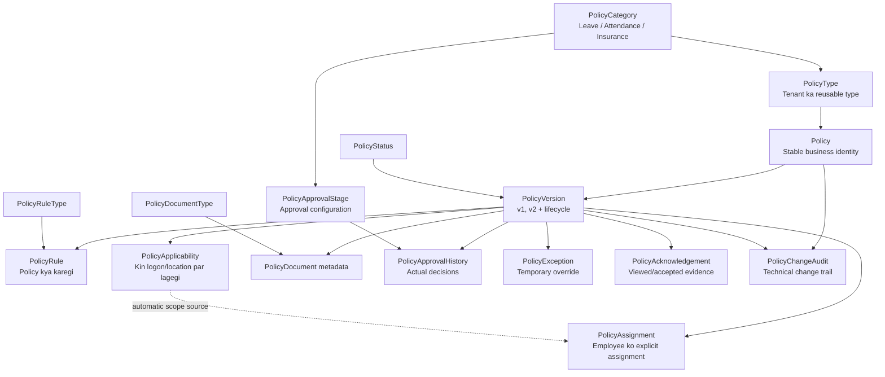
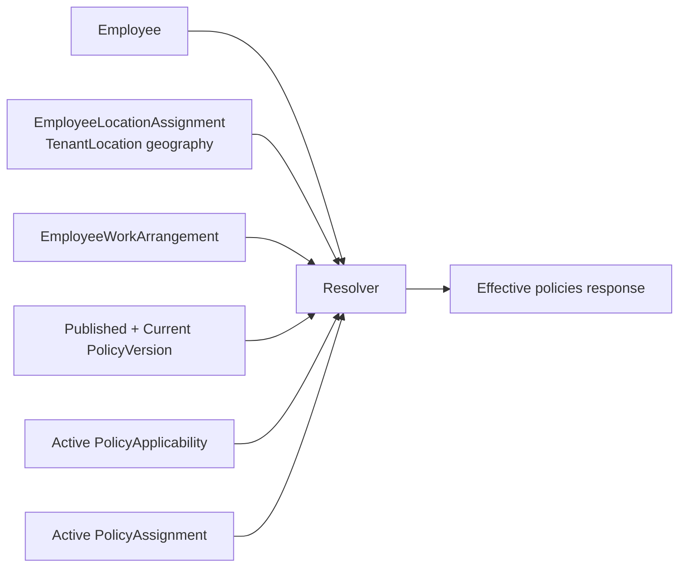
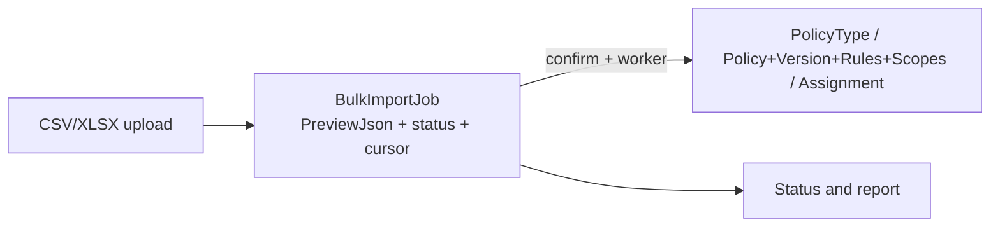

# Tenant Policy — Complete Master Guide (Hinglish)

Ye single consolidated document Tenant Policy ka complete reference hai: concepts, tables, properties, dependencies, seed-versus-runtime data, lifecycle, permissions, APIs, request/response examples, bulk flow, UI planning aur verification evidence. Generated/verified on 18 September 2026 from the repository source documents listed below.

## Is document ko kis order mein padhein

1. Part 1 se database mental model, required seeds aur row-write situations samjhein.
2. Part 2 se normal business process aur examples samjhein.
3. Part 3 se Draft/version/effective-date/HR-Admin permissions samjhein.
4. Part 4 ko API implementation/testing reference ki tarah use karein.
5. Part 5 se UI screens aur controls implement karein.

## Source-of-truth files

- [TENANT_POLICY_TABLE_DATA_FLOW_HINGLISH.md](TENANT_POLICY_TABLE_DATA_FLOW_HINGLISH.md)
- [TENANT_POLICY_API_FLOW_HINGLISH.md](TENANT_POLICY_API_FLOW_HINGLISH.md)
- [TENANT_POLICY_VERSIONING_PERMISSIONS_HINGLISH.md](TENANT_POLICY_VERSIONING_PERMISSIONS_HINGLISH.md)
- [TENANT_POLICY_ENDPOINT_CATALOG.md](TENANT_POLICY_ENDPOINT_CATALOG.md)
- [TENANT_POLICY_UI_PLANNING.md](TENANT_POLICY_UI_PLANNING.md)
- [Live business-flow test report](../testing/policy/live-business-flow/2026-09-16.md)
- [Sanitized live API evidence](../testing/policy/live-business-flow/2026-09-16-api-evidence.json)
- [Named Leave/Attendance/Insurance evidence](../testing/policy/live-business-flow/2026-09-16-named-policy-scenarios.json)

---

## Part 1 — Tables, properties, dependencies aur data-write situations


Ye document database ko samajhne ke liye hai. Iska main sawaal hai: **kis
situation mein kis table mein kaunsi row jaati hai?** API payload catalogue ke
liye [TENANT_POLICY_ENDPOINT_CATALOG.md](TENANT_POLICY_ENDPOINT_CATALOG.md) aur
screen flow ke liye
[TENANT_POLICY_API_FLOW_HINGLISH.md](TENANT_POLICY_API_FLOW_HINGLISH.md) dekhein.

### 1. Sabse important mental model

Policy framework mein 16 tables hain, lekin policy create karte hi sab 16 tables
fill nahi hoti. Tables chaar groups mein hain:

1. **Seed/master catalogue:** system ke fixed options.
2. **Policy definition:** policy kya hai, uska version, rules aur target audience.
3. **Execution/evidence:** assignment, exception, approval, acknowledgement,
   document aur audit.
4. **Shared bulk infrastructure:** uploaded file ka temporary durable job state.



Ek simple example:

```text
PolicyCategory: Leave
  └─ PolicyType: Annual Leave
      └─ Policy: India Maharashtra Annual Leave Policy
          └─ PolicyVersion: Version 1 / Draft
              ├─ PolicyRule: 18 days entitlement
              ├─ PolicyRule: 5 days carry forward
              ├─ PolicyRule: Sandwich enabled
              └─ PolicyApplicability: India + Maharashtra + Permanent
```

### 2. Chaar system master tables

Ye tables normal policy create par baar-baar insert nahi hoti. Seed/migration
inke standard options create karti hai.

#### 2.1 `PolicyCategory`

**Kaam:** broad business family batana.

**Kab row banti hai:** system seed ya authorised catalogue administration par.
Tenant policy create karne par is table mein row nahi banti.

**Main properties:**

| Property | Meaning |
| --- | --- |
| `Id` | Category primary key |
| `CategoryCode` | Stable code: `LEAVE`, `ATTENDANCE`, `INSURANCE` |
| `CategoryName` | UI name |
| `Description` | Category ka purpose |
| `IsActive` | Dropdown mein available hai ya nahi |
| audit fields | kisne/kab seed/update kiya |

**Dependency:** `PolicyType.PolicyCategoryId` aur
`PolicyApprovalStage.PolicyCategoryId` isko refer karte hain.

#### 2.2 `PolicyStatus`

**Kaam:** version lifecycle lookup.

**Rows:** Draft, Under Review, Approved, Published, Suspended, Archived,
Rejected.

| Property | Meaning |
| --- | --- |
| `Id` | Status ID |
| `StatusCode`, `StatusName` | machine/readable names |
| `IsTerminal` | Archived/Rejected jaise terminal indicator |
| `IsActive` | lookup availability |

**Dependency:** `PolicyVersion.PolicyStatusId`.

#### 2.3 `PolicyRuleType`

**Kaam:** rule JSON ka meaning batana. JSON akela ambiguous na rahe.

**Rows:** Eligibility, Entitlement, Accrual, Carry Forward, Sandwich, Limit,
Attendance Channel, Late Penalty, Overtime, Approval, Reimbursement, Calendar,
Custom.

| Property | Meaning |
| --- | --- |
| `RuleTypeCode`, `RuleTypeName` | rule family |
| `Description` | intended use |
| `JsonSchemaVersion` | configuration schema revision |
| `IsActive` | selectable hai ya nahi |

**Dependency:** `PolicyRule.PolicyRuleTypeId`.

#### 2.4 `PolicyDocumentType`

**Kaam:** attachment classification.

**Rows:** Policy Document, Annexure, Legal Circular, Employee Guide,
Translation.

**Dependency:** `PolicyDocument.PolicyDocumentTypeId`.

### 3. Tenant policy type master

#### 3.1 `PolicyType`

**Kaam:** tenant ka reusable policy type. Ye final employee policy nahi hai.

Example:

```text
PolicyCategory = Leave
PolicyType     = Annual Leave
Actual Policy = India Maharashtra Annual Leave Policy
```

**Kab row banti hai:** Tenant Admin `POST /api/TenantPolicy/types` call kare ya
Policy Type bulk import worker valid row process kare.

| Property group | Data |
| --- | --- |
| Identity | `Id`, `TenantId`, `PolicyTypeCode`, `PolicyName` |
| Classification | `PolicyCategoryId`, `IsStructured`, `PolicyTypeEnumVal` |
| Defaults | `DefaultCurrencyCode`, `Description` |
| Document indicator | `HasPolicyDocUploaded` |
| State | `IsActive`, `IsSoftDelete` |
| Audit | added/update/soft-delete user and timestamps |

**Situation example:** Tenant “Annual Leave” aur “Casual Leave” ko separate
types rakhna chahta hai. Dono ki `PolicyType` row alag hogi.

### 4. Policy definition ki core tables

#### 4.1 `Policy`

**Kaam:** stable business identity. Version badalne par ye row same rehti hai.

**Kab row banti hai:** `POST /api/TenantPolicy` ke successful transaction mein.

| Property | Meaning |
| --- | --- |
| `TenantId` | tenant isolation; payload se trust nahi hota |
| `PolicyTypeId` | kis tenant policy type ke andar hai |
| `PolicyCode` | tenant ke andar unique stable code |
| `PolicyName` | meaningful business name |
| `Summary` | policy ka short purpose |
| `OwnerDepartmentId` | owning department, target department nahi |
| `DefaultCurrencyCode` | monetary rules ka default ISO code |
| active/delete/audit fields | lifecycle and traceability |

**Important:** `OwnerDepartmentId=HR` ka matlab policy sirf HR employees par
apply nahi hoti. Targeting `PolicyApplicability` mein hoti hai.

#### 4.2 `PolicyVersion`

**Kaam:** effective-dated revision aur approval/publish state.

**Kab row banti hai:**

- new policy ke saath Version 1 Draft;
- clone endpoint se Version 2/3 ka naya Draft;
- Draft update par nayi version row nahi banti, wahi Draft update hota hai.

| Property group | Data |
| --- | --- |
| Parent | `TenantId`, `PolicyId` |
| Revision | `VersionNumber`, `RuleSchemaVersion`, `ChangeSummary` |
| Lifecycle | `PolicyStatusId`, `IsCurrent`, `IsActive` |
| Effective dates | `EffectiveFrom`, `EffectiveTo` |
| Decision evidence | approved/published actor and timestamps |
| Audit | added/updated fields |

**Rules:** ek policy/version-number duplicate nahi ho sakta; ek policy ka sirf
ek active `IsCurrent=true` version ho sakta hai. Publish par purana current false
aur naya Published version current true hota hai.

#### 4.3 `PolicyRule`

**Kaam:** policy **kya karegi**.

**Kab row banti hai:** policy Draft create ke saath request ki har `rules[]`
entry par ek row. Draft update par old rules delete/replace hote hain. Clone par
source version ke rules nayi Version ID ke saath copy hote hain.

| Property | Meaning |
| --- | --- |
| `PolicyVersionId` | rule kis exact version ka hai |
| `PolicyRuleTypeId` | Entitlement/Sandwich/Limit etc. |
| `RuleName` | human-readable rule name |
| `RuleOrder` | processing/display order; version mein unique |
| `RuleConfiguration` | PostgreSQL `jsonb` object with variable values |
| `IsActive` + audit | state and creator/updater |

Examples:

```json
{ "annualEntitlementDays": 18, "unit": "DAY" }
```

```json
{ "allowWeb": true, "allowMobile": true, "allowDevice": true }
```

```json
{ "coverageAmount": 500000, "currency": "INR" }
```

JSON flexible storage hai. `PolicyRuleTypeId` us JSON ka business meaning
preserve karta hai.

#### 4.4 `PolicyApplicability`

**Kaam:** policy **kis par apply hogi**. Rule aur applicability ka role alag hai.

**Kab row banti hai:** policy Draft create/update ke har `applicability[]` object
par ek row. Clone par copy hoti hai.

| Property group | Filters |
| --- | --- |
| Geography | `CountryId`, `StateId`, `DistrictId`, `LocalityId` |
| Tenant workplace | `TenantLocationId` |
| Organization | `EmployeeTypeId`, `DepartmentId`, `DesignationId` |
| Person | `EmployeeId`, `GenderId` |
| Work/employment | `WorkArrangementType`, `EmploymentStatus`, `MinimumServiceDays` |
| Decision | `ApplicabilityMode` 1 Include / 2 Exclude, `Priority` |
| Time | `EffectiveFrom`, `EffectiveTo`, `IsActive` |

**Example situations:**

- India + Maharashtra + Permanent ⇒ Maharashtra permanent staff include.
- same scope + EmployeeId + mode Exclude ⇒ specific employee exclude.
- TenantLocation=Hyderabad ⇒ only employees with active Hyderabad location
  assignment match.
- WorkArrangementType=Remote ⇒ current active employee work arrangement match.

### 5. Approval tables

#### 5.1 `PolicyApprovalStage`

**Kaam:** tenant ki approval configuration; kisi particular version ki approval
activity nahi.

**Kab row banti hai:** Tenant Admin approval setup screen par stage create kare.

| Property | Meaning |
| --- | --- |
| `PolicyCategoryId` | null = all categories; otherwise Leave etc. only |
| `StageName`, `StageOrder` | HR Review first, Compliance second |
| `ApproverRoleId` | kaunsi tenant role approve kar sakti hai |
| `MinimumApprovals` | stage complete karne ke liye count |
| `IsMandatory`, `IsActive` | enforcement flags |

#### 5.2 `PolicyApprovalHistory`

**Kaam:** actual immutable approve/reject event.

**Kab row banti hai:** Under Review version par approver `APPROVE` ya `REJECT`
action kare.

| Property | Meaning |
| --- | --- |
| `PolicyVersionId` | kis version ka decision |
| `PolicyApprovalStageId` | kis configured stage par |
| `ActionType` | approve/reject code |
| `ActionById`, `ActionDateTime` | actor and time |
| `Comments` | decision comment |
| `SequenceNumber` | version ke decisions ki immutable order |

Submit sirf Version status ko Under Review karta hai. Actual approval ke waqt
history row banti hai. Required stages complete hone par Version Approved hota
hai; Publish ke baad Published/current.

### 6. Employee execution tables

#### 6.1 `PolicyAssignment`

**Kaam:** Published version ko employee se explicitly map karna.

**Kab row banti hai:** manual assignment API ya Assignment bulk worker. Sirf
Published version assign ho sakta hai.

| Property | Meaning |
| --- | --- |
| `PolicyVersionId`, `EmployeeId` | exact version-person pair |
| `AssignmentSource` | 1 manual; 2 bulk/scope worker flow as implemented |
| `SourceApplicabilityId` | scope se generated ho to source scope |
| `EffectiveFrom`, `EffectiveTo` | assignment period |
| `IsMandatory`, `IsActive` | obligation/state |
| assigned/removed fields | who/when evidence |

Same version, employee and effective-from duplicate nahi banta. Removed
assignment delete nahi hota; inactive + removed evidence retained hota hai.

#### 6.2 `PolicyAcknowledgement`

**Kaam:** employee ko policy deliver hui aur usne dekhi/accept ki iska evidence.

**Kab row banti/update hoti hai:**

- assignment ke saath missing employee/version acknowledgement row status 1
  create hoti hai;
- employee acknowledge kare to status 3, viewed/acknowledged timestamps aur
  optional evidence JSON update hota hai.

| Property | Meaning |
| --- | --- |
| `PolicyVersionId`, `EmployeeId` | unique delivery recipient |
| `AcknowledgementStatus` | assigned/viewed/acknowledged state code |
| time fields | assigned, viewed, acknowledged time |
| `SourceIpHash` | raw IP ki jagah hash if supplied |
| `EvidenceJson` | channel/device/consent evidence object |

#### 6.3 `PolicyException`

**Kaam:** ek employee ke liye temporary approved override.

**Kab row banti hai:** exception create API; initial approval status Under Review.
Decision API same row ko Approved ya Rejected karti hai.

| Property | Meaning |
| --- | --- |
| `PolicyVersionId`, `EmployeeId` | base policy + affected person |
| `ExceptionType` | override classification code |
| `OverrideConfiguration` | changed values as `jsonb` object |
| `Reason` | business justification |
| `EffectiveFrom`, `EffectiveTo` | mandatory finite window |
| approval fields | status, approver and decision time |

Example: Hybrid attendance policy normally three office days maangti hai;
medical exception employee 145 ko 01–30 October Web attendance allow karti hai.

### 7. Document aur audit tables

#### 7.1 `PolicyDocument`

**Kaam:** uploaded file ki metadata. PDF bytes PostgreSQL mein nahi jaate.

**Kab row banti hai:** object storage upload successful hone ke baad editable
Draft/Rejected version par metadata insert hoti hai. Storage failure par row
nahi banni chahiye.

| Property group | Data |
| --- | --- |
| Link | `TenantId`, `PolicyVersionId`, `PolicyDocumentTypeId` |
| Display | `DocumentTitle`, `OriginalFileName`, `LanguageCode`, `IsEmployeeVisible` |
| Storage | `StorageProvider`, `ObjectKey` |
| Integrity | `ContentType`, `FileSizeBytes`, `ChecksumSha256` |
| State/audit | active, soft-delete, actor and timestamps |

Published/Archived version ke documents change/delete nahi ho sakte. Current
Render acceptance mein invalid S3 access-key configuration ke kaaran upload 500
par blocked tha aur `PolicyDocument` row insert nahi hui.

#### 7.2 `PolicyChangeAudit`

**Kaam:** technical mutation trail.

**Kab row banti hai:** policy create, Draft update, clone, transition,
assignment aur document actions jaise repository-audited mutations par.

| Property | Meaning |
| --- | --- |
| `PolicyId`, optional `PolicyVersionId` | affected aggregate/version |
| `EntityName`, `EntityId` | affected entity |
| `ActionName` | CREATE, UPDATE_DRAFT, SUBMIT, APPROVE, PUBLISH etc. |
| `BeforeData`, `AfterData` | optional `jsonb` snapshots |
| `ChangedById`, `ChangedDateTime` | actor/time |
| `CorrelationId` | request/job tracing when supplied |

Audit ko business table ya approval history ka replacement nahi samjhein.

### 8. Exact write sequence

| User action | Insert/update hone wali tables | Jahan row nahi banti |
| --- | --- | --- |
| Policy Type create | `PolicyType` | Policy/version/rules nahi |
| Policy Draft create | `Policy`, `PolicyVersion`, `PolicyRule` rows, `PolicyApplicability` rows, `PolicyChangeAudit` | assignment/acknowledgement nahi |
| Draft update | `Policy` + `PolicyVersion` update; old rules/scopes replace; audit insert | nayi Version nahi |
| Clone | new `PolicyVersion`; rules/scopes copied; audit | new `Policy` nahi |
| Submit | Version → Under Review; audit | approval-history decision nahi |
| Approve/Reject | `PolicyApprovalHistory`; Version state; audit | assignment nahi |
| Publish | Version Published/current; previous current false; audit | employee assignment automatic nahi |
| Manual/bulk assign | `PolicyAssignment`, missing `PolicyAcknowledgement`, audit | Policy/Version/rules unchanged |
| Exception create | `PolicyException` Under Review | base rule unchanged |
| Exception decision | same exception row approval fields update | new policy version nahi |
| Employee acknowledge | same `PolicyAcknowledgement` update | assignment unchanged |
| Document upload | S3 object + `PolicyDocument` + audit | DB file bytes nahi |
| Remove assignment | same assignment inactive + removal evidence | hard delete nahi |
| Archive | Version Archived, current false, audit | history delete nahi |

### 9. Resolve API read flow

`GET /api/TenantPolicy/resolve` normally new rows insert nahi karta. Ye current
data read karke decision return karta hai.



Actual repository order:

1. only active, effective, Published and current versions;
2. active manual assignment matches first;
3. otherwise applicability must match employee/location/work mode;
4. specificity: Employee > TenantLocation/Locality > District > State > Country
   > EmployeeType > Department/Designation > tenant-wide;
5. same specificity par lower `Priority` wins;
6. same specificity/priority par Exclude wins over Include.

### 10. Three complete business examples

#### 10.1 Maharashtra Annual Leave

| Table | Example row |
| --- | --- |
| `PolicyType` | Annual Leave / category Leave |
| `Policy` | `MH-ANNUAL-LEAVE`, meaningful name, HR owner |
| `PolicyVersion` | v1 Draft → Published, effective 2027-01-01 |
| `PolicyRule` | Entitlement 18; Carry Forward 5; Sandwich enabled |
| `PolicyApplicability` | India + Maharashtra + Permanent, Include |
| `PolicyDocument` | signed leave PDF metadata |
| `PolicyAssignment` | only if employee explicitly/manual/bulk assigned |
| `PolicyAcknowledgement` | assignment ke saath recipient evidence |

#### 10.2 Hybrid Attendance

| Table | Example row |
| --- | --- |
| `Policy` | Hybrid Web Mobile Device Attendance Policy |
| `PolicyRule` | Attendance Channel JSON: web/mobile/device allowed |
| `PolicyApplicability` | selected TenantLocation + employee type/work mode |
| reused prerequisite | employee location and work arrangement determine match |
| `PolicyException` | temporary medical remote attendance override |

Device na lene wale tenant ke rule JSON mein Web/Mobile allowed aur Device
required false ho sakta hai. Device enrollment policy table mein nahi; existing
device/enrollment domain mein rahega.

#### 10.3 Employee Health Insurance

| Table | Example row |
| --- | --- |
| `PolicyType` | Health Insurance / category Insurance |
| `Policy` | Employee Health Insurance Policy |
| `PolicyRule` | Eligibility + INR 500,000 Limit |
| `PolicyApplicability` | Permanent employees, country/location constraints |
| `PolicyDocument` | insurer terms PDF metadata |
| `PolicyAssignment` | covered employee/version mapping |
| existing insurance tables | actual enrollment/dependants/claim domain may consume version; generic policy tables unverified legacy replacement nahi hain |

### 11. Prerequisite tables kyon chahiye

Policy framework in masters ko duplicate nahi karta:

| Existing table | Policy mein use |
| --- | --- |
| `Tenant` | every business row isolation |
| `Country`, `State`, `District`, `Locality` | regional applicability |
| `TenantLocation` | tenant office/site targeting and timezone context |
| `EmployeeLocationAssignment` | employee kis location par effective hai |
| `EmployeeType` | Permanent/Contract targeting |
| `Department`, `Designation` | organizational targeting/owner |
| `Employee`, `Gender` | person/gender targeting |
| `EmployeeWorkArrangement` | Office/Remote/Hybrid match |
| `Role`, `UserRole` | approval-stage authorisation |

Foreign-key master galat tenant ka ho to API validation reject karti hai.

### 12. Bulk upload mein data kahan rehta hai

Policy bulk ke liye separate policy staging-row tables nahi hain. Shared
`BulkImportJob` ek durable snapshot rakhta hai.



`BulkImportJob` ke main fields: Job UUID, tenant/actor/role/module/operation,
master type, status, `PreviewJson`, input hash, next-row cursor, timestamps,
schedule and fatal error. Preview tak business tables change nahi hoti. Confirm
ke baad worker valid rows ko business tables mein commit karta hai aur same job
snapshot/cursor update karta hai.

### 13. Data kab tak rahega

- Policy identity and published/version evidence historical records hain.
- Assignment removal hard-delete nahi karta.
- Document delete metadata ko soft-delete karta hai where allowed.
- Audit, approval and acknowledgement evidence retention-oriented hai.
- Draft update rules/scopes ko replace karta hai; Published version immutable hai.
- Bulk job/report durable DB snapshot hai; current implementation mein automatic
  expiry/delete policy ko verified behavior na maanें jab tak explicit cleanup
  process configured/documented na ho.

### 14. Common confusion ka direct answer

| Confusion | Correct answer |
| --- | --- |
| Rule aur applicability same hain? | Rule = kya; Applicability = kis par. |
| Publish se employees assign ho jaate hain? | Nahi. Current API mein assignment separate manual/bulk action hai. |
| Resolve assignment banata hai? | Nahi; resolver read/decision deta hai. |
| OwnerDepartment target department hai? | Nahi; target `PolicyApplicability.DepartmentId` hai. |
| Policy update mein new version banti hai? | Draft edit mein nahi; clone par banti hai. |
| PDF DB mein store hoti hai? | Nahi; object storage mein file, DB mein metadata/checksum. |
| Har assignment par acknowledgement? | Missing employee/version acknowledgement row assignment ke saath create hoti hai. |
| Policy delete se history erase? | Published evidence ko hard-delete flow samajhna galat hai; archive/inactive/history retained model hai. |
| Legacy policy tables isi flow ka part hain? | Generic `/api/TenantPolicy` flow ke authoritative tables upar ke 16 hain. Legacy feature-specific tables ko unke own endpoints verify kiye bina merge/replacement assume na karein. |

### 15. Kaunse tables mein seed data chahiye

Policy framework ke har table mein seed data nahi daalna hai. Seed aur runtime
data ko mix karne se duplicate ya fake tenant records banenge.

#### 15.1 Mandatory system master seed

Ye chaar tables empty nahi honi chahiye. Inka idempotent seed
`CreateGenericTenantPolicyFramework.sql` mein hai.

| Table | Mandatory seeded rows | Seed kyon chahiye |
| --- | --- | --- |
| `PolicyStatus` | Draft, Under Review, Approved, Published, Suspended, Archived, Rejected | Version lifecycle IDs ke bina create/transition kaam nahi karega |
| `PolicyCategory` | Leave, Attendance, Work Arrangement, Travel, Accommodation, Insurance, Expense and Reimbursement, Holiday and Calendar, Shift and Weekly Off, Employment Lifecycle, Employee Benefit, Custom | Policy Type ko business family dene ke liye |
| `PolicyRuleType` | Eligibility, Entitlement, Accrual, Carry Forward, Sandwich, Limit, Attendance Channel, Late Penalty, Overtime, Approval, Reimbursement, Calendar, Custom Rule | `PolicyRule` ke JSON ka meaning batane ke liye |
| `PolicyDocumentType` | Policy Document, Annexure, Legal Circular, Employee Guide, Translation | Uploaded document classify karne ke liye |

In tables ka seed safe rerun hona chahiye. Existing codes/IDs ko random delete ya
rename nahi karna, kyunki business rows foreign keys se inhe refer karti hain.

#### 15.2 Module, operation aur subscription seed

Policy screens aur permission pipeline ke liye
`database-scripts/complete seed data/SeedTenantPolicyModules.sql` ye catalogue
data idempotently maintain karti hai:

| Table | Seeded data |
| --- | --- |
| `Module` | parent `TENANT_POLICIES` aur child Types, Definitions, Assignments, Exceptions, Approvals, Acknowledgements, Audit |
| `Operation` | missing normalized operations such as Publish, Archive, Acknowledge; existing CRUD/Import/Export operations reuse hote hain |
| `ModuleOperationMapping` | har policy child module ke allowed operations |
| `PlanModuleMapping` | active subscription plans ke saath policy modules |

Tenant-specific permission rows static seed nahi hain. Entitlement/sync flow
eligible tenant ke liye ye runtime mappings banata hai:

```text
TenantEnabledModule
TenantModuleOperation
RoleModuleAndPermission (default Tenant Admin permissions)
```

#### 15.3 Tenant setup/configuration data — global seed nahi

| Table | Data ka source |
| --- | --- |
| `PolicyType` | Tenant Admin UI/API ya Policy Type bulk import |
| `PolicyApprovalStage` | Tenant apni category/role approval chain configure karega |

Demo/test tenant ko sample data dena ho to separate, explicitly labelled sample
script use karein. Production master seed mein Annual Leave, Health Insurance ya
tenant-specific approval stage insert nahi karna.

#### 15.4 Runtime transactional tables — kabhi seed nahi

In tables mein sirf authenticated API/business process se data aayega:

```text
Policy
PolicyVersion
PolicyRule
PolicyApplicability
PolicyAssignment
PolicyException
PolicyDocument
PolicyApprovalHistory
PolicyAcknowledgement
PolicyChangeAudit
BulkImportJob
```

Inmein fabricated seed rows daalne se tenant isolation, audit actor, version
history, approval order aur assignment evidence unreliable ho jayega.

#### 15.5 Prerequisite masters

Policy seed in masters ko create nahi karti, lekin application ke existing seed/
tenant setup se valid data available hona chahiye:

```text
Tenant, Country, State, District, Locality, TenantLocation,
EmployeeType, Department, Designation, Employee, Gender, Role
```

Policy applicability request inhi tables ke IDs refer karti hai. Geography aur
tenant-owned IDs hierarchy/tenant validation pass karne chahiye.

#### 15.6 Current schema gap: rule form templates

`PolicyRuleType` rule families seed karti hai, lekin current seed har rule type
ke allowed JSON fields, datatype, min/max aur UI controls ka executable template
store nahi karti. Isi wajah se raw JSON UI unsafe/confusing hai. Jab formal rule
schema/template feature approve ho, tab uske dedicated master ko idempotently seed
karna hoga; tab tak arbitrary JSON examples ko mandatory universal schema na
maanें.

### 16. Actual tested records

Render API par 16 September 2026 ko actual Draft rows create/update/read-back hui:

- India Maharashtra Annual Leave Policy: Policy `4`, Version `5`;
- Hybrid Web Mobile Device Attendance Policy: Policy `5`, Version `6`;
- Employee Health Insurance Policy: Policy `6`, Version `7`.

Exact sanitized requests, responses and inserted IDs:
[2026-09-16-named-policy-scenarios.json](../testing/policy/live-business-flow/2026-09-16-named-policy-scenarios.json).

Published lifecycle, assignments, exception and acknowledgement ka separate
live evidence:
[2026-09-16-api-evidence.json](../testing/policy/live-business-flow/2026-09-16-api-evidence.json).

---

## Part 2 — Complete business/API process aur examples


Ye document UI developer ko ye samjhane ke liye hai ki Tenant Policy ki kaunsi
API kis kaam ke liye hai aur normal business flow mein APIs kis order mein call
hongi. Exact request/response payloads ke liye
[Tenant Policy endpoint catalogue](TENANT_POLICY_ENDPOINT_CATALOG.md) dekhein.
Database mein kis situation par kis table mein data jaata hai, uske diagram aur
field-level explanation ke liye
[Tenant Policy table/data-flow guide](TENANT_POLICY_TABLE_DATA_FLOW_HINGLISH.md)
pehle padhein.

### 1. Sabse pehle har basic cheez ko detail mein samjhein

Policy module samajhne ke liye pehle ye samajhna zaroori hai ki Policy Type,
Policy, Version, Rule aur Applicability alag-alag records hain. Inko ek hi cheez
maan lene se UI mein galat dropdown, galat edit button aur galat assignment flow
banega.

#### 1.1 Policy Type kya hai?

Policy Type ek tenant-level master hai. Ye actual employee policy nahi hota; ye
batata hai ki banne wali policy kis broad family/category ki hai. Policy create
request mein `policyTypeId` isi master se aata hai.

Policy Type ke 5 examples:

| # | Policy Type | Iske andar banne wali actual policies ke examples |
| --- | --- | --- |
| 1 | Leave Policy | Maharashtra Annual Leave, Karnataka Special Leave |
| 2 | Attendance Policy | Hybrid Attendance, Remote Attendance |
| 3 | Insurance Policy | Employee Health Insurance, Group Accident Cover |
| 4 | Travel Policy | Domestic Travel, International Travel |
| 5 | Reimbursement Policy | Meal, Internet, Mobile ya Local Conveyance reimbursement |

Example: `Leave Policy` ek Policy Type hai. `Maharashtra Annual Leave 2027` us
type ke andar actual Policy hai. Policy Type inactive karne ka matlab type ko
nayi policy selection se rokna hai; iska matlab existing Published policy ko
archive karna nahi hai.

#### 1.2 Policy kya hai?

Policy stable business identity hai. Iska code aur name batata hai business rule
kaunsa hai. Ek Policy ke multiple versions ho sakte hain, lekin `policyId` same
reh sakta hai.

Policy ke 5 examples:

| # | Policy code | Policy name | Business meaning |
| --- | --- | --- | --- |
| 1 | `MH-ANNUAL-LEAVE` | Maharashtra Annual Leave | Maharashtra permanent staff ki leave policy |
| 2 | `HYBRID-ATTENDANCE` | Hybrid Attendance | Web/Mobile/Device attendance rules |
| 3 | `EMP-HEALTH-INS` | Employee Health Insurance | Employee aur dependant health coverage |
| 4 | `KA-WOMEN-LEAVE` | Karnataka Women Special Leave | Karnataka ki eligible women employees |
| 5 | `IN-DOMESTIC-TRAVEL` | India Domestic Travel | Domestic travel eligibility aur reimbursement limit |

Policy ko `POST /api/TenantPolicy` se create karne par Policy identity ke saath
Version 1 Draft bhi ek transaction mein banta hai.

#### 1.3 Policy Version kya hai?

Version Policy ke time-based revision ko represent karta hai. Published version
immutable hota hai, taaki payroll, attendance, leave ya audit evidence baad mein
change na ho. Change chahiye to Published version clone karke naya Draft banega.

Version ke 5 examples:

| # | Version example | Meaning |
| --- | --- | --- |
| 1 | Leave v1, Draft | Policy likhi ja rahi hai; edit allowed |
| 2 | Leave v1, Under Review | Approvers review kar rahe hain; normal edit allowed nahi |
| 3 | Leave v1, Published | Employees ke liye current effective version |
| 4 | Leave v2, Draft | Published v1 ko clone karke next revision |
| 5 | Leave v1, Archived | Purana/retired version; history ke liye retained |

Example flow:

```text
Policy ID 42
  ├─ Version 1: Published, effective 01-Jan-2027
  └─ Version 2: Draft, proposed effective 01-Jan-2028
```

#### 1.4 Rule kya hai?

Rule batata hai Policy employee ko kya benefit, limit, condition ya channel
deti hai. Har rule ka lookup-based `policyRuleTypeId`, readable `ruleName`,
execution/display order aur JSON-object string `ruleConfiguration` hota hai.

Rule ke 5 examples:

| # | Rule Type | Rule name | Configuration ka example |
| --- | --- | --- | --- |
| 1 | Entitlement | Annual leave entitlement | 18 days per year |
| 2 | Carry Forward | Leave carry forward | Maximum 5 days, expiry 3 months |
| 3 | Sandwich | Weekly-off sandwich | Weekly off aur holiday include |
| 4 | Attendance Channel | Hybrid channels | Web, Mobile aur Device allowed |
| 5 | Limit | Insurance/travel limit | INR 500,000 coverage ya INR 5,000 daily limit |

API `ruleConfiguration` ko valid JSON object ke roop mein validate aur store
karti hai. API har custom JSON key ka business calculation automatically nahi
karti. Isliye UI ko approved rule schema se guided fields banana hoga; random key
invent nahi karni.

#### 1.5 Applicability kya hai?

Applicability batati hai Published Policy kin logon par apply ya exclude hogi.
Ek row Include (`1`) ya Exclude (`2`) ho sakti hai aur geography, organization,
employee ya employment attributes ko combine kar sakti hai.

Applicability ke 5 examples:

| # | Applicability example | Result |
| --- | --- | --- |
| 1 | Country India + State Maharashtra + Permanent employee | Maharashtra permanent employees include |
| 2 | Tenant Location Mumbai Office | Sirf Mumbai Office employees include |
| 3 | Department Sales + Designation Manager | Sales Managers include |
| 4 | Gender Women + State Karnataka | Karnataka women employees include |
| 5 | Employee ID 201 + Exclude | Employee 201 general match ke baad bhi exclude ho sakta hai |

Manual assignment sabse high precedence rakhta hai. Uske baad employee-specific,
location/locality, district, state, country, employee type, department/designation
aur tenant-default specificity evaluate hoti hai. Same specificity mein lowest
numeric priority jeetti hai; exact tie mein Exclude jeetta hai.

#### 1.6 Approval Stage kya hai?

Approval Stage batata hai Policy publish hone se pehle kaunsa role review karega
aur kitni approvals required hain. Stage order sequential hota hai.

Approval Stage ke 5 examples:

| # | Stage | Approver | Minimum approvals | Use |
| --- | --- | --- | --- | --- |
| 1 | HR Review | HR Manager role | 2 | Employee impact check |
| 2 | Legal Review | Legal role | 1 | Statutory/legal wording check |
| 3 | Finance Review | Finance role | 1 | Currency/limit/cost check |
| 4 | IT Security Review | Security role | 1 | Device/mobile/data rule check |
| 5 | Management Approval | Management role | 2 | Final organizational approval |

Stage category-specific ya tenant-wide ho sakta hai. `approverRoleId=null` ka
matlab koi bhi caller nahi; iska matlab woh caller jiske paas endpoint ka valid
Approve permission already hai.

#### 1.7 Resolve kya karta hai?

Resolve API given employee aur date ke liye effective Published/current policies
calculate karti hai. Ye preview/read operation hai; assignment create nahi karti.

Resolve ke 5 examples:

| # | Employee/date situation | Possible result |
| --- | --- | --- |
| 1 | Employee 201 manually assigned Leave v1 | `MANUAL_ASSIGNMENT` source |
| 2 | Maharashtra permanent employee | State + Employee Type applicability match |
| 3 | Mumbai office contractor | Location/Employee Type specific policy match |
| 4 | Karnataka woman employee | Gender + State policy match |
| 5 | Archived ya future-date version | Result mein nahi aayega |

Resolve result empty hona API failure nahi; iska matlab selected date par koi
effective Published/current match nahi mila.

#### 1.8 Assignment kya hai?

Assignment Published Policy Version ko employee ke saath explicitly link karti
hai. Manual assignment applicability result se higher precedence rakhti hai.

Assignment ke 5 examples:

| # | Assignment example | Behavior |
| --- | --- | --- |
| 1 | Leave v1 → Employee 201 | Nayi assignment insert |
| 2 | Same version/employee/start date repeat | Duplicate nahi; `existing` count |
| 3 | Removed matching assignment dobara bheji | Existing row reactivate |
| 4 | Draft version assign karne ki koshish | Validation/conflict; allowed nahi |
| 5 | Bulk assignment Employee 202 | Worker row create aur acknowledgement Assigned |

Assignment create hote hi missing acknowledgement row bhi `Assigned` status mein
banti hai. Assignment removal hard delete nahi; row `IsActive=false` hoti hai.

#### 1.9 Exception kya hai?

Exception base Policy ke upar employee-specific, date-bounded override request
hai. Create hone ke baad decision required hai.

Exception ke 5 examples:

| # | Exception example | Override idea |
| --- | --- | --- |
| 1 | Temporary medical accommodation | Remote attendance allow |
| 2 | Disability accommodation | Attendance/location condition relax |
| 3 | Project travel period | Temporary travel limit override |
| 4 | New joiner approval | Minimum service restriction override |
| 5 | Special leave approval | Defined date range mein extra entitlement metadata |

Rejected exception delete nahi hota; evidence retained rehta hai, lekin approved
override ki tarah treat nahi karna chahiye.

#### 1.10 Acknowledgement kya hai?

Acknowledgement employee ke policy receive/view/accept karne ka evidence hai.
Employee sirf apni active assigned policy acknowledge kar sakta hai.

Acknowledgement ke 5 examples:

| # | State/example | Meaning |
| --- | --- | --- |
| 1 | Assigned | Policy employee ko assign hui |
| 2 | Viewed timestamp available | Employee ne policy dekhi |
| 3 | Acknowledged | Employee ne accept/acknowledge ki |
| 4 | `acceptedFrom: WEB` evidence | Web UI se acknowledgement |
| 5 | Assignment removed before acknowledgement | Acknowledge endpoint forbidden karega |

#### 1.11 Audit kya hai?

Audit immutable change evidence hai. Isko edit/delete UI nahi deni.

Audit ke 5 examples:

1. Policy Draft create hua.
2. Draft rules/applicability update hue.
3. Version Submit/Approve/Reject/Publish/Archive hua.
4. Version clone hua.
5. Employee assignments create hue.

Base route:

```text
/api/TenantPolicy
```

> **Legacy API warning:** Purane `/api/PolicyType`, `/api/Insurance`,
> `/api/PolicyTypeInsuranceMap`, `/api/EmployeeLeavePolicy`, `/api/Leave`,
> `/api/LeaveRule`, `/api/PolicyMappingLeaveType`, `/api/Rule` aur
> `/api/AttendancePolicy` controller routes source mein disabled hain. Nayi policy
> UI in routes ko call na kare; sirf `/api/TenantPolicy` contract use kare.

Har request ke saath valid tenant JWT bhejein:

```http
Authorization: Bearer <tenant-access-token>
```

`moduleId` aur `operationId` authenticated menu/permission response se dynamically
resolve karein. Documentation ke numeric IDs sirf examples hain; UI constants
mein hard-code na karein. API token se TenantId, current employee aur role nikalti
hai. UI `TenantId` ya `AddedById` na bheje.

### 2. Short answer: policy create se assignment tak exact order

Normal one-by-one happy path:

```text
Authenticated menu/permissions
  -> GET /lookups
  -> GET /types
  -> POST /types                         (sirf type missing ho to)
  -> GET /approval-stages
  -> POST /approval-stages               (sirf setup missing ho to)
  -> POST /                              (Policy + Version 1 Draft)
  -> GET /{policyId}                     (saved draft verify)
  -> PUT /{policyId}/versions/{versionId} (correction ho to)
  -> POST /documents                     (optional attachment)
  -> POST /versions/{versionId}/transition, action=SUBMIT
  -> GET /versions/{versionId}/approval-progress
  -> POST /versions/{versionId}/transition, action=APPROVE
     (required stages/approvers ke hisaab se repeat)
  -> POST /versions/{versionId}/transition, action=PUBLISH
  -> GET /resolve                        (employee/date par result check)
  -> POST /assignments                   (manual assignment required ho to)
  -> GET /versions/{versionId}/assignments
  -> POST /acknowledgements              (employee action)
  -> GET /versions/{versionId}/acknowledgements
  -> GET /{policyId}/audit
```

Mandatory lifecycle:

```text
Draft -> Under Review -> Approved -> Published -> Archived
                  \-> Rejected -> Under Review
```

Draft ko direct Publish nahi kar sakte. Manual assignment sirf Published version
par hoti hai.

### 3. Kaunsa module kis API group ke liye hai

Har leaf module ka apna `moduleId` use hoga. Ek leaf ka View/operation permission
doosre leaf par reuse nahi hoga.

| API group/action | Menu/permission leaf |
| --- | --- |
| Lookups aur Policy Type CRUD | Policy Types |
| Policy list, detail, create, update, clone, resolve, documents | Policy Definitions |
| `SUBMIT` transition | Policy Definitions |
| Approval stages, progress, `APPROVE`, `REJECT`, `PUBLISH`, `ARCHIVE` | Policy Approvals |
| Assignment create/remove/list | Policy Assignments |
| Exception create/decision/list | Policy Exceptions |
| Acknowledge/list | Policy Acknowledgements |
| Audit list | Policy Audit |

Invalid/expired token par `401`; valid token lekin required permission na hone par
`403`; invalid lifecycle transition par `409` milega.

### 4. Screen open aur master setup APIs

#### 4.1 `GET /lookups`

**Kaam:** Policy form ke dropdowns ke liye categories, statuses, rule types aur
document types lana.

**Kab call karein:** Policy Type ya Policy Editor screen load par.

**Next:** `GET /types`.

#### 4.2 `GET /types`

**Kaam:** Tenant ke active/inactive Policy Types lana.

**Kab call karein:** Policy Type list aur Policy Editor ke type dropdown mein.

**Next:** Required type mil gaya to policy create karein; nahi mila to
`POST /types`.

#### 4.3 `POST /types`

**Kaam:** Leave, Attendance jaise Policy Type master ko create karna.

**Output ka use:** Response ka type `id`, `POST /api/TenantPolicy` ke
`policyTypeId` mein jayega.

#### 4.4 `PUT /types/{id}`

**Kaam:** Existing Policy Type ka code/name/description/category/currency update
karna.

#### 4.5 `PATCH /types/{id}/status`

**Kaam:** Policy Type ko active ya inactive karna. Ye actual Policy Version ko
publish/archive nahi karta.

### 5. Approval setup APIs

#### 5.1 `GET /approval-stages`

**Kaam:** Global ya category-specific approval stages dekhna.

**Kab call karein:** Approval setup screen aur submit confirmation se pehle.

#### 5.2 `POST /approval-stages`

**Kaam:** Approval stage banana, jaise HR Review ya Legal Review.

Important fields:

- `stageOrder`: stage kis order mein chalega.
- `approverRoleId`: kaunsa role approve kar sakta hai; `null` ho to endpoint ka
  Approve permission rakhne wala caller approve kar sakta hai.
- `minimumApprovals`: stage complete karne ke liye required approval count.
- `isMandatory`: stage required hai ya nahi.
- `policyCategoryId`: category-specific stage; `null` ka matlab tenant-wide stage.

#### 5.3 `PUT /approval-stages/{id}`

**Kaam:** Stage ka name, order, role, minimum approvals ya active status update
karna.

#### 5.4 `DELETE /approval-stages/{id}`

**Kaam:** Stage ko disable karna. Historical approval references preserve rehte
hain.

### 6. Policy Draft APIs

#### 6.1 `POST /api/TenantPolicy`

**Kaam:** Ek transaction mein Policy identity, Version 1 Draft, rules aur
applicability create karna.

**Is response se save karein:**

- `id` = `policyId`
- `versionId` = current draft version ID
- `versionNumber`
- `status`

**Next:** `GET /{policyId}` se saved data verify karein.

Rules:

- Dates `yyyy-MM-dd` format mein hon.
- `ruleConfiguration` JSON object ki string ho; scalar/array accepted nahi hai.
- `applicabilityMode`: `1=Include`, `2=Exclude`.

#### 6.2 `GET /api/TenantPolicy`

**Kaam:** Paged Policy list dikhana.

**Use:** Policy list/dashboard search, type/status filters aur pagination.

#### 6.3 `GET /api/TenantPolicy/{id}`

**Kaam:** Ek Policy ki selected/current version, rules aur applicability lana.

**Use:** Editor, detail page, review page aur saved draft verification.

#### 6.4 `PUT /{policyId}/versions/{versionId}`

**Kaam:** Editable Draft ki details, rules aur applicability atomically replace
karna.

**Important:** Ye Draft edit API hai. Published version immutable hai.

**Next:** Data ready ho to transition API se `SUBMIT`.

#### 6.5 `POST /{policyId}/versions/clone`

**Kaam:** Existing version ko copy karke next version ka naya Draft banana.

**Kab use karein:** Published policy badalni ho. Published version ko direct edit
na karein.

Example flow:

```text
Published Version 1 -> Clone -> Draft Version 2 -> Submit -> Approve -> Publish
```

### 7. Documents APIs

#### 7.1 `POST /documents`

**Kaam:** Draft Policy Version par PDF/DOC/DOCX document upload karna.

**Request:** `multipart/form-data`; maximum size 10 MB.

Fields: `moduleId`, `operationId`, `policyVersionId`, `policyDocumentTypeId`,
`documentTitle`, `languageCode`, `isEmployeeVisible`, `file`.

#### 7.2 `GET /versions/{versionId}/documents`

**Kaam:** Version ke active documents aur temporary download URLs lana.

#### 7.3 `DELETE /documents/{documentId}`

**Kaam:** Document metadata soft-delete aur stored object remove karna.

Published/Archived version documents immutable hain. Current deployed environment
mein successful document storage S3 access-key failure se blocked report hua hai;
UI failure ko saved state na dikhaye.

### 8. Lifecycle transition API

Sab lifecycle actions ek hi route se hote hain:

```http
POST /versions/{versionId}/transition
```

Body ka `action` decide karta hai kaam:

| Action | Kaam | Valid result |
| --- | --- | --- |
| `SUBMIT` | Draft/Rejected version review ke liye bhejna | Under Review |
| `APPROVE` | Current approval stage ki approval record karna | Next stage/Approved |
| `REJECT` | Current review cycle reject karna | Rejected |
| `PUBLISH` | Approved version ko effective/current banana | Published |
| `ARCHIVE` | Published version retire karna | Archived |

`SUBMIT` Policy Definitions module use karta hai. `APPROVE`, `REJECT`, `PUBLISH`
aur `ARCHIVE` Policy Approvals module use karte hain.

#### Approval rules

- Mandatory stages order mein complete hote hain.
- Caller ko configured `approverRoleId` hold karna hoga.
- Same employee same stage ko do baar approve nahi kar sakta.
- `minimumApprovals` complete hone ke baad next stage aata hai.
- `REJECT` current cycle end karta hai; next `SUBMIT` fresh approval count start
  karta hai.
- Koi approval stage configured na ho to simple direct approval supported hai.
- Publish previous current version ka `IsCurrent` same transaction mein remove
  karta hai.

#### `GET /versions/{versionId}/approval-progress`

**Kaam:** Har mandatory stage ka required count, current approval count aur
completion status dikhana.

**Kab call karein:** Approval inbox/detail open par aur har approve/reject ke baad.

### 9. Applicability aur Resolve

#### `GET /resolve`

**Kaam:** Given `employeeId` aur `effectiveDate` par kaunsi Published policies
effective hain, calculate karna.

**Ye kya nahi karti:** Assignment row create nahi karti.

Resolution precedence:

```text
Manual assignment
  -> Employee
  -> Location/locality
  -> District
  -> State
  -> Country
  -> Employee type
  -> Department/designation
  -> Tenant default
```

Same specificity par lowest numeric priority wins; priority tie mein Exclude wins.
Response ka `resolutionSource` batata hai result manual assignment se aaya ya
applicability se.

### 10. Assignment APIs

#### 10.1 `POST /assignments`

**Kaam:** Ek Published Policy Version ko one or more employees ko manually assign
karna.

**Kab call karein:** Publish ke baad, jab explicit employee assignment chahiye.

Behavior:

- Sirf Published version accepted hai.
- Same version + employee + start date repeat hone par duplicate nahi banta.
- Response `inserted` aur `existing` count deta hai.
- Removed matching assignment milne par woh reactivate hota hai.
- Missing acknowledgement row same transaction mein `Assigned` status se banti
  hai.

**Next:** `GET /versions/{versionId}/assignments` se verify karein.

#### 10.2 `GET /versions/{versionId}/assignments`

**Kaam:** Version ki active aur removed assignment rows dikhana.

#### 10.3 `DELETE /assignments/{assignmentId}`

**Kaam:** Assignment deactivate/remove karna. Policy ya history delete nahi hoti.

### 11. Exception APIs

Exception main create/publish/assign flow ka mandatory step nahi hai. Ye temporary
employee-specific override ke liye hai.

#### `POST /exceptions`

**Kaam:** Employee ke liye exception request create karna. `overrideConfiguration`
JSON object ki string honi chahiye.

#### `POST /exceptions/{exceptionId}/decision`

**Kaam:** Exception approve ya reject karna. Body ka `approve` true/false decision
batata hai.

#### `GET /versions/{versionId}/exceptions`

**Kaam:** Version ki exceptions aur unke decision/status dikhana.

### 12. Acknowledgement APIs

#### `POST /acknowledgements`

**Kaam:** Logged-in employee apni assigned policy acknowledge karta hai.

Rules:

- Active assignment required hai.
- Employee sirf apni acknowledgement kar sakta hai.
- Optional `evidenceJson` source/device jaise evidence rakh sakta hai.

#### `GET /versions/{versionId}/acknowledgements`

**Kaam:** Assigned, viewed aur acknowledged date/time evidence dikhana.

### 13. Audit API

#### `GET /{policyId}/audit`

**Kaam:** Newest-first immutable policy change evidence dikhana: action, before
data, after data, actor, date/time, entity aur version.

Policy Audit leaf ka apna View permission use karein.

### 14. Saari 37 APIs ka quick purpose catalogue

| # | Method aur route | Seedha purpose |
| --- | --- | --- |
| 1 | `GET /lookups` | Policy dropdown masters lana |
| 2 | `GET /types` | Policy Types list karna |
| 3 | `POST /types` | Policy Type banana |
| 4 | `PUT /types/{id}` | Policy Type update karna |
| 5 | `PATCH /types/{id}/status` | Policy Type active/inactive karna |
| 6 | `GET /` | Paged Policy list lana |
| 7 | `GET /{id}` | Policy/version/rules/applicability detail lana |
| 8 | `POST /` | Policy + Version 1 Draft create karna |
| 9 | `PUT /{policyId}/versions/{versionId}` | Editable Draft replace/update karna |
| 10 | `POST /{policyId}/versions/clone` | Existing version se next Draft banana |
| 11 | `POST /versions/{versionId}/transition` | Submit/Approve/Reject/Publish/Archive |
| 12 | `GET /resolve` | Employee/date ki effective policies calculate karna |
| 13 | `POST /assignments` | Published version manually assign karna |
| 14 | `DELETE /assignments/{assignmentId}` | Assignment deactivate karna |
| 15 | `GET /versions/{versionId}/assignments` | Version assignments list karna |
| 16 | `POST /exceptions` | Employee exception submit karna |
| 17 | `POST /exceptions/{exceptionId}/decision` | Exception approve/reject karna |
| 18 | `GET /versions/{versionId}/exceptions` | Exceptions aur decisions list karna |
| 19 | `POST /acknowledgements` | Employee policy acknowledge karna |
| 20 | `GET /versions/{versionId}/acknowledgements` | Acknowledgement evidence list karna |
| 21 | `POST /documents` | Policy document upload karna |
| 22 | `GET /versions/{versionId}/documents` | Version documents list karna |
| 23 | `DELETE /documents/{documentId}` | Document delete karna |
| 24 | `GET /{policyId}/audit` | Policy audit evidence lana |
| 25 | `GET /approval-stages` | Approval stages list karna |
| 26 | `POST /approval-stages` | Approval stage banana |
| 27 | `PUT /approval-stages/{id}` | Approval stage update karna |
| 28 | `DELETE /approval-stages/{id}` | Approval stage disable karna |
| 29 | `GET /versions/{versionId}/approval-progress` | Stage-wise approval progress lana |
| 30 | `GET /bulk/{target}/template` | Exact CSV headers/template download |
| 31 | `POST /bulk/{target}/preview` | CSV/XLSX validate karke Draft job banana |
| 32 | `POST /bulk/{target}/confirm` | Valid preview ko worker queue mein bhejna |
| 33 | `GET /bulk/{target}/jobs/{jobId}` | Ek bulk job ka progress poll karna |
| 34 | `GET /bulk/{target}/jobs` | Target ke tenant jobs list karna |
| 35 | `POST /bulk/{target}/retry` | Failed rows ka fresh retry job banana |
| 36 | `POST /bulk/{target}/cancel` | Draft/Queued cancel ya Running cancellation request |
| 37 | `GET /bulk/{target}/jobs/{jobId}/report` | Final row-wise CSV report download |

### 15. Bulk import flow

Allowed `{target}` values:

- `types`: Policy Type imports
- `definitions`: Policy + Version 1 Draft imports
- `assignments`: Published version assignment imports

Exact order:

```text
GET  /bulk/{target}/template
  -> POST /bulk/{target}/preview
  -> UI preview errors/duplicates dikhaye
  -> POST /bulk/{target}/confirm
  -> GET  /bulk/{target}/jobs/{jobId} repeatedly poll
  -> terminal status ke baad
  -> GET  /bulk/{target}/jobs/{jobId}/report
  -> retryable failed rows hon to POST /bulk/{target}/retry
```

Statuses:

```text
Draft, Queued, Running, Completed, CompletedWithErrors,
Failed, CancelRequested, Cancelled
```

Important:

- Preview database rows create hone ka proof nahi hai.
- Confirm sirf job queue karta hai; success tab maanein jab terminal job/report
  row result verify ho.
- Definition import Draft banata hai, auto-publish nahi karta.
- Assignment import sirf Published version accept karta hai.
- Assignment import missing Assigned acknowledgement bhi create karta hai.
- Retry original job/report ko edit nahi karta; fresh job banata hai.
- Running cancel next safe worker boundary par effect leta hai.

### 16. UI screen-to-API mapping

| UI screen | Main APIs |
| --- | --- |
| Policy Types | `GET/POST/PUT /types`, `PATCH /types/{id}/status`, `GET /lookups` |
| Policy List | `GET /` |
| Policy Editor | `GET /lookups`, `GET /types`, `POST /`, `GET /{id}`, `PUT /{policyId}/versions/{versionId}`, document APIs |
| Version History | `GET /{id}`, `POST /{policyId}/versions/clone` |
| Applicability Preview | `GET /resolve` |
| Approval Setup | Approval-stage CRUD APIs |
| Approval Inbox | Transition API + approval-progress API |
| Assignments | `POST /assignments`, assignment list/remove, assignment bulk APIs |
| Exceptions | Exception create/decision/list APIs |
| Acknowledgements | Acknowledge/list APIs |
| Audit | `GET /{policyId}/audit` |
| Bulk dialog | Template, preview, confirm, poll, retry, cancel, report APIs |

### 17. UI ko kaunse IDs sambhalne hain

- `policyTypeId`: Policy Type create/list response se.
- `policyId`: Policy create response ka `id`.
- `versionId`: Policy create/detail/clone response ka version ID.
- `assignmentId`: Assignment list response se remove ke liye.
- `exceptionId`: Exception create/list response se decision ke liye.
- `documentId`: Document upload/list response se delete ke liye.
- `jobId`: Bulk preview response se confirm/poll/retry/cancel/report ke liye.
- `moduleId`/`operationId`: Authenticated menu/permission response se; kabhi
  hard-code nahi karne.

### 18. Dummy UI naksha — UI exactly kaise organize karein

Ye wireframes implementation-ready screen guidance hain, final visual design nahi.
Buttons permission response aur current lifecycle status ke according hi dikhayein.
Disabled action ko enabled dikhakar API error par depend na karein.

#### 18.1 Policy dashboard aur list

```text
+--------------------------------------------------------------------------------+
| Policies                                                        [+ New Policy] |
+--------------------------------------------------------------------------------+
| Search [________________] Type [All v] Status [All v] [Apply] [Bulk Import]    |
+--------------------------------------------------------------------------------+
| Code          | Policy name                    | Version | Status       | Action |
| MH-AL-2027    | Maharashtra Annual Leave       | v1      | Published    | View   |
| HYBRID-ATT    | Hybrid Attendance              | v2      | Under Review | Review |
| HEALTH-INS    | Employee Health Insurance      | v1      | Draft        | Edit   |
+--------------------------------------------------------------------------------+
| Page 1 of 4                                                   [Previous] [Next] |
+--------------------------------------------------------------------------------+
```

Screen load:

1. Authenticated menu se Policy Definitions ka `moduleId` aur View
   `operationId` resolve karein.
2. `GET /api/TenantPolicy?pageNumber=1&pageSize=20...` call karein.
3. `Add` permission ho tabhi `New Policy` dikhayein.
4. `Import` permission ho tabhi `Bulk Import` dikhayein.
5. Row action current status se decide ho: Draft/Rejected = Edit;
   Under Review = Review; Approved = Publish; Published/Archived = View.

#### 18.2 Policy editor wizard

```text
+--------------------------------------------------------------------------------+
| Create Policy                                        Status: Draft              |
| [1 Basic]--[2 Version]--[3 Rules]--[4 Applicability]--[5 Documents]--[6 Review]|
+--------------------------------------------------------------------------------+
| Policy Type *       [Leave Policy v]   Policy Code * [MH-AL-2027________]      |
| Policy Name *       [Maharashtra Annual Leave____________________________]      |
| Owner Department   [Human Resources v] Currency [INR]                         |
| Summary             [____________________________________________________]      |
| Effective From *    [2027-01-01]          Effective To [__________]            |
| Change Summary      [Initial version____________________________________]      |
+--------------------------------------------------------------------------------+
|                                              [Save Draft] [Save & Continue >]   |
+--------------------------------------------------------------------------------+
```

Rules step:

```text
+--------------------------------------------------------------------------------+
| Rules                                                        [+ Add Rule]       |
| 1. Type [Entitlement v] Name [Annual entitlement] Order [1]                    |
|    Guided fields: Annual days [18] Unit [DAY v]                   [Remove]      |
| 2. Type [Carry Forward v] Name [Carry forward] Order [2]                       |
|    Guided fields: Days [5] Expiry months [3]                      [Remove]      |
| Advanced JSON preview: {"annualEntitlementDays":18,"unit":"DAY"}            |
+--------------------------------------------------------------------------------+
```

Applicability step:

```text
+--------------------------------------------------------------------------------+
| Applicability                                               [+ Add Condition]   |
| Mode [Include v] Country [India v] State [Maharashtra v] Employee Type [Perm v]|
| Location [All v] Department [All v] Designation [All v] Employee [All v]      |
| Priority [500] From [2027-01-01] To [__________]                  [Remove]      |
| Preview employee [Search employee v] Effective date [2027-01-15] [Resolve]     |
| Result: APPLICABILITY — Maharashtra Annual Leave                              |
+--------------------------------------------------------------------------------+
```

UI safeguards:

- `ruleConfiguration` internally JSON-object string hai, lekin normal user ko
  raw JSON force na karein. Rule type ke according guided fields dikhayein aur
  advanced JSON optional rakhein.
- Policy create response milne se pehle Documents step enable na karein, kyunki
  upload ke liye `versionId` required hai.
- Save ke baad response ka `policyId` aur `versionId` route/state mein preserve
  karein; UI-generated fake IDs use na karein.
- Published/Archived detail ko read-only banayein. Edit ke badle `Clone as Draft`
  dikhayein.

#### 18.3 Approval inbox

```text
+--------------------------------------------------------------------------------+
| Approval Inbox                                                                  |
+--------------------------------------------------------------------------------+
| Policy: Hybrid Attendance v2                 Status: Under Review               |
| Stage 1 HR Review       2 required / 2 approved        Complete                 |
| Stage 2 Legal Review    2 required / 1 approved        Pending                  |
| Comments [_______________________________________________________________]      |
|                                           [Reject] [Approve current stage]       |
+--------------------------------------------------------------------------------+
```

`GET approval-progress` ke response ko source of truth maanein. UI approval
count apni taraf se increment na kare. `Publish` button sirf `Approved` status
mein aur Publish permission ke saath dikhayein.

#### 18.4 Assignment screen

```text
+--------------------------------------------------------------------------------+
| Policy Assignments                                                              |
| Policy version [Maharashtra Annual Leave v1 — Published v]                      |
| Employees [Asha (201), Ravi (202)____________________________________]          |
| From [2027-01-01] To [__________] Mandatory [x]             [Assign]            |
+--------------------------------------------------------------------------------+
| Employee | Source | From       | Mandatory | State   | Action                   |
| Asha     | Manual | 2027-01-01 | Yes       | Active  | [Remove]                 |
| Ravi     | Bulk   | 2027-01-01 | Yes       | Active  | [Remove]                 |
+--------------------------------------------------------------------------------+
```

Published versions hi selectable hon. Assignment response ka `inserted` aur
`existing` dono result toast mein dikhayein, jaise “2 inserted, 1 already
existing”.

#### 18.5 Exceptions, acknowledgements aur audit

```text
+-------------------------------- Exceptions ------------------------------------+
| Employee | Reason                 | Window                  | Status | Action     |
| Asha     | Medical accommodation  | 01-Feb to 28-Feb 2027  | Review | Approve/Reject |
+----------------------------- Acknowledgements ---------------------------------+
| Employee | Assigned at | Viewed at | Acknowledged at | Status                  |
+---------------------------------- Audit ----------------------------------------+
| Time | Actor | Entity | Action | [Before] [After]                               |
+--------------------------------------------------------------------------------+
```

Exception decision aur policy lifecycle approval ko mix na karein; dono alag
child modules aur permissions hain. Audit read-only rahega.

#### 18.6 Bulk-import dialog

```text
+--------------------------------------------------------------------------------+
| Import Policy Definitions                                                       |
| [1 Download Template] -> [2 Upload] -> [3 Preview] -> [4 Confirm] -> [5 Report]|
| File: policies.xlsx   Sheet: PolicyDefinitions                                  |
| Valid 48 | Existing 1 | Failed 1                                                |
| Row 17: PolicyTypeCode does not match an active type                            |
|                                         [Cancel] [Confirm 48 valid rows]         |
+--------------------------------------------------------------------------------+
| Job: Running  32/48 processed                                  [Request Cancel] |
+--------------------------------------------------------------------------------+
```

Confirm ko “Import completed” na label karein. Confirm ke baad poll karein aur
terminal status/report ke baad hi final result dikhayein.

### 19. Child-module CRUD contract — kya available hai aur kya nahi

Yahan “CRUD” ka matlab API mein actually supported operations hai. Jahan Update
ya Delete endpoint nahi hai, UI apni taraf se endpoint invent na kare.

| Child module | Create | Read | Update/decision | Delete/deactivate | Important UI rule |
| --- | --- | --- | --- | --- | --- |
| Policy Types | `POST /types` | `GET /types` | `PUT /types/{id}` | `PATCH /types/{id}/status` | Hard delete nahi; active/inactive toggle |
| Policy Definitions | `POST /` | `GET /`, `GET /{id}` | `PUT /{policyId}/versions/{versionId}` only Draft/Rejected | Direct delete nahi; Published ko `ARCHIVE` transition | Published ko edit na karein; clone karein |
| Policy Versions | Initial version create ke saath; next version `POST /{policyId}/versions/clone` | `GET /{id}` selected/current detail | Transition endpoint | `ARCHIVE` only Published | Version history delete endpoint nahi |
| Rules | Policy create/update payload ke andar | `GET /{id}` detail ke andar | Draft update complete rule list replace karta hai | Draft update list se remove | Separate Rule CRUD route nahi |
| Applicability | Policy create/update payload ke andar | `GET /{id}` detail ke andar; `GET /resolve` calculation | Draft update complete applicability list replace karta hai | Draft update list se remove | Separate applicability CRUD route nahi |
| Documents | `POST /documents` | `GET /versions/{versionId}/documents` | Update endpoint nahi; delete then re-upload only while editable | `DELETE /documents/{documentId}` | Published/Archived documents immutable |
| Approval Stages | `POST /approval-stages` | `GET /approval-stages` | `PUT /approval-stages/{id}` | `DELETE /approval-stages/{id}` actually disables | Historical stage references preserve |
| Approval Lifecycle | `SUBMIT` starts cycle | `GET approval-progress` | `APPROVE`, `REJECT`, `PUBLISH`, `ARCHIVE` | Hard delete nahi | Status-driven buttons only |
| Assignments | `POST /assignments` | `GET /versions/{versionId}/assignments` | Direct update endpoint nahi; remove and reassign | `DELETE /assignments/{id}` deactivates | Only Published version assign |
| Exceptions | `POST /exceptions` | `GET /versions/{versionId}/exceptions` | Decision endpoint with `approve=true/false` | Delete/deactivate endpoint nahi | Rejected exception active record reh sakta hai but apply nahi maana jaye |
| Acknowledgements | `POST /acknowledgements` | `GET /versions/{versionId}/acknowledgements` | Update/delete endpoint nahi | None | Logged-in employee only, active assignment required |
| Audit | None | `GET /{policyId}/audit` | None | None | Immutable read-only evidence |
| Bulk Jobs | Preview creates Draft job | Get one/list/report | Confirm/retry | Cancel action | Original report retry se change nahi hota |

#### 19.1 Policy Type ke poore supported CRUD ka example

Create karna:

```http
POST /api/TenantPolicy/types
```

```json
{
  "moduleId": 101,
  "operationId": 1,
  "policyTypeCode": "LEAVE",
  "policyName": "Leave Policy",
  "description": "Leave entitlement and usage policies",
  "policyCategoryId": 1,
  "defaultCurrencyCode": "INR"
}
```

```json
{
  "isSucceeded": true,
  "message": "Policy type created successfully.",
  "data": {
    "id": 12,
    "code": "LEAVE",
    "name": "Leave Policy",
    "description": "Leave entitlement and usage policies",
    "categoryId": 1,
    "currencyCode": "INR",
    "isActive": true
  },
  "errors": []
}
```

List/read karna:

```http
GET /api/TenantPolicy/types?moduleId=101&operationId=4&isActive=true
```

Update karna:

```http
PUT /api/TenantPolicy/types/12
```

```json
{
  "moduleId": 101,
  "operationId": 2,
  "policyTypeCode": "LEAVE",
  "policyName": "Employee Leave Policy",
  "description": "Updated leave policy master",
  "policyCategoryId": 1,
  "defaultCurrencyCode": "INR",
  "isActive": true
}
```

Inactive/reactivate karna:

```http
PATCH /api/TenantPolicy/types/12/status
```

```json
{
  "moduleId": 101,
  "operationId": 9,
  "isActive": false
}
```

Policy Type inactive karne se woh `isActive=true` dropdown se hat jayega aur
create/update validation us inactive type ko accept nahi karegi. Existing Policy
ya Published Version automatically archive/delete nahi hoti, kyunki status
endpoint sirf `PolicyType.IsActive` badalta hai. Reactivate ke liye same endpoint
par `isActive:true` aur matching Active permission bhejein.

### 20. Five complete policy examples

#### IDs ke baare mein zaroori baat

JSON field names aur API ke `message` English mein isliye hain kyunki ye exact
backend contract hai. UI label Hinglish/Hindi ho sakta hai, lekin request field
name ya action string translate na karein.

Neeche numeric IDs copy karke production UI mein hard-code na karein. `moduleId`,
`operationId`, `policyTypeId`, rule type IDs, geography IDs, department IDs aur
employee-type IDs current authenticated tenant ke lookups/menu/master APIs se
resolve honge. Pehle teen examples deployed read-back evidence par based hain;
last do contract-valid illustrative UI examples hain aur deployment acceptance
claim nahi hain.

#### 20.1 Example 1 — Maharashtra Annual Leave Policy

Kaam: permanent employees ke liye annual entitlement, carry-forward aur
sandwich rule.

Request JSON:

```json
{
  "moduleId": 110,
  "operationId": 1,
  "policyTypeId": 6,
  "policyCode": "MH-ANNUAL-LEAVE-2027",
  "policyName": "India Maharashtra Annual Leave Policy",
  "summary": "Annual leave for permanent employees working in Maharashtra",
  "ownerDepartmentId": 4,
  "defaultCurrencyCode": "INR",
  "effectiveFrom": "2027-01-01",
  "effectiveTo": null,
  "changeSummary": "Initial 2027 version",
  "rules": [
    {
      "policyRuleTypeId": 2,
      "ruleName": "Annual leave entitlement",
      "ruleOrder": 1,
      "ruleConfiguration": "{\"annualEntitlementDays\":18,\"unit\":\"DAY\"}"
    },
    {
      "policyRuleTypeId": 4,
      "ruleName": "Annual leave carry forward",
      "ruleOrder": 2,
      "ruleConfiguration": "{\"carryForwardDays\":5,\"expiryMonths\":3}"
    },
    {
      "policyRuleTypeId": 5,
      "ruleName": "Maharashtra sandwich rule",
      "ruleOrder": 3,
      "ruleConfiguration": "{\"enabled\":true,\"includeWeeklyOff\":true,\"includePublicHoliday\":true}"
    }
  ],
  "applicability": [
    {
      "applicabilityMode": 1,
      "countryId": 1,
      "stateId": 22,
      "employeeTypeId": 7,
      "minimumServiceDays": 0,
      "priority": 500,
      "effectiveFrom": "2027-01-01",
      "effectiveTo": null
    }
  ]
}
```

Udaharan response JSON:

```json
{
  "isSucceeded": true,
  "message": "Policy draft created successfully.",
  "data": {
    "id": 42,
    "code": "MH-ANNUAL-LEAVE-2027",
    "name": "India Maharashtra Annual Leave Policy",
    "summary": "Annual leave for permanent employees working in Maharashtra",
    "policyTypeId": 6,
    "ownerDepartmentId": 4,
    "defaultCurrencyCode": "INR",
    "versionId": 73,
    "versionNumber": 1,
    "statusId": 1,
    "status": "Draft",
    "effectiveFrom": "2027-01-01",
    "effectiveTo": null,
    "changeSummary": "Initial 2027 version",
    "rules": [
      { "id": 81, "ruleTypeId": 2, "name": "Annual leave entitlement", "order": 1, "configuration": "{\"annualEntitlementDays\": 18, \"unit\": \"DAY\"}" },
      { "id": 82, "ruleTypeId": 4, "name": "Annual leave carry forward", "order": 2, "configuration": "{\"carryForwardDays\": 5, \"expiryMonths\": 3}" },
      { "id": 83, "ruleTypeId": 5, "name": "Maharashtra sandwich rule", "order": 3, "configuration": "{\"enabled\": true, \"includeWeeklyOff\": true, \"includePublicHoliday\": true}" }
    ],
    "applicability": [
      { "id": 91, "mode": 1, "priority": 500, "countryId": 1, "stateId": 22, "employeeTypeId": 7, "minimumServiceDays": 0, "effectiveFrom": "2027-01-01", "effectiveTo": null }
    ]
  },
  "errors": []
}
```

#### 20.2 Example 2 — Hybrid Attendance Policy

Kaam: employee ko Web, Mobile ya assigned Device se attendance allow karna;
location validation aur office-day count JSON rule mein record karna.

Request:

```json
{
  "moduleId": 110,
  "operationId": 1,
  "policyTypeId": 6,
  "policyCode": "HYBRID-ATTENDANCE-2027",
  "policyName": "Hybrid Web Mobile Device Attendance Policy",
  "summary": "Hybrid attendance through web, mobile or assigned device",
  "ownerDepartmentId": 4,
  "defaultCurrencyCode": "INR",
  "effectiveFrom": "2027-01-01",
  "effectiveTo": null,
  "changeSummary": "Initial hybrid attendance version",
  "rules": [
    {
      "policyRuleTypeId": 7,
      "ruleName": "Hybrid attendance channels",
      "ruleOrder": 1,
      "ruleConfiguration": "{\"officeDaysPerWeek\":3,\"allowWeb\":true,\"allowMobile\":true,\"allowDevice\":true,\"locationValidationRequired\":true}"
    }
  ],
  "applicability": [
    {
      "applicabilityMode": 1,
      "countryId": 1,
      "employeeTypeId": 7,
      "priority": 500,
      "effectiveFrom": "2027-01-01",
      "effectiveTo": null
    }
  ]
}
```

Representative response:

```json
{
  "isSucceeded": true,
  "message": "Policy draft created successfully.",
  "data": {
    "id": 43,
    "code": "HYBRID-ATTENDANCE-2027",
    "name": "Hybrid Web Mobile Device Attendance Policy",
    "policyTypeId": 6,
    "versionId": 74,
    "versionNumber": 1,
    "statusId": 1,
    "status": "Draft",
    "effectiveFrom": "2027-01-01",
    "rules": [
      {
        "id": 84,
        "ruleTypeId": 7,
        "name": "Hybrid attendance channels",
        "order": 1,
        "configuration": "{\"allowWeb\": true, \"allowMobile\": true, \"allowDevice\": true, \"officeDaysPerWeek\": 3, \"locationValidationRequired\": true}"
      }
    ],
    "applicability": [
      { "id": 92, "mode": 1, "priority": 500, "countryId": 1, "employeeTypeId": 7, "effectiveFrom": "2027-01-01", "effectiveTo": null }
    ]
  },
  "errors": []
}
```

#### 20.3 Example 3 — Employee Health Insurance Policy

Kaam: employee/dependant eligibility aur coverage limit define karna.

Request:

```json
{
  "moduleId": 110,
  "operationId": 1,
  "policyTypeId": 6,
  "policyCode": "HEALTH-INSURANCE-2027",
  "policyName": "Employee Health Insurance Policy",
  "summary": "Health insurance for permanent employees and eligible dependants",
  "ownerDepartmentId": 4,
  "defaultCurrencyCode": "INR",
  "effectiveFrom": "2027-01-01",
  "effectiveTo": null,
  "changeSummary": "Initial insurance version",
  "rules": [
    {
      "policyRuleTypeId": 1,
      "ruleName": "Health insurance eligibility",
      "ruleOrder": 1,
      "ruleConfiguration": "{\"employeeTypeId\":7,\"minimumServiceDays\":0,\"dependentCoverage\":true}"
    },
    {
      "policyRuleTypeId": 6,
      "ruleName": "Health insurance coverage limit",
      "ruleOrder": 2,
      "ruleConfiguration": "{\"coverageAmount\":500000,\"currency\":\"INR\",\"employeeContributionPercent\":0}"
    }
  ],
  "applicability": [
    {
      "applicabilityMode": 1,
      "countryId": 1,
      "employeeTypeId": 7,
      "minimumServiceDays": 0,
      "priority": 500,
      "effectiveFrom": "2027-01-01",
      "effectiveTo": null
    }
  ]
}
```

Representative response:

```json
{
  "isSucceeded": true,
  "message": "Policy draft created successfully.",
  "data": {
    "id": 44,
    "code": "HEALTH-INSURANCE-2027",
    "name": "Employee Health Insurance Policy",
    "policyTypeId": 6,
    "versionId": 75,
    "versionNumber": 1,
    "statusId": 1,
    "status": "Draft",
    "effectiveFrom": "2027-01-01",
    "rules": [
      { "id": 85, "ruleTypeId": 1, "name": "Health insurance eligibility", "order": 1, "configuration": "{\"employeeTypeId\": 7, \"minimumServiceDays\": 0, \"dependentCoverage\": true}" },
      { "id": 86, "ruleTypeId": 6, "name": "Health insurance coverage limit", "order": 2, "configuration": "{\"coverageAmount\": 500000, \"currency\": \"INR\", \"employeeContributionPercent\": 0}" }
    ],
    "applicability": [
      { "id": 93, "mode": 1, "priority": 500, "countryId": 1, "employeeTypeId": 7, "minimumServiceDays": 0, "effectiveFrom": "2027-01-01", "effectiveTo": null }
    ]
  },
  "errors": []
}
```

#### 20.4 Example 4 — Women-specific Regional Leave Policy

Kaam: selected state/location aur gender ke liye special leave. Ye illustrative
example hai; actual gender/state/type IDs master APIs se resolve honge.

Request:

```json
{
  "moduleId": 110,
  "operationId": 1,
  "policyTypeId": 12,
  "policyCode": "KA-WOMEN-SPECIAL-LEAVE-2027",
  "policyName": "Karnataka Women Special Leave Policy",
  "summary": "Special leave for eligible women employees in Karnataka",
  "ownerDepartmentId": 4,
  "defaultCurrencyCode": "INR",
  "effectiveFrom": "2027-01-01",
  "effectiveTo": null,
  "changeSummary": "Initial version",
  "rules": [
    {
      "policyRuleTypeId": 2,
      "ruleName": "Special leave entitlement",
      "ruleOrder": 1,
      "ruleConfiguration": "{\"annualEntitlementDays\":6,\"unit\":\"DAY\"}"
    }
  ],
  "applicability": [
    {
      "applicabilityMode": 1,
      "countryId": 1,
      "stateId": 29,
      "genderId": 2,
      "employeeTypeId": 7,
      "priority": 300,
      "effectiveFrom": "2027-01-01",
      "effectiveTo": null
    }
  ]
}
```

Representative response:

```json
{
  "isSucceeded": true,
  "message": "Policy draft created successfully.",
  "data": {
    "id": 45,
    "code": "KA-WOMEN-SPECIAL-LEAVE-2027",
    "name": "Karnataka Women Special Leave Policy",
    "policyTypeId": 12,
    "versionId": 76,
    "versionNumber": 1,
    "statusId": 1,
    "status": "Draft",
    "effectiveFrom": "2027-01-01",
    "rules": [
      { "id": 87, "ruleTypeId": 2, "name": "Special leave entitlement", "order": 1, "configuration": "{\"annualEntitlementDays\": 6, \"unit\": \"DAY\"}" }
    ],
    "applicability": [
      { "id": 94, "mode": 1, "priority": 300, "countryId": 1, "stateId": 29, "employeeTypeId": 7, "genderId": 2, "effectiveFrom": "2027-01-01", "effectiveTo": null }
    ]
  },
  "errors": []
}
```

#### 20.5 Example 5 — Travel and Reimbursement Policy

Kaam: eligible designation ke liye reimbursement limit, currency, receipt
threshold aur travel class store karna. Ye illustrative example hai; `ruleConfiguration`
ki business keys ko UI schema owner se approve karayein, kyunki API JSON object
shape validate karti hai lekin domain-specific key semantics execute nahi karti.

Request:

```json
{
  "moduleId": 110,
  "operationId": 1,
  "policyTypeId": 15,
  "policyCode": "IN-DOMESTIC-TRAVEL-2027",
  "policyName": "India Domestic Travel and Reimbursement Policy",
  "summary": "Domestic travel limits for eligible employees",
  "ownerDepartmentId": 9,
  "defaultCurrencyCode": "INR",
  "effectiveFrom": "2027-04-01",
  "effectiveTo": null,
  "changeSummary": "FY 2027 travel policy",
  "rules": [
    {
      "policyRuleTypeId": 1,
      "ruleName": "Travel eligibility",
      "ruleOrder": 1,
      "ruleConfiguration": "{\"minimumServiceDays\":90}"
    },
    {
      "policyRuleTypeId": 6,
      "ruleName": "Domestic travel reimbursement limit",
      "ruleOrder": 2,
      "ruleConfiguration": "{\"dailyLimit\":5000,\"currency\":\"INR\",\"receiptRequiredAbove\":1000,\"allowedClass\":\"ECONOMY\"}"
    }
  ],
  "applicability": [
    {
      "applicabilityMode": 1,
      "countryId": 1,
      "designationId": 18,
      "minimumServiceDays": 90,
      "priority": 400,
      "effectiveFrom": "2027-04-01",
      "effectiveTo": null
    }
  ]
}
```

Representative response:

```json
{
  "isSucceeded": true,
  "message": "Policy draft created successfully.",
  "data": {
    "id": 46,
    "code": "IN-DOMESTIC-TRAVEL-2027",
    "name": "India Domestic Travel and Reimbursement Policy",
    "policyTypeId": 15,
    "ownerDepartmentId": 9,
    "defaultCurrencyCode": "INR",
    "versionId": 77,
    "versionNumber": 1,
    "statusId": 1,
    "status": "Draft",
    "effectiveFrom": "2027-04-01",
    "rules": [
      { "id": 88, "ruleTypeId": 1, "name": "Travel eligibility", "order": 1, "configuration": "{\"minimumServiceDays\": 90}" },
      { "id": 89, "ruleTypeId": 6, "name": "Domestic travel reimbursement limit", "order": 2, "configuration": "{\"dailyLimit\": 5000, \"currency\": \"INR\", \"receiptRequiredAbove\": 1000, \"allowedClass\": \"ECONOMY\"}" }
    ],
    "applicability": [
      { "id": 95, "mode": 1, "priority": 400, "countryId": 1, "designationId": 18, "minimumServiceDays": 90, "effectiveFrom": "2027-04-01", "effectiveTo": null }
    ]
  },
  "errors": []
}
```

### 21. One policy ka complete lifecycle request/response sequence

Create response se `policyId=42`, `versionId=73` maan kar:

#### 21.1 Submit

```http
POST /api/TenantPolicy/versions/73/transition
```

```json
{
  "moduleId": 102,
  "operationId": 20,
  "action": "SUBMIT",
  "comments": "Rules and applicability verified"
}
```

Response detail ka `status` `Under Review` hoga.

#### 21.2 Approval progress

```http
GET /api/TenantPolicy/versions/73/approval-progress?moduleId=105&operationId=4
```

```json
{
  "isSucceeded": true,
  "message": "Policy approval progress retrieved successfully.",
  "data": [
    { "stageId": 801, "stageName": "HR Review", "stageOrder": 1, "minimumApprovals": 2, "approvalCount": 1, "isComplete": false }
  ],
  "errors": []
}
```

#### 21.3 Approve

```json
{
  "moduleId": 105,
  "operationId": 21,
  "action": "APPROVE",
  "comments": "HR review completed"
}
```

Required approvers/stages ke according call repeat hogi. Final mandatory stage
complete hone par response `status: "Approved"` dega.

#### 21.4 Publish

```json
{
  "moduleId": 105,
  "operationId": 28,
  "action": "PUBLISH",
  "comments": "Approved policy released"
}
```

Response `status: "Published"` aur ye version current ho jayega.

#### 21.5 Assign

```json
{
  "moduleId": 103,
  "operationId": 11,
  "policyVersionId": 73,
  "employeeIds": [201, 202],
  "effectiveFrom": "2027-01-01",
  "effectiveTo": null,
  "isMandatory": true
}
```

```json
{
  "isSucceeded": true,
  "message": "Policy assignments processed successfully.",
  "data": { "inserted": 2, "existing": 0 },
  "errors": []
}
```

#### 21.6 Resolve

```http
GET /api/TenantPolicy/resolve?moduleId=102&operationId=4&employeeId=201&effectiveDate=2027-01-15
```

```json
{
  "isSucceeded": true,
  "message": "Effective policies resolved successfully.",
  "data": [
    {
      "policyId": 42,
      "policyVersionId": 73,
      "policyCode": "MH-ANNUAL-LEAVE-2027",
      "policyName": "India Maharashtra Annual Leave Policy",
      "priority": 500,
      "resolutionSource": "MANUAL_ASSIGNMENT"
    }
  ],
  "errors": []
}
```

### 22. Inactive, Reject, Remove, Disable aur Archive ka exact effect

| User action | API/state change | Kya hoga | Kya nahi hoga | UI behavior |
| --- | --- | --- | --- | --- |
| Policy Type Inactive | `PATCH /types/{id}/status`, `isActive=false` | Active dropdown se type hatega; new create/update mein inactive type reject hoga | Existing policies/versions auto-delete ya auto-archive nahi | Inactive tab mein dikhayein; Reactivate action permission-based |
| Policy Under Review Reject | Transition `REJECT` | Version `Rejected`; current approval cycle end | Policy identity delete nahi; Published old version unaffected | Rejection comments show; owner ko Edit + Resubmit |
| Rejected version edit | Draft update API | Update ke waqt version Draft ban jata hai; rules/scopes replace hote hain | Old approval count reuse nahi | Save ke baad status refresh; Submit action show |
| Rejected version resubmit | Transition `SUBMIT` | Naya Under Review cycle; approvals fresh rejection boundary ke baad count | Previous rejection evidence delete nahi | Approval timeline mein old and new cycle distinguish |
| Assignment Remove/Deactivate | `DELETE /assignments/{id}` | `IsActive=false`, remover/time recorded; manual resolution source band | Policy/version aur history delete nahi | Removed row history mein show; acknowledge action active assignment ke bina block |
| Approval Stage Disable | `DELETE /approval-stages/{id}` | Stage future active-stage selection se hatega | Historical approval foreign keys/evidence delete nahi | Inactive stage filter mein show; destructive “Delete forever” text na use karein |
| Exception Reject | Decision with `approve=false` | Approval status Rejected | Exception record delete/deactivate nahi hota | Override ko effective policy ke roop mein show na karein; reason/history show |
| Document Delete | `DELETE /documents/{id}` | Editable version metadata soft-delete; object removal attempt | Published/Archived document delete allowed nahi | Confirm dialog; API success ke baad list refresh |
| Published Policy Archive | Transition `ARCHIVE` | Version `Archived`, `IsCurrent=false` | Historical assignments/audit/version delete nahi | Read-only Archived badge; new changes ke liye clone strategy/business decision |
| Bulk Cancel Draft/Queued | Cancel endpoint | Immediately Cancelled | Target rows process nahi honge | Terminal Cancelled state show |
| Bulk Cancel Running | Cancel endpoint | CancelRequested; worker next safe boundary par rukta hai | Already committed rows automatically rollback claim na karein | Poll continue; report se actual rows show |

#### Reject ke baad exact request

```json
{
  "moduleId": 105,
  "operationId": 22,
  "action": "REJECT",
  "comments": "Applicability mein contractor exclusion missing hai"
}
```

Udaharan error jab UI galat transition bheje:

```json
{
  "isSucceeded": false,
  "message": "Action PUBLISH is invalid for the current policy status.",
  "data": null,
  "errors": [],
  "errorCode": "CONFLICT"
}
```

### 23. UI implementation checklist — wrong UI rokne ke liye

- [ ] Menu response se har leaf ka current `moduleId` aur operation IDs resolve
      kiye; numeric documentation examples hard-code nahi kiye.
- [ ] Legacy `/api/PolicyType`, Leave, Insurance aur AttendancePolicy routes use
      nahi kiye; sirf `/api/TenantPolicy` contract use kiya.
- [ ] Policy Type inactive aur Policy Version archive ko same action nahi maana.
- [ ] Draft/Rejected only editor enabled; Published/Archived read-only.
- [ ] Rules aur applicability update ko full replacement maana; omitted rows
      unintentionally delete na hon isliye complete editor state submit ki.
- [ ] `ruleConfiguration`, `overrideConfiguration`, `evidenceJson` JSON-object
      strings bheje; raw object/array nahi.
- [ ] Create response se real `policyId` aur `versionId` save kiya.
- [ ] Documents upload ko multipart FormData bheja; JSON nahi.
- [ ] S3 upload failure par saved-success UI nahi dikhaya.
- [ ] Approval progress server se refresh kiya; local approval count invent nahi.
- [ ] Assignment screen par sirf Published versions selectable rakhe.
- [ ] Resolve response ko assignment creation na maana.
- [ ] Acknowledge current logged-in employee ke context mein kiya.
- [ ] Delete wording sirf actual behavior ke according: assignment remove,
      approval-stage disable, document soft-delete; policy hard-delete endpoint nahi.
- [ ] Bulk Confirm ko completion na maana; terminal poll + report verify kiya.
- [ ] `401`, `403`, validation error aur `409 Conflict` ko alag UX messages diye.

### 24. Har child module ki dedicated dummy UI

Neeche ke wireframes UI layout samjhane ke liye hain. Ye frontend code nahi hain,
lekin inmein button, status aur API binding saaf dikhayi gayi hai.

#### 24.1 Policy Type master

```text
+--------------------------------------------------------------------------------+
| Policy Type Master                                      [ + Add Policy Type ]  |
+--------------------------------------------------------------------------------+
| Search [____________]  Status [Active v]                          [ Search ]    |
+--------------------------------------------------------------------------------+
| Code       Name                    Category   Currency   Status    Actions       |
| LEAVE      Leave Policy            Leave      INR        Active    Edit Deactivate|
| ATTENDANCE Attendance Policy       Attendance -          Active    Edit Deactivate|
+--------------------------------------------------------------------------------+
| Add/Edit drawer                                                               |
| Code* [_______] Name* [________________] Category* [v] Currency [___]          |
| Description [____________________________________________________________]     |
|                                                   [Cancel] [Save]             |
+--------------------------------------------------------------------------------+
```

- Page load: `GET /lookups`, phir `GET /types`.
- Save new: `POST /types`; edit: `PUT /types/{id}`.
- Deactivate/Reactivate: confirmation ke baad `PATCH /types/{id}/status`.
- Inactive Type ko new-policy dropdown mein mat dikhayein. Existing policies ko
  inactive/archived maan lena galat hoga.

#### 24.2 Approval Stage setup

```text
+--------------------------------------------------------------------------------+
| Approval Setup                    Category [All v]          [ + Add Stage ]     |
+--------------------------------------------------------------------------------+
| Order | Stage name       | Approver role | Min approvals | Mandatory | Action |
|   1   | HR Review        | HR Manager    |       1       | Yes       | Edit Disable|
|   2   | Finance Review   | Finance Head  |       2       | No        | Edit Disable|
+--------------------------------------------------------------------------------+
| Stage name* [____________] Order* [__] Role [v] Min approvals* [__]            |
| Mandatory [x]                                      [Cancel] [Save]            |
+--------------------------------------------------------------------------------+
```

- Load: `GET /approval-stages`.
- Add/Edit/Disable: corresponding POST/PUT/DELETE route.
- DELETE button ka visible label `Disable` rakhein, kyunki database row hard-delete
  nahi hoti; `isActive=false` hota hai.
- `policyCategoryId=null` ka matlab generic/all-category stage ho sakta hai; UI
  server response ko source of truth rakhe.

#### 24.3 Version history, clone aur rejected correction

```text
+--------------------------------------------------------------------------------+
| Maharashtra Annual Leave                         Current published: Version 1  |
+--------------------------------------------------------------------------------+
| Version | Status       | Effective from | Change summary | Action              |
| 1       | Published    | 2027-01-01     | Initial issue  | View  Clone         |
| 2       | Rejected     | 2028-01-01     | 2028 revision  | Edit  Resubmit      |
+--------------------------------------------------------------------------------+
| Rejection comment: Carry-forward limit clarify karein.                         |
| [Open Draft Editor] [Submit again]                                              |
+--------------------------------------------------------------------------------+
```

- Published row directly editable nahi hai. `POST /{policyId}/versions/clone`
  karke new Draft banayein.
- Agar Draft pehle se hai to clone `409` de sakta hai; UI existing Draft khole.
- Rejected version editable hai. `PUT` se correction save karke `SUBMIT` karein.
- Backend mein dedicated “all version history” endpoint nahi hai. Isliye fake
  history API/UI mat banayein; available policy detail/audit aur returned IDs se
  hi screen banayein jab tak backend contract extend na ho.

#### 24.4 Documents tab

```text
+--------------------------------------------------------------------------------+
| Documents — Version 2 (Draft)                             [ + Upload ]          |
+--------------------------------------------------------------------------------+
| Title              Type       Language  Employee visible  Size       Action    |
| Leave Handbook     Policy     en         Yes               220 KB     Delete    |
+--------------------------------------------------------------------------------+
| Upload: Title* [____________] Type* [v] Language [__] Visible [x]               |
| File* [ Choose file ]                                [Cancel] [Upload]         |
+--------------------------------------------------------------------------------+
```

- List: `GET /versions/{versionId}/documents`.
- Upload multipart `FormData`; JSON body nahi.
- Document update route nahi hai: editable Draft/Rejected mein delete + re-upload.
- Published/Archived mein Upload/Delete buttons disabled/hidden.
- Current deployed environment mein successful upload S3 credential issue se
  blocked report hua hai; API failure ko success mat dikhayein.

#### 24.5 Resolve tester aur conflict display

```text
+--------------------------------------------------------------------------------+
| Policy Resolve Tester                                                          |
| Employee* [Search employee v] Effective date [2027-04-01] [Resolve]            |
+--------------------------------------------------------------------------------+
| Priority | Policy                     Source           Version                 |
| 500      | Maharashtra Annual Leave   APPLICABILITY    73                      |
| 300      | Company Leave Baseline     APPLICABILITY    41                      |
+--------------------------------------------------------------------------------+
| Note: This result calculates applicable Published policies; it assigns nothing.|
+--------------------------------------------------------------------------------+
```

- Call: `GET /resolve?employeeId=...&effectiveDate=...`.
- Empty result ka matlab assignment delete nahi; us date par resolver ko matching
  Published/current/effective policy nahi mili.
- Multiple results ko backend priority/order mein dikhayein; UI apna winner rule
  invent na kare.

#### 24.6 Archive aur bulk-job confirmation

```text
+-------------------------------- Archive ---------------------------------------+
| Published Version 1 archive karne ke baad resolver/assignment selection mein   |
| current version ki tarah use nahi hogi. Existing evidence delete nahi hoga.    |
| Reason [_______________________________________________________________]        |
|                                                   [Cancel] [Archive]           |
+--------------------------------------------------------------------------------+

+-------------------------------- Bulk Jobs -------------------------------------+
| Job | Target       | Status      | Total | Success | Failed | Actions           |
| 91  | ASSIGNMENTS  | Processing  | 100   | 60      | 2      | View Cancel       |
| 84  | TYPES        | Failed      | 20    | 18      | 2      | Report Retry      |
+--------------------------------------------------------------------------------+
```

- Archive: transition action `ARCHIVE`, sirf Published se.
- Bulk Confirm ke response ko final completion na maanein. Job terminal state tak
  poll karein, phir report dekhein.
- Original job ka report retry se overwrite nahi hota; retry ko separate action/job
  ke roop mein dikhayein.

### 25. Child modules ka request/response playbook

Policy Type ka complete example section 19.1 mein hai aur Policy create/lifecycle
sections 20–21 mein hain. Neeche baaki har child module ka actual supported CRUD
contract diya hai. `moduleId`/`operationId` samples illustrative hain; authenticated
menu/permission pipeline se current IDs resolve karna mandatory hai.

#### 25.1 Approval Stage — Create, Read, Update, Disable

Create:

```json
{
  "moduleId": 103,
  "operationId": 1,
  "policyCategoryId": 1,
  "stageName": "HR Review",
  "stageOrder": 1,
  "approverRoleId": 8,
  "minimumApprovals": 1,
  "isMandatory": true
}
```

```json
{
  "isSucceeded": true,
  "message": "Policy approval stage created successfully.",
  "data": {
    "id": 31,
    "policyCategoryId": 1,
    "stageName": "HR Review",
    "stageOrder": 1,
    "approverRoleId": 8,
    "minimumApprovals": 1,
    "isMandatory": true,
    "isActive": true
  },
  "errors": []
}
```

Read: `GET /approval-stages?policyCategoryId=1&isActive=true`; response `data` mein
upar jaise objects ki array aayegi. Update body same hai, plus `isActive`; path
`PUT /approval-stages/31`. Disable:

```http
DELETE /api/TenantPolicy/approval-stages/31?moduleId=103&operationId=3
```

```json
{
  "isSucceeded": true,
  "message": "Policy approval stage deleted successfully.",
  "data": true,
  "errors": []
}
```

Message mein “deleted” aa sakta hai, lekin persistence behavior disable/soft-delete
hai. UI historical approvals ko erase na kare.

#### 25.2 Rules aur Applicability — embedded child CRUD

In dono ke separate POST/PUT/DELETE routes nahi hain. Draft/Rejected version ke
`PUT /{policyId}/versions/{versionId}` mein **poori desired list** bhejni hoti hai.

```json
{
  "moduleId": 102,
  "operationId": 2,
  "policyTypeId": 12,
  "policyCode": "MH-ANNUAL-LEAVE",
  "policyName": "Maharashtra Annual Leave",
  "summary": "Updated draft",
  "ownerDepartmentId": 4,
  "defaultCurrencyCode": "INR",
  "effectiveFrom": "2027-01-01",
  "effectiveTo": null,
  "changeSummary": "Entitlement and scope corrected",
  "rules": [
    {
      "policyRuleTypeId": 2,
      "ruleName": "Annual entitlement",
      "ruleOrder": 1,
      "ruleConfiguration": "{\"days\":18,\"unit\":\"DAY\"}"
    }
  ],
  "applicability": [
    {
      "applicabilityMode": 1,
      "countryId": 1,
      "stateId": 22,
      "priority": 500,
      "effectiveFrom": "2027-01-01",
      "effectiveTo": null
    }
  ]
}
```

Success mein full `PolicyDetailResponseDTO` aata hai. Kisi existing rule/scope ko
array se hata dene par woh desired replacement list ka part nahi rahega. UI sirf
edited row nahi, complete current editor state bheje.

#### 25.3 Documents — Upload, Read, Delete

```http
POST /api/TenantPolicy/documents
Content-Type: multipart/form-data
```

```text
moduleId=102
operationId=1
policyVersionId=73
policyDocumentTypeId=1
documentTitle=Leave Handbook
languageCode=en
isEmployeeVisible=true
file=<leave-handbook.pdf>
```

```json
{
  "isSucceeded": true,
  "message": "Policy document uploaded successfully.",
  "data": {
    "id": 501,
    "policyVersionId": 73,
    "documentTypeId": 1,
    "title": "Leave Handbook",
    "originalFileName": "leave-handbook.pdf",
    "contentType": "application/pdf",
    "fileSizeBytes": 225280,
    "languageCode": "en",
    "isEmployeeVisible": true,
    "url": "<server-returned-url>"
  },
  "errors": []
}
```

Read: `GET /versions/73/documents?moduleId=102&operationId=4`. Delete:
`DELETE /documents/501?moduleId=102&operationId=3`; successful `data:true`.
Published/Archived document mutation reject ho sakti hai; list/read allowed rahega.

#### 25.4 Assignment — Create, Read, Remove

Create request section 21.5 mein hai. Typical response:

```json
{
  "isSucceeded": true,
  "message": "Policy assigned successfully.",
  "data": { "inserted": 4, "existing": 1 },
  "errors": []
}
```

Iska matlab 5 selected employees mein 4 new assignments bane aur 1 pehle se
existing tha. Read response item:

```json
{
  "id": 901,
  "policyVersionId": 73,
  "employeeId": 10021,
  "assignmentSource": 1,
  "effectiveFrom": "2027-01-01",
  "effectiveTo": null,
  "isMandatory": true,
  "isActive": true
}
```

Remove: `DELETE /assignments/901?moduleId=104&operationId=3`. Success `data:true`;
row deactivate hoti hai. Direct update nahi: remove + correct reassign flow use karein.

#### 25.5 Exception — Create, Read, Approve/Reject

```json
{
  "moduleId": 105,
  "operationId": 1,
  "policyVersionId": 73,
  "employeeId": 10021,
  "exceptionType": 1,
  "overrideConfiguration": "{\"days\":3,\"unit\":\"DAY\"}",
  "reason": "Approved special leave adjustment",
  "effectiveFrom": "2027-04-01",
  "effectiveTo": "2027-04-30"
}
```

```json
{
  "isSucceeded": true,
  "message": "Policy exception created successfully.",
  "data": {
    "id": 701,
    "policyVersionId": 73,
    "employeeId": 10021,
    "exceptionType": 1,
    "overrideConfiguration": "{\"days\":3,\"unit\":\"DAY\"}",
    "reason": "Approved special leave adjustment",
    "effectiveFrom": "2027-04-01",
    "effectiveTo": "2027-04-30",
    "approvalStatusId": 2,
    "isActive": true
  },
  "errors": []
}
```

Create ke baad status UnderReview hota hai. Read:
`GET /versions/73/exceptions?...`. Decision:

```json
{
  "moduleId": 105,
  "operationId": 5,
  "approve": false
}
```

`POST /exceptions/701/decision` response updated exception object deta hai.
Reject exception ko policy reject samajhna galat hai; sirf exception request reject
hoti hai. Exception delete/update endpoint available nahi hai.

#### 25.6 Acknowledgement — Acknowledge aur Read

```json
{
  "moduleId": 106,
  "operationId": 1,
  "policyVersionId": 73,
  "evidenceJson": "{\"source\":\"EMPLOYEE_PORTAL\",\"accepted\":true}"
}
```

```json
{
  "isSucceeded": true,
  "message": "Policy acknowledged successfully.",
  "data": {
    "id": 801,
    "policyVersionId": 73,
    "employeeId": 10021,
    "status": 3,
    "assignedDateTime": "2027-04-01T09:00:00Z",
    "viewedDateTime": "2027-04-02T10:00:00Z",
    "acknowledgedDateTime": "2027-04-02T10:05:00Z"
  },
  "errors": []
}
```

Active assignment required hai aur employee current authenticated employee context
se aata hai; admin UI arbitrary `employeeId` body mein na bheje. Read admin/audit
screen: `GET /versions/73/acknowledgements?...`. Update/delete endpoint nahi.

#### 25.7 Audit — Read-only evidence

```json
{
  "isSucceeded": true,
  "message": "Policy audit retrieved successfully.",
  "data": [
    {
      "id": 1001,
      "policyId": 42,
      "policyVersionId": 73,
      "entityName": "PolicyVersion",
      "entityId": 73,
      "actionName": "PUBLISH",
      "beforeData": "{\"statusId\":3}",
      "afterData": "{\"statusId\":4}",
      "changedById": 9001,
      "changedDateTime": "2027-03-01T11:30:00Z",
      "correlationId": "8a5d1c78-1e68-4b68-a198-57b784516d91"
    }
  ],
  "errors": []
}
```

Route: `GET /42/audit?...`. Audit par create/update/delete UI kabhi na banayein.

#### 25.8 Bulk — complete screen sequence

1. `GET /bulk/{target}/template` se current template download.
2. `POST /bulk/{target}/preview` multipart file upload; returned job/row validation dikhayein.
3. User validation dekhe; `POST /bulk/{target}/confirm` kare.
4. `GET /bulk/{target}/jobs/{jobId}` poll kare.
5. Terminal state par `GET /bulk/{target}/jobs/{jobId}/report` download kare.
6. Failed job ho to `POST /retry`; processing ko stop karna ho to `POST /cancel`.
7. History screen ke liye `GET /bulk/{target}/jobs`.

Supported `{target}` values existing contract ke hisaab se Policy Types, Policy
Definitions aur Assignments hain. Target ko free text mat rakhein; documented
server route values/dropdown use karein. Exact multipart fields, status response
aur samples ke liye endpoint catalogue ke API numbers 28–37 source of truth hain.

### 26. Field dictionary — mandatory, optional aur UI control

#### 26.1 Policy aur Version fields

| Field | Required/validation | UI control aur meaning |
| --- | --- | --- |
| `policyTypeId` | Required, `> 0` | Active Policy Type dropdown |
| `policyCode` | Required, max 50 | Stable business code; duplicate server error dikhayein |
| `policyName` | Required, max 200 | Display name |
| `summary` | Optional, max 1000 | Multiline summary |
| `ownerDepartmentId` | Optional | Department dropdown |
| `defaultCurrencyCode` | Optional, exactly 3 chars | Currency code such as INR; hard-code list na karein |
| `effectiveFrom` | Required date value | Version/scope start date |
| `effectiveTo` | Optional | Blank means open-ended; start se pehle na bhejein |
| `changeSummary` | Optional, max 1000 | Version mein kya badla |
| `rules` | List | Zero or more; each row validated below |
| `applicability` | List | Zero or more; complete replacement on update |

#### 26.2 Rule aur Applicability fields

| Field | Required/validation | Meaning |
| --- | --- | --- |
| `policyRuleTypeId` | Required, `> 0` | `/lookups.ruleTypes` se |
| `ruleName` | Required, max 150 | Human-readable rule label |
| `ruleOrder` | Required, `>= 1` | Evaluation/display order |
| `ruleConfiguration` | Required JSON-object **string** | Schema rule type/domain par depend karta hai |
| `applicabilityMode` | Required range 1–2 | Include/Exclude mapping ko lookup/backend contract se label karein |
| geography/location/employee fields | Optional IDs | Matching dimensions; IDs master APIs se |
| `minimumServiceDays` | Optional, `>= 0` | Service threshold |
| `priority` | Integer, default 100 | Matching precedence input |
| scope dates | `effectiveFrom` + optional `effectiveTo` | Applicability validity |

`workArrangementType` aur `employmentStatus` numeric fields hain, lekin is document
ke evidence mein authoritative enum labels nahi mile. UI label/value invent na kare;
existing constants/lookup contract confirm hone ke baad hi dropdown bind kare.

#### 26.3 Other child fields

| Module | Required | Optional/notes |
| --- | --- | --- |
| Assignment | `policyVersionId`, non-empty `employeeIds`, `effectiveFrom` | `effectiveTo`, `isMandatory` default true |
| Exception | version, employee, type, JSON-string override, reason, both dates | Reason max 1000; type labels backend enum se |
| Acknowledgement | `policyVersionId` | `evidenceJson` optional JSON-object string |
| Document | version, document type, title, file | language optional max 10; visible default true |
| Approval Stage | name, order, minimum approvals | category/role optional; mandatory default true |
| Transition | `action` | comments optional max 1000; version ID path se |
| Clone | source version and effective-from | change summary optional |

### 27. Button-to-permission aur status matrix

Numeric permission IDs hard-code nahi karne. Module code ke authenticated menu
operations se current IDs resolve karke request mein bhejne hain.

| UI action | Permission module | Operation intent | Status condition |
| --- | --- | --- | --- |
| Type list/create/edit/status | `TENANT_POLICY_TYPES` | View/Create/Update/Active-Inactive | Type state ke according |
| Policy list/detail/create/edit/clone/docs | `TENANT_POLICY_DEFINITIONS` | View/Create/Update/Delete where route uses it | Edit Draft/Rejected; docs immutable Published/Archived |
| Submit | `TENANT_POLICY_DEFINITIONS` | Submit | Draft or Rejected |
| Approve/Reject/Publish/Archive | `TENANT_POLICY_APPROVALS` | Matching lifecycle operation | Exact legal transition only |
| Stage CRUD/progress | `TENANT_POLICY_APPROVALS` | View/Create/Update/Delete | Setup/progress context |
| Assign/list/remove | `TENANT_POLICY_ASSIGNMENTS` | Create/View/Delete | Assign only Published |
| Exception create/list/decision | `TENANT_POLICY_EXCEPTIONS` | Create/View/Approve/Reject | Exception state driven |
| Acknowledge/list | `TENANT_POLICY_ACKNOWLEDGEMENTS` | Create/View | Active assignment required |
| Audit | `TENANT_POLICY_AUDIT` | View | Read-only |

Button visibility permission se aur button enabled state lifecycle status se decide
hogi. Sirf frontend hide security nahi hai; backend permission pipeline final authority
hai. `403` aane par user ko permission message dikhayein, silent failure nahi.

### 28. Error aur negative scenario UX

| Case | Expected UI behavior |
| --- | --- |
| `401 Unauthorized` | Session refresh/login flow; business validation na dikhayein |
| `403 Forbidden` | “Aapke paas is action ki permission nahi hai”; button mapping recheck |
| `400` validation | Server `errors` ko field/general error mein map karein |
| `404` | Record refresh karein; stale route/ID message |
| `409 Conflict` | Duplicate, illegal transition, existing Draft jaise conflict ko actionable text |
| `415` upload | Multipart/FormData correction; JSON upload retry na karein |
| S3/storage failure | Uploaded/saved badge na lagayein; retry option dikhayein |
| Published edit attempt | Editor read-only; “Clone new version” CTA |
| Assignment to non-Published | selection rok dein; server message preserve karein |
| Acknowledge without active assignment | acknowledgement button disable + assignment status explain |
| Resolve empty | “No effective published policy found”; assignment absent assume na karein |
| Bulk preview row errors | Confirm se pehle row/column error table |
| Bulk processing | polling with backoff; duplicate Confirm clicks disable |
| Bulk partial/failed | totals + downloadable report; success rows ko failed na dikhayein |

Representative error envelope:

```json
{
  "isSucceeded": false,
  "message": "The request could not be completed.",
  "data": null,
  "errors": ["Server-returned validation or business error"]
}
```

Exact message ko frontend decision key na banaye; HTTP status, `isSucceeded`, data
aur documented status fields use karein.

### 29. Operation se persistence par kya effect hota hai

| Operation | Main persistence effect | Kya nahi hota |
| --- | --- | --- |
| Create Type | `PolicyType` row | Policy/version auto-create nahi |
| Type inactive | `PolicyType.IsActive=false` | Existing policies archive/delete nahi |
| Create Policy | `Policy` + Version 1 Draft + rule/scope rows | Publish/assignment nahi |
| Update Draft/Rejected | Version fields; rule/scope desired lists replace | Published version in-place edit nahi |
| Clone | Same policy ke liye next Draft + copied children | Old Published row mutate nahi |
| Submit | Version UnderReview + approval workflow/history setup | Publish nahi |
| Approve | Approval history/count; complete hone par Approved | Assignment nahi |
| Reject | Version Rejected | Policy/type/document hard-delete nahi |
| Publish | Version Published/current; previous current unset | Employee assignment auto-create nahi |
| Archive | Published version Archived/current false | Historical audit/evidence delete nahi |
| Assign | Employee assignment rows; duplicates counted existing | Resolve rule create nahi |
| Remove assignment | Assignment inactive + removal metadata | Hard-delete/history loss nahi |
| Exception create | UnderReview active exception | Override approved/applicable assume nahi |
| Exception decision | Approval status Approved/Rejected | Base policy status change nahi |
| Acknowledge | Current employee acknowledgement status/timestamps | Other employee acknowledge nahi |
| Document delete | Soft-delete while mutable | Storage/audit history necessarily erased nahi |
| Stage delete | Approval stage inactive | Past approval history delete nahi |
| Bulk preview | Draft job + validation rows | Business rows final import nahi |
| Bulk confirm | Worker processing start/queue | Immediate completion guarantee nahi |

Relevant tables/entities repository behavior mein `PolicyType`, `Policy`,
`PolicyVersion`, `PolicyRule`, `PolicyApplicability`, `PolicyDocument`,
`PolicyApprovalStage`, `PolicyApprovalHistory`, `PolicyAssignment`,
`PolicyException`, `PolicyAcknowledgement`, `PolicyChangeAudit`, `BulkImportJob`
aur `BulkImportRow` hain. UI ko database par direct depend nahi karna; ye mapping
sirf operation ka effect samjhane ke liye hai.

### 30. Five examples ka coverage aur evidence boundary

Section 20 mein **5 alag complete policy create datasets** diye gaye hain. Har
dataset mein request aur representative response hai:

1. Maharashtra Annual Leave — deployed evidence based.
2. Hybrid Attendance — deployed evidence based.
3. Employee Health Insurance — deployed evidence based.
4. Women-specific Regional Leave — illustrative business example.
5. Travel and Reimbursement — illustrative business example.

Iska matlab “5 examples total” poora hai. Agar “har Policy Type ke andar 5 database
rows” chahiye, woh separate seed-data requirement hogi aur existing type master ki
final list/domain approval ke bina invent nahi ki ja sakti. `ruleConfiguration` ek
generic JSON-string contract hai; sample keys rule-engine schema ki formal guarantee
nahi hain jab tak domain schema/test evidence explicitly unhe validate na kare.

### 31. Current verification status

- All 37 routes deployed Swagger mein exposed hain.
- Authenticated business flow Policy Type CRUD, Draft create/read/update,
  Submit/Approve/Publish, assignment/resolve, exception, acknowledgement, audit,
  clone aur reject/resubmit tak pass report hua hai.
- Policy Type, Definition aur Assignment bulk imports ke live persistence evidence
  available hain.
- Document success flow configured S3 access-key rejection ki wajah se blocked hai.
- Terminal bulk job cancellation fix local hai; deployment pending report hua hai.
- Successful Retry flow genuine failed worker row milne tak pending hai.

Detailed contracts aur evidence:

- [Tenant Policy versioning, effective dates and permissions](TENANT_POLICY_VERSIONING_PERMISSIONS_HINGLISH.md)
- [Tenant Policy API handoff](TENANT_POLICY_API.md)
- [Tenant Policy endpoint catalogue](TENANT_POLICY_ENDPOINT_CATALOG.md)
- [Tenant Policy UI planning](TENANT_POLICY_UI_PLANNING.md)
- [Deployed business-flow evidence](../testing/policy/live-business-flow/2026-09-16.md)
- [Bulk-import evidence](../testing/policy/bulk-import/2026-09-16.md)

---

## Part 3 — Versioning, effective dates, status aur permissions


Ye document UI developer, backend developer, tester aur business user ko ek hi
jagah par ye samjhane ke liye hai:

- Policy aur Policy Version mein kya difference hai;
- old aur new Published version ke saath exactly kya hota hai;
- `EffectiveFrom`, `EffectiveTo`, `IsCurrent` aur `IsActive` ka kya role hai;
- Draft, Submit, Approve, Reject, Publish aur Archive ka complete flow;
- HR Draft manage kare aur Admin approval/rejection kare to permission kaise lagegi;
- har operation mein kaunsi API aur kaunsi table use hoti hai;
- current backend behavior mein kaunse important gaps/decisions hain.

Base route:

```text
/api/TenantPolicy
```

Har protected request mein bearer token aur authenticated menu/permission flow se
resolve kiye gaye `moduleId` aur `operationId` required hain. Numeric IDs ko hard-code
na karein; is document ke numbers sirf examples hain.

---

### 1. Sabse simple mental model

```text
PolicyCategory: Leave
  └─ PolicyType: Annual Leave
      └─ Policy: MH Leave Policy
          ├─ Version 1
          │   ├─ Rules
          │   ├─ Applicability
          │   └─ Documents
          └─ Version 2
              ├─ Rules
              ├─ Applicability
              └─ Documents
```

#### Policy kya hai?

Policy ek permanent business identity hai:

```text
PolicyId   = 100
PolicyCode = MH-LEAVE
PolicyName = MH Leave Policy
```

#### Policy Version kya hai?

Policy Version batati hai ki kisi revision/period mein us Policy ke kaunse rules
aur applicability the:

```text
Version 1 = 18 days leave, 5 days carry-forward
Version 2 = 20 days leave, 8 days carry-forward
```

Ek line mein:

> Policy batati hai “ye kaunsi Policy hai”; Version batati hai “is revision mein
> Policy ke rules kya hain aur woh kab se effective hain.”

---

### 2. MH aur CG Policies ka Draft rule

MH Leave Policy aur CG Leave Policy alag Policies hain, kyunki unke `PolicyId`
alag hain:

```text
MH Leave Policy — PolicyId 100
└─ Version 2 — Draft

CG Leave Policy — PolicyId 200
└─ Version 1 — Draft
```

Dono ka Draft ek saath ho sakta hai.

Restriction per Policy lagti hai:

```text
MH Leave Policy — PolicyId 100
├─ Version 1 — Published
├─ Version 2 — Draft       ✅
└─ Version 3 — Draft       ❌ same Policy ka second Draft allowed nahi
```

Clone ke samay agar isi `PolicyId` ka koi Draft already hai to backend conflict
deta hai:

```text
A draft version already exists.
```

Current check specifically Draft status dekhta hai. Parallel revision business
flow approve na ho to UI ko ek revision complete hone se pehle doosra revision
start nahi karna chahiye.

---

### 3. Pehli baar Policy banane par tables mein kya jayega?

API:

```http
POST /api/TenantPolicy
```

Request example:

```json
{
  "moduleId": 102,
  "operationId": 1,
  "policyTypeId": 12,
  "policyCode": "MH-LEAVE",
  "policyName": "MH Leave Policy",
  "summary": "Maharashtra employees ki annual leave policy",
  "ownerDepartmentId": 4,
  "defaultCurrencyCode": "INR",
  "effectiveFrom": "2027-01-01",
  "effectiveTo": null,
  "changeSummary": "Initial policy version",
  "rules": [
    {
      "policyRuleTypeId": 2,
      "ruleName": "Annual Leave Entitlement",
      "ruleOrder": 1,
      "ruleConfiguration": "{\"days\":18,\"unit\":\"DAY\"}"
    },
    {
      "policyRuleTypeId": 4,
      "ruleName": "Carry Forward",
      "ruleOrder": 2,
      "ruleConfiguration": "{\"maximumDays\":5}"
    }
  ],
  "applicability": [
    {
      "applicabilityMode": 1,
      "countryId": 1,
      "stateId": 22,
      "employeeTypeId": 7,
      "priority": 100,
      "effectiveFrom": "2027-01-01",
      "effectiveTo": null
    }
  ]
}
```

Is ek API call se backend transaction mein ye records banata hai:

```text
Policy                   → main identity row
PolicyVersion            → Version 1, Draft
PolicyRule               → request ke rule rows
PolicyApplicability      → request ke applicability rows
PolicyChangeAudit        → CREATE evidence
```

#### 3.1 `Policy` table

| Id | PolicyCode | PolicyName | PolicyTypeId | IsActive |
| ---: | --- | --- | ---: | ---: |
| 100 | MH-LEAVE | MH Leave Policy | 12 | true |

#### 3.2 `PolicyVersion` table

| Id | PolicyId | VersionNumber | Status | EffectiveFrom | EffectiveTo | IsCurrent |
| ---: | ---: | ---: | --- | --- | --- | ---: |
| 501 | 100 | 1 | Draft | 2027-01-01 | null | false |

#### 3.3 `PolicyRule` table

| Id | PolicyVersionId | RuleName | Configuration |
| ---: | ---: | --- | --- |
| 701 | 501 | Annual Leave Entitlement | `{"days":18}` |
| 702 | 501 | Carry Forward | `{"maximumDays":5}` |

#### 3.4 `PolicyApplicability` table

| Id | PolicyVersionId | CountryId | StateId | EmployeeTypeId | Priority |
| ---: | ---: | ---: | ---: | ---: | ---: |
| 801 | 501 | 1 | 22 | 7 | 100 |

Response mein UI ko teen values ka difference samajhna hai:

```json
{
  "id": 100,
  "versionId": 501,
  "versionNumber": 1,
  "status": "Draft"
}
```

| Field | Meaning |
| --- | --- |
| `id` / `policyId` | Permanent Policy identity |
| `versionId` | Specific version ki unique database ID |
| `versionNumber` | User-facing revision number: 1, 2, 3… |

---

### 4. Policy Version kitni ho sakti hain?

Fixed business limit jaise “maximum 5 versions” current code mein nahi hai.
Version number integer hai aur clone ke samay backend calculation karta hai:

```text
New VersionNumber = existing maximum VersionNumber + 1
```

Example:

```text
MH Leave Policy — PolicyId 100
├─ Version 1 — VersionId 501
├─ Version 2 — VersionId 502
├─ Version 3 — VersionId 503
└─ Version 4 — VersionId 504
```

Sabka `PolicyId=100` rahega. Har row ka `VersionId` alag hoga.

Draft ko baar-baar save/edit karne par version number nahi badhta:

```text
Version 1 Draft → edit → Version 1 Draft
```

New version tab banti hai jab Clone API call hoti hai.

---

### 5. Existing Published version se new version kaise banegi?

Maan lijiye:

```text
Version 1 — Published — IsCurrent=true — 18 days
```

2028 ke liye 20 days karne hain. Published Version 1 ko edit nahi karenge.
Clone API call karenge:

```http
POST /api/TenantPolicy/100/versions/clone
```

```json
{
  "moduleId": 102,
  "operationId": 1,
  "sourceVersionId": 501,
  "effectiveFrom": "2028-01-01",
  "changeSummary": "Annual entitlement changed from 18 to 20 days"
}
```

Clone ke baad:

```text
MH Leave Policy — PolicyId 100
├─ Version 1 — VersionId 501 — Published — IsCurrent=true
└─ Version 2 — VersionId 502 — Draft     — IsCurrent=false
```

Backend source version ke Rules aur Applicability ko new rows ke roop mein copy
karta hai. Version 1 ke child rows modify nahi hote.

Ab Version 2 ko Draft update API se change karein:

```http
PUT /api/TenantPolicy/100/versions/502
```

Draft update complete Rule aur Applicability lists replace karta hai. UI ko sirf
edited row nahi, complete desired editor state bhejni hai.

---

### 6. New version Publish hone par old Published version ka kya hoga?

Version 2 Publish hone se pehle:

| Version | Status | IsCurrent | Resolve mein use? |
| --- | --- | ---: | ---: |
| Version 1 | Published | true | Haan |
| Version 2 | Draft/UnderReview/Approved | false | Nahi |

Version 2 Publish hote hi backend:

```text
Version 2.Status    = Published
Version 2.IsCurrent = true
Version 1.IsCurrent = false
```

Result:

| Version | Status | IsCurrent |
| --- | --- | ---: |
| Version 1 | Published | false |
| Version 2 | Published | true |

Old Version 1:

- delete nahi hoti;
- automatically Archived nahi hoti;
- uska `EffectiveTo` automatically set nahi hota;
- audit/history ke liye database mein rehti hai;
- Resolve use ignore karta hai kyunki `IsCurrent=false` hai.

---

### 7. New version system mein kaise use hogi?

Resolve API:

```http
GET /api/TenantPolicy/resolve?employeeId=10021&effectiveDate=2028-02-01&moduleId=102&operationId=4
```

Resolver pehle sirf aisi Version leta hai jo:

```text
PolicyStatus = Published
AND IsCurrent = true
AND Version.IsActive = true
AND Policy.IsActive = true
AND EffectiveFrom <= requested date
AND (EffectiveTo is null OR EffectiveTo >= requested date)
```

Phir employee ki manual Assignment aur Applicability match hoti hai. Manual
assignment highest precedence rakhti hai. Applicability match mein specificity,
priority aur include/exclude behavior backend decide karta hai; UI apna resolution
algorithm na banaye.

Resolve sirf calculation hai. Ye assignment row create nahi karta.

---

### 8. Effective dates ko bilkul clear samjhein

#### 8.1 `EffectiveTo = null`

```json
{
  "effectiveFrom": "2027-01-01",
  "effectiveTo": null
}
```

Meaning:

```text
01-01-2027 se start; koi fixed ending date nahi.
```

`null` ka matlab expired ya current date tak nahi. Ye open-ended period hai.

#### 8.2 `EffectiveTo` present

```json
{
  "effectiveFrom": "2027-01-01",
  "effectiveTo": "2027-12-31"
}
```

Dono boundary dates inclusive hain:

| Date | Date-range valid? |
| --- | ---: |
| 2026-12-31 | Nahi |
| 2027-01-01 | Haan |
| 2027-12-31 | Haan |
| 2028-01-01 | Nahi |

#### 8.3 Version, Applicability aur Assignment ki alag dates

Ek employee resolve hone ke liye relevant levels ki dates valid honi chahiye:

```text
PolicyVersion date window
        AND
PolicyApplicability date window

OR manual case mein

PolicyVersion date window
        AND
PolicyAssignment date window
```

Example:

```text
Version EffectiveFrom       = 2028-01-01
Applicability EffectiveFrom = 2028-04-01
```

January–March mein version date valid ho sakti hai, lekin applicability date valid
nahi hogi. April se matching employee resolve ho sakta hai.

---

### 9. Future-dated new version ka important current behavior

Maan lijiye:

```text
Version 1: EffectiveFrom=2027-01-01, EffectiveTo=null, IsCurrent=true
Version 2: EffectiveFrom=2028-01-01, Approved, IsCurrent=false
```

Agar Version 2 ko 15-12-2027 ko hi Publish kar diya:

```text
Version 1.IsCurrent = false
Version 2.IsCurrent = true
```

20-12-2027 ke Resolve mein:

```text
Version 1 reject → IsCurrent=false
Version 2 reject → EffectiveFrom future mein
Result           → koi matching current version nahi
```

Current backend scheduled activation nahi karta. Safe operational rule:

> Future version ko Approved rakhein aur required effective date par Publish karein,
> jab tak scheduled publishing/current-version logic separately implement na ho.

Historical date Resolve bhi only `IsCurrent=true` versions dekhta hai. Isliye new
version Publish hone ke baad old non-current version historical Resolve mein nahi
aayegi, chahe uski dates historically match karti hon. Ye current implementation
behavior hai, historical version engine samajhkar UI claim na kare.

---

### 10. Existing Assignment ka new version par kya effect hoga?

Assignment `PolicyId` ko nahi, exact `PolicyVersionId` ko point karti hai:

```text
Employee 10021 → VersionId 501
```

Version 2 Publish hone par backend:

- old Version 1 assignment automatically deactivate nahi karta;
- assignment Version 2 par migrate nahi karta;
- Version 2 ke acknowledgement records automatically old version se copy nahi karta.

Version 2 manually assign karni ho:

```http
POST /api/TenantPolicy/assignments
```

```json
{
  "moduleId": 104,
  "operationId": 1,
  "policyVersionId": 502,
  "employeeIds": [10021, 10022],
  "effectiveFrom": "2028-01-01",
  "effectiveTo": null,
  "isMandatory": true
}
```

Old assignment deactivate karni ho:

```http
DELETE /api/TenantPolicy/assignments/{assignmentId}?moduleId=104&operationId=3
```

Assignment removal hard-delete nahi; `PolicyAssignment.IsActive=false` aur removal
actor/time save hote hain.

---

### 11. Policy Status ka complete meaning

Status specific `PolicyVersion` ka hai, main Policy ka nahi:

```text
MH Leave Policy
├─ Version 1 — Published
└─ Version 2 — Draft
```

| Status ID | Status | Meaning | Edit? |
| ---: | --- | --- | ---: |
| 1 | Draft | HR/editor version bana raha hai | Haan |
| 2 | UnderReview | Approval ke liye submitted | Nahi |
| 3 | Approved | Mandatory approval complete; publish pending | Nahi |
| 4 | Published | Live/current ban sakti hai | Nahi |
| 6 | Archived | Retired version | Nahi |
| 7 | Rejected | Correction required | Haan; save par Draft banegi |

Valid transitions:

```text
Draft ──SUBMIT──> UnderReview
Rejected ──SUBMIT──> UnderReview
UnderReview ──APPROVE──> UnderReview ya Approved
UnderReview ──REJECT──> Rejected
Approved ──PUBLISH──> Published
Published ──ARCHIVE──> Archived
```

Invalid status/action combination `409 Conflict` dega.

---

### 12. HR Draft aur Admin Approval requirement

Requirement:

```text
HR          → Policy Draft create/edit/submit kare
Admin       → Approve ya Reject kare
Authorized  → Approved version Publish kare
```

Ismein do independent controls hain.

#### 12.1 Endpoint permission

Ye decide karti hai user API call kar sakta hai ya nahi.

Suggested HR permissions under `TENANT_POLICY_DEFINITIONS`:

- View Policy;
- Create Policy;
- Update Draft;
- Clone Version;
- manage editable-version documents;
- Submit.

Suggested Admin permissions under `TENANT_POLICY_APPROVALS`:

- View Approval Progress;
- Approve;
- Reject;
- Publish;
- Archive;
- Approval Stage CRUD, agar Admin setup bhi manage kare.

Actual operation IDs authenticated menu/permission pipeline se milengi.

#### 12.2 Approval Stage role

Ye decide karta hai current stage par kis role ka user approval/rejection de sakta
hai.

Admin-only approval stage:

```http
POST /api/TenantPolicy/approval-stages
```

```json
{
  "moduleId": 103,
  "operationId": 1,
  "policyCategoryId": 1,
  "stageName": "Admin Final Approval",
  "stageOrder": 1,
  "approverRoleId": 5,
  "minimumApprovals": 1,
  "isMandatory": true
}
```

Meaning:

| Field | Meaning |
| --- | --- |
| `policyCategoryId=1` | Leave category ke liye stage |
| `stageOrder=1` | First/current stage |
| `approverRoleId=5` | Admin role ID example |
| `minimumApprovals=1` | Ek valid Admin approval required |
| `isMandatory=true` | Iske bina version Approved nahi hogi |

Stage data `PolicyApprovalStage` table mein jata hai.

Permission aur stage role dono pass hone chahiye. Approval permission hone ke baad
bhi wrong role ho to backend `403` dega:

```text
The current approval stage requires a different approver role.
```

`approverRoleId=null` ho to koi bhi caller jiske paas endpoint ki Approve/Reject
permission hai, decision de sakta hai.

---

### 13. One-stage aur multi-stage approval

#### Admin-only one-stage flow

```text
Stage 1: Admin Final Approval
Role: Admin
Minimum approvals: 1
```

```text
HR Draft → HR Submit → Admin Approve → Approved → Publish
```

#### HR review + Admin final approval

| Order | Stage | Role | Minimum |
| ---: | --- | --- | ---: |
| 1 | HR Review | HR Manager | 1 |
| 2 | Admin Final Approval | Admin | 1 |

Flow:

```text
Draft
  ↓ SUBMIT
UnderReview
  ↓ HR Manager APPROVE
UnderReview
  ↓ Admin APPROVE
Approved
  ↓ PUBLISH
Published
```

Pehli stage complete hone par bhi status `UnderReview` reh sakta hai. Last mandatory
stage complete hone par status `Approved` hota hai.

---

### 14. Complete API process flow

#### Step 0: Approval Stage configure karein

```http
GET    /api/TenantPolicy/approval-stages
POST   /api/TenantPolicy/approval-stages
PUT    /api/TenantPolicy/approval-stages/{id}
DELETE /api/TenantPolicy/approval-stages/{id}
```

DELETE logical disable hai; historical approval references delete nahi hote.

#### Step 1: HR Policy create kare

```http
POST /api/TenantPolicy
```

Status:

```text
Version 1 = Draft
```

#### Step 2: HR Draft edit kare

```http
PUT /api/TenantPolicy/{policyId}/versions/{versionId}
```

Sirf Draft ya Rejected version editable hai. Rejected version save hote hi backend
status Draft set karta hai.

#### Step 3: HR Submit kare

```http
POST /api/TenantPolicy/versions/{versionId}/transition
```

```json
{
  "moduleId": 102,
  "operationId": 19,
  "action": "SUBMIT",
  "comments": "Draft completed; Admin approval required."
}
```

Result:

```text
Draft → UnderReview
```

Submit par `PolicyVersion` status aur `PolicyChangeAudit` update hote hain. Approval
History row actual decision ke samay banti hai, Submit ke samay nahi.

#### Step 4: Admin progress dekhe

```http
GET /api/TenantPolicy/versions/{versionId}/approval-progress
```

Representative response:

```json
{
  "isSucceeded": true,
  "message": "Policy approval progress retrieved successfully.",
  "data": [
    {
      "stageId": 31,
      "stageName": "Admin Final Approval",
      "stageOrder": 1,
      "minimumApprovals": 1,
      "approvalCount": 0,
      "isComplete": false
    }
  ],
  "errors": []
}
```

#### Step 5A: Admin Approve kare

```http
POST /api/TenantPolicy/versions/501/transition
```

```json
{
  "moduleId": 103,
  "operationId": 5,
  "action": "APPROVE",
  "comments": "Leave rules verified and approved."
}
```

Last mandatory stage complete hone par:

```text
UnderReview → Approved
```

#### Step 5B: Admin Reject kare

```json
{
  "moduleId": 103,
  "operationId": 6,
  "action": "REJECT",
  "comments": "Carry-forward rule clear nahi hai."
}
```

Result:

```text
UnderReview → Rejected
```

#### Step 6: Rejected ho to HR correction kare

```text
Rejected
  ↓ PUT Draft Update
Draft
  ↓ SUBMIT
UnderReview
```

Purani rejection history preserve rehti hai. New decision next sequence mein add
hota hai.

#### Step 7: Approved version Publish karein

```json
{
  "moduleId": 103,
  "operationId": 7,
  "action": "PUBLISH",
  "comments": "Activate approved leave version."
}
```

Result:

```text
Approved → Published
New Version.IsCurrent = true
Previous Current Version.IsCurrent = false
```

#### Step 8: Optional explicit Assignment

```http
POST /api/TenantPolicy/assignments
```

Assignment ke liye exact Version Published honi chahiye.

#### Step 9: Resolve verify karein

```http
GET /api/TenantPolicy/resolve?employeeId=10021&effectiveDate=2028-01-01
```

Resolve read-only calculation hai.

#### Step 10: Published version retire karni ho

```json
{
  "moduleId": 103,
  "operationId": 8,
  "action": "ARCHIVE",
  "comments": "Policy version retired."
}
```

Result:

```text
Published → Archived
IsCurrent = false
```

---

### 15. Approval/Reject decision mein table entries

#### `PolicyApprovalStage`

Workflow configuration rakhti hai:

```text
Stage name, order, approver role, minimum approvals, mandatory/active flags
```

#### `PolicyApprovalHistory`

Har actual Approve/Reject decision ka evidence:

| Field | Example |
| --- | --- |
| `PolicyVersionId` | 501 |
| `PolicyApprovalStageId` | 31 |
| `ActionType` | 1 Approve / 2 Reject |
| `ActionById` | Admin employee ID |
| `ActionDateTime` | UTC timestamp |
| `Comments` | Decision comment |
| `SequenceNumber` | 1, 2, 3… |

Same employee current stage par twice approve nahi kar sakta. `MinimumApprovals=2`
ho to do distinct eligible approvers required honge.

#### `PolicyVersion`

Final state aur timestamps:

```text
PolicyStatusId
ApprovedById / ApprovedDateTime
PublishedById / PublishedDateTime
IsCurrent
```

#### `PolicyChangeAudit`

CREATE, UPDATE_DRAFT, CLONE, SUBMIT, APPROVE, REJECT, PUBLISH aur ARCHIVE jaise
actions ka audit evidence rakhti hai.

---

### 16. Operation-to-table mapping

| Operation | API | Main persistence effect |
| --- | --- | --- |
| Create Policy | `POST /api/TenantPolicy` | Policy + V1 Draft + Rules + Applicability + Audit |
| Edit Draft/Rejected | `PUT /{policyId}/versions/{versionId}` | Version update; Rules/Scopes replace; Audit |
| Clone | `POST /{policyId}/versions/clone` | Next Draft version; copied children; Audit |
| Submit | `POST /versions/{versionId}/transition` | Version UnderReview; Audit |
| Approve | Same transition API | ApprovalHistory; possibly Version Approved; Audit |
| Reject | Same transition API | ApprovalHistory; Version Rejected; Audit |
| Publish | Same transition API | Version Published/current; previous current unset; Audit |
| Archive | Same transition API | Version Archived/current false; Audit |
| Approval Progress | `GET /versions/{versionId}/approval-progress` | Read-only calculation |
| Assign | `POST /assignments` | Assignment + missing acknowledgement rows + Audit |
| Remove Assignment | `DELETE /assignments/{id}` | Assignment inactive + removed metadata |
| Resolve | `GET /resolve` | Read-only; no assignment created |

---

### 17. Permission mapping

| UI action | Expected module code | Permission intent |
| --- | --- | --- |
| Policy list/detail | `TENANT_POLICY_DEFINITIONS` | View |
| Create Policy | `TENANT_POLICY_DEFINITIONS` | Add/Create |
| Edit Draft | `TENANT_POLICY_DEFINITIONS` | Update |
| Clone Version | `TENANT_POLICY_DEFINITIONS` | Add/Create |
| Submit | `TENANT_POLICY_DEFINITIONS` | Submit |
| Approve/Reject | `TENANT_POLICY_APPROVALS` | Matching operation |
| Publish/Archive | `TENANT_POLICY_APPROVALS` | Matching operation |
| Approval Stage CRUD | `TENANT_POLICY_APPROVALS` | View/Add/Update/Delete |
| Approval Progress | `TENANT_POLICY_APPROVALS` | View |
| Assign/Remove/List | `TENANT_POLICY_ASSIGNMENTS` | Assign/Remove/View |
| Audit | `TENANT_POLICY_AUDIT` | View |

UI button visibility permission se aur enabled/disabled state current Version status
se decide karein. Backend permission pipeline final authority hai.

---

### 18. Specific HR ko Draft assign karne ki limitation

Current model mein:

```text
Policy.OwnerDepartmentId
Policy.AddedById
Policy.UpdatedById
```

available hain, lekin dedicated fields/API nahi mile:

```text
DraftAssigneeEmployeeId
DraftAssigneeRoleId
AssignDraftToHr API
```

Isliye current authorization broadly permission-based hai:

```text
Jis authenticated HR ke paas correct module + operation permission hai,
woh Draft edit kar sakta hai.
```

`OwnerDepartmentId` ko specific editor security samajhna galat hoga; current Draft
update code us field se editor restrict nahi karta.

Agar business requirement ho:

```text
“Version 2 sirf HR employee Ravi edit kare”
```

to ye current API contract se covered nahi hai. Iske liye user-approved ownership/
work-item design ki zarurat hogi; UI apni taraf se assignment simulate na kare.

---

### 19. Approval setup ke important current behaviors

1. Mandatory active stages category-wise aur tenant-wide stages se runtime par read
   hote hain.
2. Submit ke samay approval-stage snapshot rows create nahi hoti.
3. Decision ke samay current active stage configuration use hoti hai.
4. Stage configuration UnderReview ke beech badalne ka in-flight workflow par effect
   ho sakta hai; business ko stage changes carefully control karne chahiye.
5. Koi mandatory stage configured nahi ho to authorized Approve action Version ko
   directly Approved kar sakta hai.
6. Approver role null ho to endpoint permission wala caller approve/reject kar sakta
   hai.
7. Reject kisi bhi current mandatory stage par Version ko Rejected kar deta hai.
8. Rejected correction save karne par Version Draft ban jati hai.
9. Publish ke waqt backend mandatory approval completion/Approved state enforce karta
   hai.

---

### 20. UI button matrix

| Version status | HR buttons | Admin/Approver buttons |
| --- | --- | --- |
| Draft | Edit, Save, Documents, Submit | View |
| UnderReview | View | Approve, Reject, View Progress |
| Rejected | Edit, Save, Resubmit | View decision history |
| Approved | View | Publish |
| Published | View, Clone | Archive, Assign (separate permission) |
| Archived | Read-only | Read-only |

Permission missing ho to button hide/disable ho. Status invalid ho to bhi button
disabled ho. Sirf frontend control security nahi; backend error handle karna zaroori
hai.

---

### 21. Dummy UI flow

```text
+-------------------------------------------------------------------------------+
| MH Leave Policy                                                PolicyId: 100  |
+-------------------------------------------------------------------------------+
| Version | Status       | Effective From | Current | Actions                   |
| 1       | Published    | 01-Jan-2027    | No      | View                      |
| 2       | Under Review | 01-Jan-2028    | No      | View Progress             |
+-------------------------------------------------------------------------------+
| Version 2 Approval Progress                                                 |
| Stage 1: Admin Final Approval     Required: 1     Received: 0     Pending     |
| Comment [______________________________________________________________]     |
|                                              [Reject] [Approve]              |
+-------------------------------------------------------------------------------+
```

Approve ke baad:

```text
Version 2 → Approved
[Publish] button authorized user ko dikhai dega
```

Publish ke baad:

```text
Version 1 → Published, Current=No
Version 2 → Published, Current=Yes
```

---

### 22. Error handling

| Error | UI meaning/action |
| --- | --- |
| `401` | Login/session problem |
| `403` | Module permission ya approval role mismatch |
| `409 A draft version already exists` | Existing Draft open karein |
| `409 invalid action` | Status refresh karein; wrong lifecycle button na dikhayein |
| Same approver duplicate | Progress refresh; duplicate approval block |
| Mandatory approval incomplete | Publish disabled; progress screen dikhayein |
| Non-Published assignment | Assignment action block karein |
| Resolve empty | No current/effective/applicable Published version; assignment delete assume na karein |

Frontend decision sirf response message string par na banaye. HTTP status,
`isSucceeded`, status fields aur documented contract use kare.

---

### 23. Current backend gaps aur business decisions

Ye implemented behavior ko samajhne ke liye critical list hai:

1. New Publish old Version ko delete/archive nahi karta; only `IsCurrent=false`.
2. Old Version ka `EffectiveTo` automatically close nahi hota.
3. Future-dated Version ko early Publish karne par Resolve gap ho sakta hai.
4. Historical-date Resolve old non-current Version nahi select karta.
5. Old Assignments new Version par auto-migrate/deactivate nahi hote.
6. New Published Version automatically employees ko assign nahi hoti.
7. Specific HR Draft-assignee ka table/API nahi hai.
8. Approval-stage snapshot Submit par persist nahi hota; decision runtime setup use
   karta hai.
9. Approve aur Publish alag operations hain.
10. `PolicyApprovalHistory` actual Approve/Reject par banti hai, Submit par nahi.

Inmein koi behavior change karna ho to separate business decision aur explicit
implementation request chahiye. UI ko undocumented behavior invent nahi karna.

---

### 24. Complete example timeline

```text
01-Jan-2027
HR creates MH Leave Policy
→ PolicyId 100
→ VersionId 501 / Version 1 / Draft

02-Jan-2027
HR edits rules
→ Version 1 remains Draft

03-Jan-2027
HR submits
→ Version 1 UnderReview

04-Jan-2027
Admin approves
→ Version 1 Approved

05-Jan-2027
Authorized user publishes
→ Version 1 Published, IsCurrent=true

01-Dec-2027
HR clones Version 1
→ VersionId 502 / Version 2 / Draft
→ Version 1 remains live/current

02-Dec-2027
HR changes 18 days to 20 days
→ Version 2 remains Draft

03-Dec-2027
HR submits
→ Version 2 UnderReview

04-Dec-2027
Admin rejects: carry-forward unclear
→ Version 2 Rejected

05-Dec-2027
HR corrects
→ Version 2 Draft

06-Dec-2027
HR resubmits
→ Version 2 UnderReview

07-Dec-2027
Admin approves
→ Version 2 Approved

01-Jan-2028
Authorized user publishes
→ Version 2 Published, IsCurrent=true
→ Version 1 Published, IsCurrent=false

After Publish
→ Applicability/Resolve Version 2 ko current maanta hai
→ Manual assignments ko separately review/migrate karna hoga
```

---

### 25. Saari 37 Policy APIs — purpose, permission aur use-time

Neeche complete active `TenantPolicyController` catalogue hai. Base route har row
ke aage `/api/TenantPolicy` hai.

#### 25.1 Lookups aur Policy Type APIs

| # | Method aur route | Permission module | Kab/kis kaam ke liye |
| ---: | --- | --- | --- |
| 1 | `GET /lookups` | `TENANT_POLICY_TYPES` | Editor dropdowns ke categories, statuses, rule types aur document types load karna |
| 2 | `GET /types` | `TENANT_POLICY_TYPES` | Active/inactive Policy Type list dikhana |
| 3 | `POST /types` | `TENANT_POLICY_TYPES` | Annual Leave jaise Policy Type master banana |
| 4 | `PUT /types/{id}` | `TENANT_POLICY_TYPES` | Policy Type name/category/currency/details update karna |
| 5 | `PATCH /types/{id}/status` | `TENANT_POLICY_TYPES` | Type active/inactive karna; hard-delete nahi |

Recommended screen-load order:

```text
GET /lookups
  ↓
GET /types?isActive=true
  ↓
Policy Create/Edit form bind
```

Type inactive karne se existing Policies/Versions automatically archive nahi hoti.

#### 25.2 Policy Definition aur Version APIs

| # | Method aur route | Permission module | Kab/kis kaam ke liye |
| ---: | --- | --- | --- |
| 6 | `GET /` | `TENANT_POLICY_DEFINITIONS` | Paged/search/filter Policy list |
| 7 | `GET /{id}` | `TENANT_POLICY_DEFINITIONS` | Policy, selected/current Version, Rules aur Applicability detail |
| 8 | `POST /` | `TENANT_POLICY_DEFINITIONS` | Policy + Version 1 Draft + children create |
| 9 | `PUT /{policyId}/versions/{versionId}` | `TENANT_POLICY_DEFINITIONS` | Draft/Rejected Version update; Rules/Applicability complete replace |
| 10 | `POST /{policyId}/versions/clone` | `TENANT_POLICY_DEFINITIONS` | Existing Version se next Draft copy banana |
| 11 | `POST /versions/{versionId}/transition` | Action-dependent | `SUBMIT`, `APPROVE`, `REJECT`, `PUBLISH`, `ARCHIVE` |
| 12 | `GET /resolve` | `TENANT_POLICY_DEFINITIONS` | Employee/date ke effective Published current Policies calculate karna |

Transition permission split:

```text
SUBMIT
→ TENANT_POLICY_DEFINITIONS

APPROVE / REJECT / PUBLISH / ARCHIVE
→ TENANT_POLICY_APPROVALS
```

#### 25.3 Assignment APIs

| # | Method aur route | Permission module | Kab/kis kaam ke liye |
| ---: | --- | --- | --- |
| 13 | `POST /assignments` | `TENANT_POLICY_ASSIGNMENTS` | Published Version explicitly employees ko assign karna |
| 14 | `DELETE /assignments/{assignmentId}` | `TENANT_POLICY_ASSIGNMENTS` | Assignment deactivate karna; history preserve |
| 15 | `GET /versions/{versionId}/assignments` | `TENANT_POLICY_ASSIGNMENTS` | Active/removed assignments aur removal ID dekhna |

Exact order:

```text
Version Published
  ↓
POST /assignments
  ↓
GET /versions/{versionId}/assignments
  ↓ optional
DELETE /assignments/{assignmentId}
```

#### 25.4 Exception APIs

| # | Method aur route | Permission module | Kab/kis kaam ke liye |
| ---: | --- | --- | --- |
| 16 | `POST /exceptions` | `TENANT_POLICY_EXCEPTIONS` | Employee-specific temporary override request create karna |
| 17 | `POST /exceptions/{exceptionId}/decision` | `TENANT_POLICY_EXCEPTIONS` | Exception approve/reject karna |
| 18 | `GET /versions/{versionId}/exceptions` | `TENANT_POLICY_EXCEPTIONS` | Exception request, dates, reason aur decision list karna |

Exception rejection Version rejection nahi hai. Ye sirf employee override request
ka decision hai.

#### 25.5 Acknowledgement APIs

| # | Method aur route | Permission module | Kab/kis kaam ke liye |
| ---: | --- | --- | --- |
| 19 | `POST /acknowledgements` | `TENANT_POLICY_ACKNOWLEDGEMENTS` | Logged-in employee apni assigned Version acknowledge kare |
| 20 | `GET /versions/{versionId}/acknowledgements` | `TENANT_POLICY_ACKNOWLEDGEMENTS` | Assignment/acknowledgement evidence list dikhana |

Acknowledge call arbitrary employee ID accept nahi karti. Actor authenticated
employee hota hai aur active assignment required hai.

#### 25.6 Document APIs

| # | Method aur route | Permission module | Kab/kis kaam ke liye |
| ---: | --- | --- | --- |
| 21 | `POST /documents` | `TENANT_POLICY_DEFINITIONS` | Editable Version par PDF/DOC/DOCX multipart upload |
| 22 | `GET /versions/{versionId}/documents` | `TENANT_POLICY_DEFINITIONS` | Active documents aur temporary URLs list karna |
| 23 | `DELETE /documents/{documentId}` | `TENANT_POLICY_DEFINITIONS` | Editable Version ka document soft-delete/storage removal |

Upload `multipart/form-data` hai; JSON request nahi. Published/Archived Version ke
documents immutable hain.

#### 25.7 Audit API

| # | Method aur route | Permission module | Kab/kis kaam ke liye |
| ---: | --- | --- | --- |
| 24 | `GET /{policyId}/audit` | `TENANT_POLICY_AUDIT` | Newest-first immutable action/actor/version evidence dikhana |

Audit ke liye Policy Definitions View permission reuse nahi karna; dedicated Audit
View permission required hai.

#### 25.8 Approval setup aur progress APIs

| # | Method aur route | Permission module | Kab/kis kaam ke liye |
| ---: | --- | --- | --- |
| 25 | `GET /approval-stages` | `TENANT_POLICY_APPROVALS` | Global/category-specific stages load karna |
| 26 | `POST /approval-stages` | `TENANT_POLICY_APPROVALS` | Ordered stage, role aur minimum approvals create karna |
| 27 | `PUT /approval-stages/{id}` | `TENANT_POLICY_APPROVALS` | Stage configuration update karna |
| 28 | `DELETE /approval-stages/{id}` | `TENANT_POLICY_APPROVALS` | Stage disable karna; history delete nahi |
| 29 | `GET /versions/{versionId}/approval-progress` | `TENANT_POLICY_APPROVALS` | Stage-wise required/received/completed progress |

Approval operation sequence:

```text
GET /approval-stages
  ↓ setup only
POST/PUT stage
  ↓ policy lifecycle
SUBMIT transition
  ↓ approver screen
GET /approval-progress
  ↓
APPROVE or REJECT transition
  ↓
GET /approval-progress refresh
```

#### 25.9 Bulk Import APIs

Allowed `{target}` values:

```text
types        → Policy Types
definitions  → Policy + Version 1 Draft
assignments  → Published Version assignments
```

Permission module target ke according badalta hai:

```text
types        → TENANT_POLICY_TYPES
definitions  → TENANT_POLICY_DEFINITIONS
assignments  → TENANT_POLICY_ASSIGNMENTS
```

| # | Method aur route | Kab/kis kaam ke liye |
| ---: | --- | --- |
| 30 | `GET /bulk/{target}/template` | Current exact CSV headers/template download |
| 31 | `POST /bulk/{target}/preview` | CSV/XLSX validate karke Draft bulk job aur row errors banana |
| 32 | `POST /bulk/{target}/confirm` | Valid preview ko durable worker processing ke liye queue karna |
| 33 | `GET /bulk/{target}/jobs/{jobId}` | Ek job ka current progress/status poll karna |
| 34 | `GET /bulk/{target}/jobs` | Tenant/target job history list karna |
| 35 | `POST /bulk/{target}/retry` | Failed rows ke liye fresh retry job banana |
| 36 | `POST /bulk/{target}/cancel` | Draft/Queued cancel ya Running cancellation request |
| 37 | `GET /bulk/{target}/jobs/{jobId}/report` | Terminal job ka row-wise CSV result download |

Mandatory bulk order:

```text
GET template
  ↓
POST preview
  ↓ UI validation/duplicates review
POST confirm
  ↓
GET job repeatedly poll
  ↓ terminal status
GET report
  ↓ if retryable failures
POST retry
```

Confirm response ko completion na samjhein. Definition import Draft banata hai,
auto-approve/publish nahi. Assignment import sirf Published Version accept karta hai.

#### 25.10 Complete screen-to-API map

| UI screen | APIs |
| --- | --- |
| Policy Type Master | 1–5 |
| Policy Dashboard/List | 1, 2, 6 |
| Policy Create Wizard | 1, 2, 8 |
| Draft Editor | 7, 9, 21–23 |
| Version Clone | 7, 10 |
| Approval Setup | 25–28 |
| Approval Inbox/Viewer | 6, 7, 11, 29 |
| Effective Policy Tester | 12 |
| Assignment Screen | 13–15 |
| Exception Screen | 16–18 |
| Employee Acknowledgement | 19 |
| Acknowledgement Evidence | 20 |
| Audit Timeline | 24 |
| Bulk Import Dialog/History | 30–37 |

---

### 26. Final short summary

```text
HR:
Create → Draft Edit → Submit

Admin:
Review → Approve ya Reject

Rejected:
HR Correct → Draft → Resubmit

Approved:
Authorized user Publish

Publish:
New Version IsCurrent=true
Old Version IsCurrent=false
Old Version delete nahi
Old assignment auto-migrate nahi
```

`EffectiveTo=null` ka final meaning:

> Fixed end date nahi hai, lekin use hone ke liye Version ka Published, Current,
> Active, date-valid aur employee ke liye applicable/assigned hona bhi zaroori hai.

Related detailed documents:

- [Tenant Policy complete API flow](TENANT_POLICY_API_FLOW_HINGLISH.md)
- [Tenant Policy table/data flow](TENANT_POLICY_TABLE_DATA_FLOW_HINGLISH.md)
- [Tenant Policy endpoint catalogue](TENANT_POLICY_ENDPOINT_CATALOG.md)
- [Tenant Policy API handoff](TENANT_POLICY_API.md)

---

## Part 4 — All 37 endpoints: request, response aur errors


Endpoint payload padhne se pehle database relationships aur kis action par kis
table mein row jaati hai samajhne ke liye
[Tenant Policy table/data-flow Hinglish guide](TENANT_POLICY_TABLE_DATA_FLOW_HINGLISH.md)
dekhein.

Base URL: `https://axionpro-api.onrender.com/api/TenantPolicy`

All endpoints require `Authorization: Bearer <tenant-access-token>`. Resolve
`moduleId` and `operationId` dynamically from the authenticated menu. IDs below
are illustrative. Every normal JSON response uses:

```json
{ "isSucceeded": true, "message": "...", "data": {}, "errors": [] }
```

The deployed commit `ddeb4d7e` exposes all 37 operations in Swagger. On
2026-09-16, route/authentication smoke returned 401 for 35 operations without a
token. The two multipart operations returned 415 when deliberately sent JSON.
This proves deployment and route/content-type registration; it is not an
authenticated business-flow pass.

### Lookups and policy types

#### 1. GET `/lookups`

Input query:

```json
{ "moduleId": 101, "operationId": 4, "isActive": true }
```

Output sample:

```json
{ "isSucceeded": true, "message": "Policy lookups retrieved successfully.", "data": { "categories": [{ "id": 1, "code": "LEAVE", "name": "Leave" }], "statuses": [{ "id": 1, "code": "DRAFT", "name": "Draft" }], "ruleTypes": [{ "id": 2, "code": "ENTITLEMENT", "name": "Entitlement" }], "documentTypes": [{ "id": 1, "code": "POLICY", "name": "Policy Document" }] }, "errors": [] }
```

#### 2. GET `/types`

Input query:

```json
{ "moduleId": 101, "operationId": 4, "isActive": true }
```

Output sample:

```json
{ "isSucceeded": true, "message": "Policy types retrieved successfully.", "data": [{ "id": 12, "code": "LEAVE", "name": "Leave Policy", "description": "Leave rules", "categoryId": 1, "currencyCode": "INR", "isActive": true }], "errors": [] }
```

#### 3. POST `/types`

Input body:

```json
{ "moduleId": 101, "operationId": 1, "policyTypeCode": "LEAVE", "policyName": "Leave Policy", "description": "Leave and holiday rules", "policyCategoryId": 1, "defaultCurrencyCode": "INR" }
```

Output sample:

```json
{ "isSucceeded": true, "message": "Policy type created successfully.", "data": { "id": 12, "code": "LEAVE", "name": "Leave Policy", "description": "Leave and holiday rules", "categoryId": 1, "currencyCode": "INR", "isActive": true }, "errors": [] }
```

#### 4. PUT `/types/{id}`

Input body (`id` comes from path):

```json
{ "moduleId": 101, "operationId": 2, "policyTypeCode": "LEAVE", "policyName": "Leave Policy", "description": "Updated description", "policyCategoryId": 1, "defaultCurrencyCode": "INR", "isActive": true }
```

Output: same `PolicyType` object as create, message `Policy type updated successfully.`

#### 5. PATCH `/types/{id}/status`

```json
{ "moduleId": 101, "operationId": 9, "isActive": false }
```

```json
{ "isSucceeded": true, "message": "Policy type status updated successfully.", "data": true, "errors": [] }
```

### Policy definitions and versions

#### 6. GET `/`

Input query:

```json
{ "moduleId": 102, "operationId": 4, "pageNumber": 1, "pageSize": 20, "policyTypeId": 12, "statusId": 1, "search": "leave" }
```

Output sample:

```json
{ "isSucceeded": true, "message": "Policies retrieved successfully.", "data": [{ "id": 42, "code": "MH-CASUAL-LEAVE", "name": "Maharashtra Casual Leave", "policyTypeId": 12, "isActive": true, "currentVersionId": 73, "versionNumber": 1, "status": "Draft" }], "errors": [], "pageNumber": 1, "pageSize": 20, "totalRecords": 1, "totalPages": 1 }
```

#### 7. GET `/{id}`

```json
{ "moduleId": 102, "operationId": 4 }
```

```json
{ "isSucceeded": true, "message": "Policy retrieved successfully.", "data": { "id": 42, "code": "MH-CASUAL-LEAVE", "name": "Maharashtra Casual Leave", "summary": "Casual leave", "policyTypeId": 12, "ownerDepartmentId": 4, "defaultCurrencyCode": "INR", "versionId": 73, "versionNumber": 1, "statusId": 1, "status": "Draft", "effectiveFrom": "2027-01-01", "effectiveTo": null, "changeSummary": "Initial version", "rules": [{ "id": 81, "ruleTypeId": 2, "name": "Annual entitlement", "order": 1, "configuration": "{\"days\":12}" }], "applicability": [{ "id": 91, "mode": 1, "priority": 500, "countryId": 1, "stateId": 22, "districtId": null, "localityId": null, "tenantLocationId": 5, "employeeTypeId": 7, "departmentId": null, "designationId": null, "employeeId": null, "genderId": null, "workArrangementType": null, "employmentStatus": null, "minimumServiceDays": null, "effectiveFrom": "2027-01-01", "effectiveTo": null }] }, "errors": [] }
```

#### 8. POST `/`

```json
{ "moduleId": 102, "operationId": 1, "policyTypeId": 12, "policyCode": "MH-CASUAL-LEAVE", "policyName": "Maharashtra Casual Leave", "summary": "Casual leave", "ownerDepartmentId": 4, "defaultCurrencyCode": "INR", "effectiveFrom": "2027-01-01", "effectiveTo": null, "changeSummary": "Initial version", "rules": [{ "policyRuleTypeId": 2, "ruleName": "Annual entitlement", "ruleOrder": 1, "ruleConfiguration": "{\"days\":12,\"unit\":\"DAY\"}" }], "applicability": [{ "applicabilityMode": 1, "countryId": 1, "stateId": 22, "tenantLocationId": 5, "employeeTypeId": 7, "priority": 500, "effectiveFrom": "2027-01-01", "effectiveTo": null }] }
```

Output: the complete Policy detail object shown for endpoint 7; message
`Policy draft created successfully.`

#### 9. PUT `/{policyId}/versions/{versionId}`

Input: same fields as endpoint 8. Path supplies both IDs; body IDs are ignored.
Output: updated Policy detail; message `Policy draft updated successfully.`

#### 10. POST `/{policyId}/versions/clone`

```json
{ "moduleId": 102, "operationId": 1, "sourceVersionId": 73, "effectiveFrom": "2028-01-01", "changeSummary": "2028 revision" }
```

Output: cloned Policy detail with next version in Draft; message
`Policy version cloned as draft.`

#### 11. POST `/versions/{versionId}/transition`

```json
{ "moduleId": 105, "operationId": 20, "action": "SUBMIT", "comments": "Ready for review" }
```

Allowed action values: `SUBMIT`, `APPROVE`, `REJECT`, `PUBLISH`, `ARCHIVE`.
Output: updated Policy detail; message `Policy lifecycle action completed successfully.`

#### 12. GET `/resolve`

```json
{ "moduleId": 102, "operationId": 4, "employeeId": 201, "effectiveDate": "2027-01-15" }
```

```json
{ "isSucceeded": true, "message": "Effective policies resolved successfully.", "data": [{ "policyId": 42, "policyVersionId": 73, "policyCode": "MH-CASUAL-LEAVE", "policyName": "Maharashtra Casual Leave", "priority": 500, "resolutionSource": "APPLICABILITY" }], "errors": [] }
```

### Assignments, exceptions and acknowledgements

#### 13. POST `/assignments`

```json
{ "moduleId": 103, "operationId": 11, "policyVersionId": 73, "employeeIds": [201, 202], "effectiveFrom": "2027-01-01", "effectiveTo": null, "isMandatory": true }
```

```json
{ "isSucceeded": true, "message": "Policy assignments processed successfully.", "data": { "inserted": 2, "existing": 0 }, "errors": [] }
```

#### 14. DELETE `/assignments/{assignmentId}`

```json
{ "moduleId": 103, "operationId": 12 }
```

```json
{ "isSucceeded": true, "message": "Policy assignment removed successfully.", "data": true, "errors": [] }
```

#### 15. GET `/versions/{versionId}/assignments`

```json
{ "moduleId": 103, "operationId": 4 }
```

```json
{ "isSucceeded": true, "message": "Policy assignments retrieved successfully.", "data": [{ "id": 301, "policyVersionId": 73, "employeeId": 201, "assignmentSource": 1, "effectiveFrom": "2027-01-01", "effectiveTo": null, "isMandatory": true, "isActive": true }], "errors": [] }
```

#### 16. POST `/exceptions`

```json
{ "moduleId": 104, "operationId": 1, "policyVersionId": 73, "employeeId": 201, "exceptionType": 1, "overrideConfiguration": "{\"allowRemoteAttendance\":true}", "reason": "Temporary medical accommodation", "effectiveFrom": "2027-02-01", "effectiveTo": "2027-02-28" }
```

```json
{ "isSucceeded": true, "message": "Policy exception submitted successfully.", "data": 401, "errors": [] }
```

#### 17. POST `/exceptions/{exceptionId}/decision`

```json
{ "moduleId": 104, "operationId": 21, "approve": true }
```

```json
{ "isSucceeded": true, "message": "Policy exception decision saved successfully.", "data": true, "errors": [] }
```

#### 18. GET `/versions/{versionId}/exceptions`

```json
{ "moduleId": 104, "operationId": 4 }
```

```json
{ "isSucceeded": true, "message": "Policy exceptions retrieved successfully.", "data": [{ "id": 401, "policyVersionId": 73, "employeeId": 201, "exceptionType": 1, "overrideConfiguration": "{\"allowRemoteAttendance\":true}", "reason": "Temporary medical accommodation", "effectiveFrom": "2027-02-01", "effectiveTo": "2027-02-28", "approvalStatusId": 2, "isActive": true }], "errors": [] }
```

#### 19. POST `/acknowledgements`

```json
{ "moduleId": 106, "operationId": 30, "policyVersionId": 73, "evidenceJson": "{\"acceptedFrom\":\"WEB\"}" }
```

```json
{ "isSucceeded": true, "message": "Policy acknowledged successfully.", "data": true, "errors": [] }
```

#### 20. GET `/versions/{versionId}/acknowledgements`

```json
{ "moduleId": 106, "operationId": 4 }
```

```json
{ "isSucceeded": true, "message": "Policy acknowledgements retrieved successfully.", "data": [{ "id": 501, "policyVersionId": 73, "employeeId": 201, "status": 3, "assignedDateTime": "2027-01-01T10:00:00Z", "viewedDateTime": "2027-01-02T10:00:00Z", "acknowledgedDateTime": "2027-01-02T10:05:00Z" }], "errors": [] }
```

### Documents and audit

#### 21. POST `/documents`

Multipart input:

```text
moduleId=102
operationId=<Upload operation>
policyVersionId=73
policyDocumentTypeId=1
documentTitle=Maharashtra Leave Policy
languageCode=en
isEmployeeVisible=true
file=<PDF, DOC or DOCX; 1 byte–10 MB>
```

```json
{ "isSucceeded": true, "message": "Policy document uploaded successfully.", "data": { "id": 601, "policyVersionId": 73, "documentTypeId": 1, "title": "Maharashtra Leave Policy", "originalFileName": "leave-policy.pdf", "contentType": "application/pdf", "fileSizeBytes": 248320, "languageCode": "en", "isEmployeeVisible": true, "url": "https://temporary-object-url" }, "errors": [] }
```

#### 22. GET `/versions/{versionId}/documents`

```json
{ "moduleId": 102, "operationId": 4 }
```

Output `data` is an array of the document object from endpoint 21.

#### 23. DELETE `/documents/{documentId}`

```json
{ "moduleId": 102, "operationId": 3 }
```

```json
{ "isSucceeded": true, "message": "Policy document deleted successfully.", "data": true, "errors": [] }
```

#### 24. GET `/{policyId}/audit`

```json
{ "moduleId": 107, "operationId": 4 }
```

```json
{ "isSucceeded": true, "message": "Policy audit retrieved successfully.", "data": [{ "id": 701, "policyId": 42, "policyVersionId": 73, "entityName": "Policy", "entityId": 42, "actionName": "CREATE", "beforeData": null, "afterData": "{}", "changedById": 1, "changedDateTime": "2027-01-01T10:00:00Z", "correlationId": null }], "errors": [] }
```

### Approval stages and progress

#### 25. GET `/approval-stages`

```json
{ "moduleId": 105, "operationId": 4, "policyCategoryId": 1, "isActive": true }
```

```json
{ "isSucceeded": true, "message": "Policy approval stages retrieved successfully.", "data": [{ "id": 801, "policyCategoryId": 1, "stageName": "HR Review", "stageOrder": 1, "approverRoleId": 12, "minimumApprovals": 2, "isMandatory": true, "isActive": true }], "errors": [] }
```

#### 26. POST `/approval-stages`

```json
{ "moduleId": 105, "operationId": 1, "policyCategoryId": 1, "stageName": "HR Review", "stageOrder": 1, "approverRoleId": 12, "minimumApprovals": 2, "isMandatory": true }
```

Output: approval-stage object from endpoint 25; message
`Policy approval stage created successfully.`

#### 27. PUT `/approval-stages/{id}`

```json
{ "moduleId": 105, "operationId": 2, "policyCategoryId": 1, "stageName": "HR and Legal Review", "stageOrder": 1, "approverRoleId": 12, "minimumApprovals": 2, "isMandatory": true, "isActive": true }
```

Output: updated stage object; message `Policy approval stage updated successfully.`

#### 28. DELETE `/approval-stages/{id}`

```json
{ "moduleId": 105, "operationId": 3 }
```

```json
{ "isSucceeded": true, "message": "Policy approval stage disabled successfully.", "data": true, "errors": [] }
```

#### 29. GET `/versions/{versionId}/approval-progress`

```json
{ "moduleId": 105, "operationId": 4 }
```

```json
{ "isSucceeded": true, "message": "Policy approval progress retrieved successfully.", "data": [{ "stageId": 801, "stageName": "HR Review", "stageOrder": 1, "minimumApprovals": 2, "approvalCount": 1, "isComplete": false }], "errors": [] }
```

### Durable bulk endpoints

`{target}` is exactly `types`, `definitions`, or `assignments`. Types use Policy
Types ModuleId, definitions use Policy Definitions ModuleId, and assignments use
Policy Assignments ModuleId.

#### 30. GET `/bulk/{target}/template`

```json
{ "moduleId": 101, "operationId": 4 }
```

Output is `text/csv`, for example:

```csv
PolicyTypeCode,PolicyName,PolicyCategoryCode,Description,DefaultCurrencyCode,IsActive
```

#### 31. POST `/bulk/{target}/preview`

Multipart input:

```text
moduleId=<target leaf ModuleId>
operationId=<Import OperationId>
columnMappingJson={}    # optional target-field to source-header JSON
file=<CSV or XLSX>
pastedText=<tabular text> # optional alternative to file
sheetName=<sheet name>   # optional XLSX sheet selection
```

Output sample:

```json
{ "isSucceeded": true, "message": "Policy import preview saved successfully.", "data": { "jobId": "49f4d194-6df7-4147-9eb9-3f3d7cab13b3", "master": 12, "sourceColumns": ["PolicyTypeCode", "PolicyName", "PolicyCategoryCode"], "columnMapping": { "PolicyTypeCode": "PolicyTypeCode" }, "errors": [], "rows": [{ "rowNumber": 2, "status": 1, "existingId": null, "willReactivate": false, "errors": [] }] }, "errors": [] }
```

#### 32. POST `/bulk/{target}/confirm`

```json
{ "moduleId": 101, "operationId": 13, "jobId": "49f4d194-6df7-4147-9eb9-3f3d7cab13b3" }
```

```json
{ "isSucceeded": true, "message": "Policy import action completed successfully.", "data": { "jobId": "49f4d194-6df7-4147-9eb9-3f3d7cab13b3", "status": 2, "statusName": "Queued", "totalRows": 1, "processedRows": 0 }, "errors": [] }
```

#### 33. GET `/bulk/{target}/jobs/{jobId}`

```json
{ "moduleId": 101, "operationId": 4 }
```

Output: job object from endpoint 32 with current counts and row results.

#### 34. GET `/bulk/{target}/jobs`

```json
{ "moduleId": 101, "operationId": 4, "pageNumber": 1, "pageSize": 20 }
```

Output: array/paged list of current tenant and target job objects.

#### 35. POST `/bulk/{target}/retry`

```json
{ "moduleId": 101, "operationId": 13, "jobId": "49f4d194-6df7-4147-9eb9-3f3d7cab13b3" }
```

Output: new queued retry job object. Retry is valid only for retryable failed
rows and never edits the original report.

#### 36. POST `/bulk/{target}/cancel`

```json
{ "moduleId": 101, "operationId": 13, "jobId": "49f4d194-6df7-4147-9eb9-3f3d7cab13b3" }
```

Output: Cancelled for Draft/Queued, or CancelRequested for Running. Terminal jobs
return a conflict/error and cannot be cancelled.

#### 37. GET `/bulk/{target}/jobs/{jobId}/report`

```json
{ "moduleId": 101, "operationId": 4 }
```

Output is `text/csv`:

```csv
RowNumber,Status,Errors
2,Created,
```

### Common error samples

```json
{ "isSucceeded": false, "message": "Authentication is required.", "data": null, "errors": [], "errorCode": "UNAUTHORIZED" }
```

```json
{ "isSucceeded": false, "message": "You do not have permission to perform this action.", "data": null, "errors": [], "errorCode": "FORBIDDEN" }
```

```json
{ "isSucceeded": false, "message": "The selected module is not valid for this policy action.", "data": null, "errors": [], "errorCode": "FORBIDDEN" }
```

### Current verification status

- PASS: all 37 operations are deployed; authenticated route-ID binding now works.
- PASS: Policy Type CRUD/status; policy draft create/read/update; ordered
  submit/approve/publish; assignment/resolve; exception approval;
  acknowledgement; audit; clone; reject/resubmit/approve.
- PASS: Policy Type, Definition and Assignment durable imports have live target
  persistence evidence. A repeat assignment reports `Existing`.
- BLOCKED: document upload/list/delete. Render S3 rejects the configured access
  key before policy metadata is written. UI should show the API failure and must
  not claim the document was saved.
- FIXED LOCALLY, DEPLOYMENT PENDING: cancelling a terminal bulk job now returns
  conflict instead of successful no-op.
- PENDING: successful Retry path needs a genuine failed worker row.

Full evidence: [deployed real-data flow](../testing/policy/live-business-flow/2026-09-16.md)
and [bulk import](../testing/policy/bulk-import/2026-09-16.md).

---

## Part 5 — UI screens, routes aur implementation planning


Policy tables, dependencies aur exact write situations samajhne ke liye
[Tenant Policy table/data-flow Hinglish guide](TENANT_POLICY_TABLE_DATA_FLOW_HINGLISH.md)
dekhein.

### Current phase

The persistence, EF mappings, permission pipeline, core policy APIs, approval-stage
administration/enforcement and operational list APIs are implemented locally. See
[TENANT_POLICY_API.md](TENANT_POLICY_API.md) for callable routes and examples.
Durable bulk endpoints and UI contract are implemented locally. PostgreSQL
lifecycle testing and deployed acceptance remain pending release gates.

### Screen evaluation

The professional flow needs **12 screens/views**. Seven are menu leaf modules;
the remaining five are nested detail/workflow views.

| # | Screen | Route | Menu module | Main responsibility |
| --- | --- | --- | --- | --- |
| 1 | Policy dashboard | `/app/policies/dashboard` | Parent landing | Counts, expiring policies, pending approvals and acknowledgements |
| 2 | Policy types | `/app/policies/types` | Policy Types | Tenant policy-type CRUD and category mapping |
| 3 | Policy list | `/app/policies` | Policy Definitions | Search, status, effective date and current version |
| 4 | Policy editor wizard | `/app/policies/new` and `/:id/edit` | Nested | Identity, rules, applicability, documents and validation |
| 5 | Version history | `/app/policies/:id/versions` | Nested | Compare, clone and inspect immutable versions |
| 6 | Applicability preview | `/app/policies/:id/applicability` | Nested | Test which employees/locations match before publish |
| 7 | Assignments | `/app/policies/assignments` | Policy Assignments | Resolved assignments, manual assign/remove and bulk import |
| 8 | Exceptions | `/app/policies/exceptions` | Policy Exceptions | Temporary overrides and approval status |
| 9 | Approval inbox | `/app/policies/approvals` | Policy Approvals | Review, approve, reject and publish |
| 10 | Acknowledgements | `/app/policies/acknowledgements` | Policy Acknowledgements | Delivery, viewed/accepted status and reminders |
| 11 | Audit | `/app/policies/audit` | Policy Audit | Before/after evidence and export |
| 12 | Bulk import/report dialog | contextual | Nested | Template, upload, preview, confirm, progress and report |

Documents belong inside the policy editor/version viewer, so a separate document
menu is unnecessary. Category, status, rule type and document type are lookup data.

### Editor wizard sections

1. Basic information: type, code, name, owner, currency and summary.
2. Version: version number, effective dates and change summary.
3. Rules: typed rule cards with schema-driven fields; custom JSON is an advanced option.
4. Applicability: include/exclude geography and organization filters with priority.
5. Documents: upload, language, visibility, checksum and document type.
6. Preview: matched employee count, conflicts and validation warnings.
7. Submission: approval route and final confirmation.

### Permission behavior

UI must discover ModuleId and OperationId from the authenticated menu/permission
response. Numeric IDs must never be hard-coded. Hide or disable actions according
to operations mapped to each module. A valid authenticated user without an action
must receive 403 when endpoints are implemented; invalid/expired authentication remains 401.

### API handoff

The implemented API groups cover lookups, policy types, policy drafts, version
cloning, rules/applicability replacement, approval stages and progress, lifecycle
transitions, resolution, assignments, exceptions and acknowledgements. Exact contracts are maintained in
[TENANT_POLICY_API.md](TENANT_POLICY_API.md).
