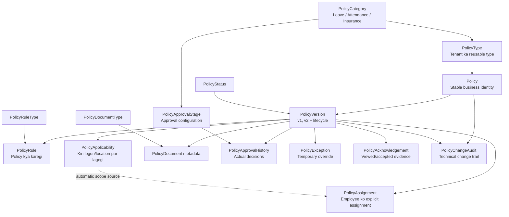
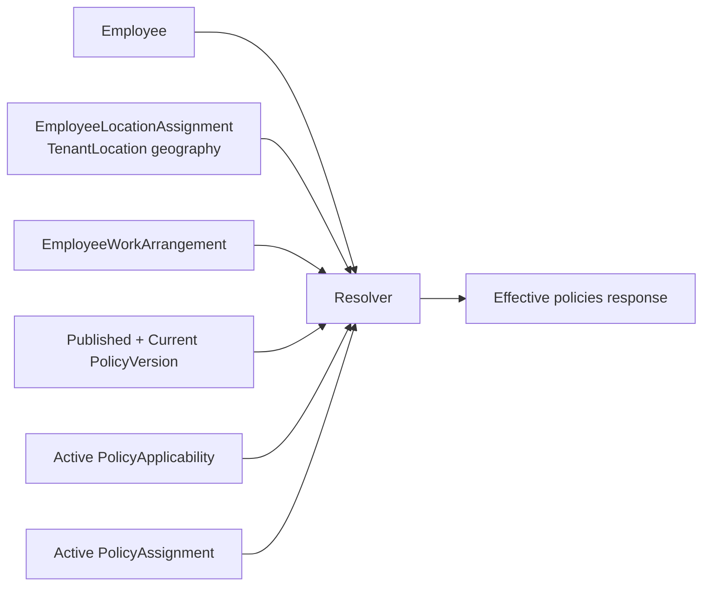
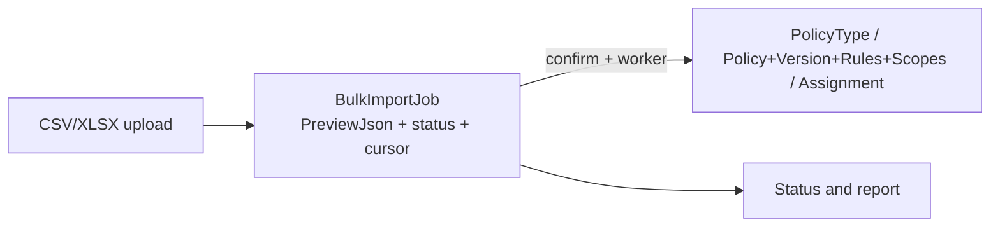

# Tenant Policy tables aur data flow — Hinglish guide

Ye document database ko samajhne ke liye hai. Iska main sawaal hai: **kis
situation mein kis table mein kaunsi row jaati hai?** API payload catalogue ke
liye [TENANT_POLICY_ENDPOINT_CATALOG.md](TENANT_POLICY_ENDPOINT_CATALOG.md) aur
screen flow ke liye
[TENANT_POLICY_API_FLOW_HINGLISH.md](TENANT_POLICY_API_FLOW_HINGLISH.md) dekhein.

## 1. Sabse important mental model

Policy framework mein 16 tables hain, lekin policy create karte hi sab 16 tables
fill nahi hoti. Tables chaar groups mein hain:

1. **Seed/master catalogue:** system ke fixed options.
2. **Policy definition:** policy kya hai, uska version, rules aur target audience.
3. **Execution/evidence:** assignment, exception, approval, acknowledgement,
   document aur audit.
4. **Shared bulk infrastructure:** uploaded file ka temporary durable job state.



Ek simple example:

```text
PolicyCategory: Leave
  └─ PolicyType: Annual Leave
      └─ Policy: India Maharashtra Annual Leave Policy
          └─ PolicyVersion: Version 1 / Draft
              ├─ PolicyRule: 18 days entitlement
              ├─ PolicyRule: 5 days carry forward
              ├─ PolicyRule: Sandwich enabled
              └─ PolicyApplicability: India + Maharashtra + Permanent
```

## 2. Chaar system master tables

Ye tables normal policy create par baar-baar insert nahi hoti. Seed/migration
inke standard options create karti hai.

### 2.1 `PolicyCategory`

**Kaam:** broad business family batana.

**Kab row banti hai:** system seed ya authorised catalogue administration par.
Tenant policy create karne par is table mein row nahi banti.

**Main properties:**

| Property | Meaning |
| --- | --- |
| `Id` | Category primary key |
| `CategoryCode` | Stable code: `LEAVE`, `ATTENDANCE`, `INSURANCE` |
| `CategoryName` | UI name |
| `Description` | Category ka purpose |
| `IsActive` | Dropdown mein available hai ya nahi |
| audit fields | kisne/kab seed/update kiya |

**Dependency:** `PolicyType.PolicyCategoryId` aur
`PolicyApprovalStage.PolicyCategoryId` isko refer karte hain.

### 2.2 `PolicyStatus`

**Kaam:** version lifecycle lookup.

**Rows:** Draft, Under Review, Approved, Published, Suspended, Archived,
Rejected.

| Property | Meaning |
| --- | --- |
| `Id` | Status ID |
| `StatusCode`, `StatusName` | machine/readable names |
| `IsTerminal` | Archived/Rejected jaise terminal indicator |
| `IsActive` | lookup availability |

**Dependency:** `PolicyVersion.PolicyStatusId`.

### 2.3 `PolicyRuleType`

**Kaam:** rule JSON ka meaning batana. JSON akela ambiguous na rahe.

**Rows:** Eligibility, Entitlement, Accrual, Carry Forward, Sandwich, Limit,
Attendance Channel, Late Penalty, Overtime, Approval, Reimbursement, Calendar,
Custom.

| Property | Meaning |
| --- | --- |
| `RuleTypeCode`, `RuleTypeName` | rule family |
| `Description` | intended use |
| `JsonSchemaVersion` | configuration schema revision |
| `IsActive` | selectable hai ya nahi |

**Dependency:** `PolicyRule.PolicyRuleTypeId`.

### 2.4 `PolicyDocumentType`

**Kaam:** attachment classification.

**Rows:** Policy Document, Annexure, Legal Circular, Employee Guide,
Translation.

**Dependency:** `PolicyDocument.PolicyDocumentTypeId`.

## 3. Tenant policy type master

### 3.1 `PolicyType`

**Kaam:** tenant ka reusable policy type. Ye final employee policy nahi hai.

Example:

```text
PolicyCategory = Leave
PolicyType     = Annual Leave
Actual Policy = India Maharashtra Annual Leave Policy
```

**Kab row banti hai:** Tenant Admin `POST /api/TenantPolicy/types` call kare ya
Policy Type bulk import worker valid row process kare.

| Property group | Data |
| --- | --- |
| Identity | `Id`, `TenantId`, `PolicyTypeCode`, `PolicyName` |
| Classification | `PolicyCategoryId`, `IsStructured`, `PolicyTypeEnumVal` |
| Defaults | `DefaultCurrencyCode`, `Description` |
| Document indicator | `HasPolicyDocUploaded` |
| State | `IsActive`, `IsSoftDelete` |
| Audit | added/update/soft-delete user and timestamps |

**Situation example:** Tenant “Annual Leave” aur “Casual Leave” ko separate
types rakhna chahta hai. Dono ki `PolicyType` row alag hogi.

## 4. Policy definition ki core tables

### 4.1 `Policy`

**Kaam:** stable business identity. Version badalne par ye row same rehti hai.

**Kab row banti hai:** `POST /api/TenantPolicy` ke successful transaction mein.

| Property | Meaning |
| --- | --- |
| `TenantId` | tenant isolation; payload se trust nahi hota |
| `PolicyTypeId` | kis tenant policy type ke andar hai |
| `PolicyCode` | tenant ke andar unique stable code |
| `PolicyName` | meaningful business name |
| `Summary` | policy ka short purpose |
| `OwnerDepartmentId` | owning department, target department nahi |
| `DefaultCurrencyCode` | monetary rules ka default ISO code |
| active/delete/audit fields | lifecycle and traceability |

**Important:** `OwnerDepartmentId=HR` ka matlab policy sirf HR employees par
apply nahi hoti. Targeting `PolicyApplicability` mein hoti hai.

### 4.2 `PolicyVersion`

**Kaam:** effective-dated revision aur approval/publish state.

**Kab row banti hai:**

- new policy ke saath Version 1 Draft;
- clone endpoint se Version 2/3 ka naya Draft;
- Draft update par nayi version row nahi banti, wahi Draft update hota hai.

| Property group | Data |
| --- | --- |
| Parent | `TenantId`, `PolicyId` |
| Revision | `VersionNumber`, `RuleSchemaVersion`, `ChangeSummary` |
| Lifecycle | `PolicyStatusId`, `IsCurrent`, `IsActive` |
| Effective dates | `EffectiveFrom`, `EffectiveTo` |
| Decision evidence | approved/published actor and timestamps |
| Audit | added/updated fields |

**Rules:** ek policy/version-number duplicate nahi ho sakta; ek policy ka sirf
ek active `IsCurrent=true` version ho sakta hai. Publish par purana current false
aur naya Published version current true hota hai.

### 4.3 `PolicyRule`

**Kaam:** policy **kya karegi**.

**Kab row banti hai:** policy Draft create ke saath request ki har `rules[]`
entry par ek row. Draft update par old rules delete/replace hote hain. Clone par
source version ke rules nayi Version ID ke saath copy hote hain.

| Property | Meaning |
| --- | --- |
| `PolicyVersionId` | rule kis exact version ka hai |
| `PolicyRuleTypeId` | Entitlement/Sandwich/Limit etc. |
| `RuleName` | human-readable rule name |
| `RuleOrder` | processing/display order; version mein unique |
| `RuleConfiguration` | PostgreSQL `jsonb` object with variable values |
| `IsActive` + audit | state and creator/updater |

Examples:

```json
{ "annualEntitlementDays": 18, "unit": "DAY" }
```

```json
{ "allowWeb": true, "allowMobile": true, "allowDevice": true }
```

```json
{ "coverageAmount": 500000, "currency": "INR" }
```

JSON flexible storage hai. `PolicyRuleTypeId` us JSON ka business meaning
preserve karta hai.

### 4.4 `PolicyApplicability`

**Kaam:** policy **kis par apply hogi**. Rule aur applicability ka role alag hai.

**Kab row banti hai:** policy Draft create/update ke har `applicability[]` object
par ek row. Clone par copy hoti hai.

| Property group | Filters |
| --- | --- |
| Geography | `CountryId`, `StateId`, `DistrictId`, `LocalityId` |
| Tenant workplace | `TenantLocationId` |
| Organization | `EmployeeTypeId`, `DepartmentId`, `DesignationId` |
| Person | `EmployeeId`, `GenderId` |
| Work/employment | `WorkArrangementType`, `EmploymentStatus`, `MinimumServiceDays` |
| Decision | `ApplicabilityMode` 1 Include / 2 Exclude, `Priority` |
| Time | `EffectiveFrom`, `EffectiveTo`, `IsActive` |

**Example situations:**

- India + Maharashtra + Permanent ⇒ Maharashtra permanent staff include.
- same scope + EmployeeId + mode Exclude ⇒ specific employee exclude.
- TenantLocation=Hyderabad ⇒ only employees with active Hyderabad location
  assignment match.
- WorkArrangementType=Remote ⇒ current active employee work arrangement match.

## 5. Approval tables

### 5.1 `PolicyApprovalStage`

**Kaam:** tenant ki approval configuration; kisi particular version ki approval
activity nahi.

**Kab row banti hai:** Tenant Admin approval setup screen par stage create kare.

| Property | Meaning |
| --- | --- |
| `PolicyCategoryId` | null = all categories; otherwise Leave etc. only |
| `StageName`, `StageOrder` | HR Review first, Compliance second |
| `ApproverRoleId` | kaunsi tenant role approve kar sakti hai |
| `MinimumApprovals` | stage complete karne ke liye count |
| `IsMandatory`, `IsActive` | enforcement flags |

### 5.2 `PolicyApprovalHistory`

**Kaam:** actual immutable approve/reject event.

**Kab row banti hai:** Under Review version par approver `APPROVE` ya `REJECT`
action kare.

| Property | Meaning |
| --- | --- |
| `PolicyVersionId` | kis version ka decision |
| `PolicyApprovalStageId` | kis configured stage par |
| `ActionType` | approve/reject code |
| `ActionById`, `ActionDateTime` | actor and time |
| `Comments` | decision comment |
| `SequenceNumber` | version ke decisions ki immutable order |

Submit sirf Version status ko Under Review karta hai. Actual approval ke waqt
history row banti hai. Required stages complete hone par Version Approved hota
hai; Publish ke baad Published/current.

## 6. Employee execution tables

### 6.1 `PolicyAssignment`

**Kaam:** Published version ko employee se explicitly map karna.

**Kab row banti hai:** manual assignment API ya Assignment bulk worker. Sirf
Published version assign ho sakta hai.

| Property | Meaning |
| --- | --- |
| `PolicyVersionId`, `EmployeeId` | exact version-person pair |
| `AssignmentSource` | 1 manual; 2 bulk/scope worker flow as implemented |
| `SourceApplicabilityId` | scope se generated ho to source scope |
| `EffectiveFrom`, `EffectiveTo` | assignment period |
| `IsMandatory`, `IsActive` | obligation/state |
| assigned/removed fields | who/when evidence |

Same version, employee and effective-from duplicate nahi banta. Removed
assignment delete nahi hota; inactive + removed evidence retained hota hai.

### 6.2 `PolicyAcknowledgement`

**Kaam:** employee ko policy deliver hui aur usne dekhi/accept ki iska evidence.

**Kab row banti/update hoti hai:**

- assignment ke saath missing employee/version acknowledgement row status 1
  create hoti hai;
- employee acknowledge kare to status 3, viewed/acknowledged timestamps aur
  optional evidence JSON update hota hai.

| Property | Meaning |
| --- | --- |
| `PolicyVersionId`, `EmployeeId` | unique delivery recipient |
| `AcknowledgementStatus` | assigned/viewed/acknowledged state code |
| time fields | assigned, viewed, acknowledged time |
| `SourceIpHash` | raw IP ki jagah hash if supplied |
| `EvidenceJson` | channel/device/consent evidence object |

### 6.3 `PolicyException`

**Kaam:** ek employee ke liye temporary approved override.

**Kab row banti hai:** exception create API; initial approval status Under Review.
Decision API same row ko Approved ya Rejected karti hai.

| Property | Meaning |
| --- | --- |
| `PolicyVersionId`, `EmployeeId` | base policy + affected person |
| `ExceptionType` | override classification code |
| `OverrideConfiguration` | changed values as `jsonb` object |
| `Reason` | business justification |
| `EffectiveFrom`, `EffectiveTo` | mandatory finite window |
| approval fields | status, approver and decision time |

Example: Hybrid attendance policy normally three office days maangti hai;
medical exception employee 145 ko 01–30 October Web attendance allow karti hai.

## 7. Document aur audit tables

### 7.1 `PolicyDocument`

**Kaam:** uploaded file ki metadata. PDF bytes PostgreSQL mein nahi jaate.

**Kab row banti hai:** object storage upload successful hone ke baad editable
Draft/Rejected version par metadata insert hoti hai. Storage failure par row
nahi banni chahiye.

| Property group | Data |
| --- | --- |
| Link | `TenantId`, `PolicyVersionId`, `PolicyDocumentTypeId` |
| Display | `DocumentTitle`, `OriginalFileName`, `LanguageCode`, `IsEmployeeVisible` |
| Storage | `StorageProvider`, `ObjectKey` |
| Integrity | `ContentType`, `FileSizeBytes`, `ChecksumSha256` |
| State/audit | active, soft-delete, actor and timestamps |

Published/Archived version ke documents change/delete nahi ho sakte. Current
Render acceptance mein invalid S3 access-key configuration ke kaaran upload 500
par blocked tha aur `PolicyDocument` row insert nahi hui.

### 7.2 `PolicyChangeAudit`

**Kaam:** technical mutation trail.

**Kab row banti hai:** policy create, Draft update, clone, transition,
assignment aur document actions jaise repository-audited mutations par.

| Property | Meaning |
| --- | --- |
| `PolicyId`, optional `PolicyVersionId` | affected aggregate/version |
| `EntityName`, `EntityId` | affected entity |
| `ActionName` | CREATE, UPDATE_DRAFT, SUBMIT, APPROVE, PUBLISH etc. |
| `BeforeData`, `AfterData` | optional `jsonb` snapshots |
| `ChangedById`, `ChangedDateTime` | actor/time |
| `CorrelationId` | request/job tracing when supplied |

Audit ko business table ya approval history ka replacement nahi samjhein.

## 8. Exact write sequence

| User action | Insert/update hone wali tables | Jahan row nahi banti |
| --- | --- | --- |
| Policy Type create | `PolicyType` | Policy/version/rules nahi |
| Policy Draft create | `Policy`, `PolicyVersion`, `PolicyRule` rows, `PolicyApplicability` rows, `PolicyChangeAudit` | assignment/acknowledgement nahi |
| Draft update | `Policy` + `PolicyVersion` update; old rules/scopes replace; audit insert | nayi Version nahi |
| Clone | new `PolicyVersion`; rules/scopes copied; audit | new `Policy` nahi |
| Submit | Version → Under Review; audit | approval-history decision nahi |
| Approve/Reject | `PolicyApprovalHistory`; Version state; audit | assignment nahi |
| Publish | Version Published/current; previous current false; audit | employee assignment automatic nahi |
| Manual/bulk assign | `PolicyAssignment`, missing `PolicyAcknowledgement`, audit | Policy/Version/rules unchanged |
| Exception create | `PolicyException` Under Review | base rule unchanged |
| Exception decision | same exception row approval fields update | new policy version nahi |
| Employee acknowledge | same `PolicyAcknowledgement` update | assignment unchanged |
| Document upload | S3 object + `PolicyDocument` + audit | DB file bytes nahi |
| Remove assignment | same assignment inactive + removal evidence | hard delete nahi |
| Archive | Version Archived, current false, audit | history delete nahi |

## 9. Resolve API read flow

`GET /api/TenantPolicy/resolve` normally new rows insert nahi karta. Ye current
data read karke decision return karta hai.



Actual repository order:

1. only active, effective, Published and current versions;
2. active manual assignment matches first;
3. otherwise applicability must match employee/location/work mode;
4. specificity: Employee > TenantLocation/Locality > District > State > Country
   > EmployeeType > Department/Designation > tenant-wide;
5. same specificity par lower `Priority` wins;
6. same specificity/priority par Exclude wins over Include.

## 10. Three complete business examples

### 10.1 Maharashtra Annual Leave

| Table | Example row |
| --- | --- |
| `PolicyType` | Annual Leave / category Leave |
| `Policy` | `MH-ANNUAL-LEAVE`, meaningful name, HR owner |
| `PolicyVersion` | v1 Draft → Published, effective 2027-01-01 |
| `PolicyRule` | Entitlement 18; Carry Forward 5; Sandwich enabled |
| `PolicyApplicability` | India + Maharashtra + Permanent, Include |
| `PolicyDocument` | signed leave PDF metadata |
| `PolicyAssignment` | only if employee explicitly/manual/bulk assigned |
| `PolicyAcknowledgement` | assignment ke saath recipient evidence |

### 10.2 Hybrid Attendance

| Table | Example row |
| --- | --- |
| `Policy` | Hybrid Web Mobile Device Attendance Policy |
| `PolicyRule` | Attendance Channel JSON: web/mobile/device allowed |
| `PolicyApplicability` | selected TenantLocation + employee type/work mode |
| reused prerequisite | employee location and work arrangement determine match |
| `PolicyException` | temporary medical remote attendance override |

Device na lene wale tenant ke rule JSON mein Web/Mobile allowed aur Device
required false ho sakta hai. Device enrollment policy table mein nahi; existing
device/enrollment domain mein rahega.

### 10.3 Employee Health Insurance

| Table | Example row |
| --- | --- |
| `PolicyType` | Health Insurance / category Insurance |
| `Policy` | Employee Health Insurance Policy |
| `PolicyRule` | Eligibility + INR 500,000 Limit |
| `PolicyApplicability` | Permanent employees, country/location constraints |
| `PolicyDocument` | insurer terms PDF metadata |
| `PolicyAssignment` | covered employee/version mapping |
| existing insurance tables | actual enrollment/dependants/claim domain may consume version; generic policy tables unverified legacy replacement nahi hain |

## 11. Prerequisite tables kyon chahiye

Policy framework in masters ko duplicate nahi karta:

| Existing table | Policy mein use |
| --- | --- |
| `Tenant` | every business row isolation |
| `Country`, `State`, `District`, `Locality` | regional applicability |
| `TenantLocation` | tenant office/site targeting and timezone context |
| `EmployeeLocationAssignment` | employee kis location par effective hai |
| `EmployeeType` | Permanent/Contract targeting |
| `Department`, `Designation` | organizational targeting/owner |
| `Employee`, `Gender` | person/gender targeting |
| `EmployeeWorkArrangement` | Office/Remote/Hybrid match |
| `Role`, `UserRole` | approval-stage authorisation |

Foreign-key master galat tenant ka ho to API validation reject karti hai.

## 12. Bulk upload mein data kahan rehta hai

Policy bulk ke liye separate policy staging-row tables nahi hain. Shared
`BulkImportJob` ek durable snapshot rakhta hai.



`BulkImportJob` ke main fields: Job UUID, tenant/actor/role/module/operation,
master type, status, `PreviewJson`, input hash, next-row cursor, timestamps,
schedule and fatal error. Preview tak business tables change nahi hoti. Confirm
ke baad worker valid rows ko business tables mein commit karta hai aur same job
snapshot/cursor update karta hai.

## 13. Data kab tak rahega

- Policy identity and published/version evidence historical records hain.
- Assignment removal hard-delete nahi karta.
- Document delete metadata ko soft-delete karta hai where allowed.
- Audit, approval and acknowledgement evidence retention-oriented hai.
- Draft update rules/scopes ko replace karta hai; Published version immutable hai.
- Bulk job/report durable DB snapshot hai; current implementation mein automatic
  expiry/delete policy ko verified behavior na maanें jab tak explicit cleanup
  process configured/documented na ho.

## 14. Common confusion ka direct answer

| Confusion | Correct answer |
| --- | --- |
| Rule aur applicability same hain? | Rule = kya; Applicability = kis par. |
| Publish se employees assign ho jaate hain? | Nahi. Current API mein assignment separate manual/bulk action hai. |
| Resolve assignment banata hai? | Nahi; resolver read/decision deta hai. |
| OwnerDepartment target department hai? | Nahi; target `PolicyApplicability.DepartmentId` hai. |
| Policy update mein new version banti hai? | Draft edit mein nahi; clone par banti hai. |
| PDF DB mein store hoti hai? | Nahi; object storage mein file, DB mein metadata/checksum. |
| Har assignment par acknowledgement? | Missing employee/version acknowledgement row assignment ke saath create hoti hai. |
| Policy delete se history erase? | Published evidence ko hard-delete flow samajhna galat hai; archive/inactive/history retained model hai. |
| Legacy policy tables isi flow ka part hain? | Generic `/api/TenantPolicy` flow ke authoritative tables upar ke 16 hain. Legacy feature-specific tables ko unke own endpoints verify kiye bina merge/replacement assume na karein. |

## 15. Actual tested records

Render API par 16 September 2026 ko actual Draft rows create/update/read-back hui:

- India Maharashtra Annual Leave Policy: Policy `4`, Version `5`;
- Hybrid Web Mobile Device Attendance Policy: Policy `5`, Version `6`;
- Employee Health Insurance Policy: Policy `6`, Version `7`.

Exact sanitized requests, responses and inserted IDs:
[2026-09-16-named-policy-scenarios.json](../testing/policy/live-business-flow/2026-09-16-named-policy-scenarios.json).

Published lifecycle, assignments, exception and acknowledgement ka separate
live evidence:
[2026-09-16-api-evidence.json](../testing/policy/live-business-flow/2026-09-16-api-evidence.json).
