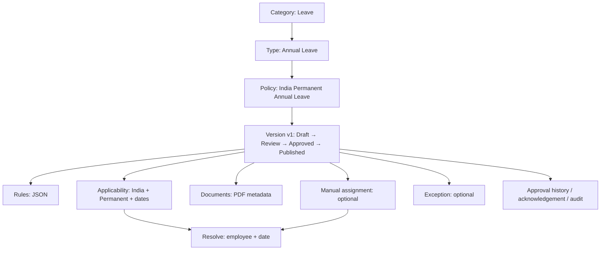

# Tenant Policy: screen se API aur table tak — actual code map

**Checked:** 22 September 2026. **Scope:** `C:\latestAxionProUI\axionpro-app` read-only Angular code, current API controller/DTO/repository. Yeh code inspection hai; deployed UI/DB ka live test nahi. Screenshots ko evidence maana hai, API response ka substitute nahi. Angular project mein koi change nahi kiya.

## 1. Ek minute mein poora system

| Naam | Seed/master ya transaction? | Seedha matlab |
|---|---|---|
| `PolicyCategory` | shared master/lookup | Vishay: Leave, Travel, Attendance, Insurance |
| `PolicyType` | **tenant-created** master | Vishay ke andar reusable type: Annual Leave, Casual Leave, Hybrid Attendance |
| `Policy` | tenant transaction | Asli named policy: “India Permanent Annual Leave” |
| `PolicyVersion` | tenant transaction | Usi policy ka v1/v2, date aur Draft→Published status |
| `PolicyRule` | version ka child | JSON mein *kya rule likha hai* |
| `PolicyApplicability` | version ka child | *Kis employee/location par* policy lagegi |
| `PolicyDocument` | version ka child | Uploaded file ki metadata; file object storage mein |
| `PolicyApprovalStage` | tenant configuration | Approval ka gate: kaun, kitne approvals, kis category ke liye |
| `PolicyApprovalHistory` | transaction | Kisne approval/rejection diya |
| `PolicyAssignment` | transaction | Kisi employee ko manually version dena |
| `PolicyException` | transaction | Ek employee ke liye temporary override request/decision |
| `PolicyAcknowledgement` | transaction | Employee ne policy acknowledge ki ya nahi |
| `PolicyChangeAudit` | append-only evidence | Policy/version par kya change hua |
| `PolicyStatus`, `PolicyRuleType`, `PolicyDocumentType` | shared lookup | Dropdown/status vocabulary |

**Yaad rakhne ka rule:** Type ek dabba hai; Policy us dabbe ki actual policy; Version us policy ki date wali copy; Rule “kya”; Applicability “kis par”; Assignment kisi ek employee ka direct override. `PolicyRule.ruleConfiguration` ka JSON save hota hai, lekin is generic policy resolver mein annual leave balance, accrual, payroll, attendance approval ya insurance claim calculate karne wala execution nahi mila. `GET /resolve` applicable *published policies ki list* deta hai, benefit calculation nahi. Is boundary ko UI mein clearly batana chahiye.



## 2. Kitni screens sach mein bani hain?

Angular routes mein **3 menu pages + 1 nested workspace** hain. Har popup alag route nahi hai.

| UI route/screen | Kya dikhata hai | Main actions |
|---|---|---|
| `/app/tenant-policies/types` — Policy Types | Types ki list, Category, Active | Add, Edit, Activate/Deactivate, Import |
| `/app/tenant-policies` — Policy Definitions | Policy list, latest version/status | Create, Edit draft, Import, Resolve, Submit/Approve/Reject/Publish/Archive, Open workspace |
| `/app/tenant-policies/approval-stages` — Policy Approvals | Approval stages | Add, Edit, Disable |
| `/app/tenant-policies/:policyId/versions/:versionId` — Policy Version | Header + 6 tabs | Clone; Documents, Assignments, Exceptions, Acknowledgements, Approval progress, Audit |

`Attendance Policies` sidebar ka alag, purana feature hai; generic `TenantPolicy` flow ka page nahi. `Policy Types` bhi old `/PolicyType` feature se confuse na karein: is document ka Type API `/api/TenantPolicy/types` hai. Routes ka source: Angular `features/tenant-policies/tenant-policies.routes.ts`; API source: `core/services/tenant-policy-api.ts`.

**Common request rule:** Neeche `moduleId`/`operationId` ko `M`/`O` likha hai. Har protected call mein ye IDs authenticated `my-menu` ke relevant leaf + operation se dynamic milti hain; hardcode number nahi. Success envelope usually `{ "isSucceeded": true, "message": "...", "errors": [], "data": ... }` hai; list API paging fields bhi deti hai. Validation/permission failure par success sample expect na karein.

## 3. Screen 1 — Policy Types (`/types`)

Page load: `GET /api/TenantPolicy/types?moduleId=M&operationId=O&isActive=true` aur `GET /api/TenantPolicy/lookups?moduleId=M&operationId=O` (`TENANT_POLICY_TYPES / View`). Types list ka data `PolicyType`; Category dropdown/name `PolicyCategory` lookup se. Status filter server request badalta hai, search Angular mein already-loaded rows filter karta hai. Screenshot mein 9 types dikhna us screenshot ka observation hai, current DB count nahi.

| Click | Request (main fields) | Success `data` | Table effect |
|---|---|---|---|
| Add Policy Type | `POST /api/TenantPolicy/types`, `{moduleId,operationId,policyTypeCode,policyName,description,policyCategoryId,defaultCurrencyCode}` | `{id,code,name,description,categoryId,currencyCode,isActive}` | `PolicyType` insert |
| Edit | `PUT /api/TenantPolicy/types/{id}`, same + `isActive` | updated type object | `PolicyType` update |
| Deactivate/Activate | `PATCH /api/TenantPolicy/types/{id}/status`, `{moduleId,operationId,isActive}` | boolean | `PolicyType.IsActive` update |
| Import Policy Types | `/api/TenantPolicy/bulk/types/...` flow, section 7 | preview/job/report | Bulk job rows, then valid `PolicyType` inserts |

Example: Category lookup mein `{id: <actual ID>, code:"LEAVE", name:"Leave"}` mile to Add mein `policyCategoryId` usi **actual ID** ka hoga. Type `ANNUAL_LEAVE` banane se kisi employee ko leave nahi milti; abhi sirf reusable type bana hai.

## 4. Screen 2 — Policy Definitions (`/app/tenant-policies`)

Page load: `GET /api/TenantPolicy?pageNumber=1&pageSize=10&moduleId=M&operationId=O` (`TENANT_POLICY_DEFINITIONS / View`). `policyTypeId`, `statusId`, `search` filter query mein jaate hain. Response: `data: [{id,code,name,policyTypeId,isActive,currentVersionId,versionNumber,status}], pageNumber,pageSize,totalRecords,totalPages`. Policy type names ke liye **alag** `GET /types` (`TENANT_POLICY_TYPES / View`), status/rule-type dropdown ke liye `GET /lookups`. Type View permission fail ho to list aa sakti hai par type label/filter blank ho sakta hai.

### Create/Edit form: ek button, chaar tables

Form ke **top fields** `Policy` mein jaate hain: `policyTypeId`, `policyCode`, `policyName`, `summary`, `ownerDepartmentId`, `defaultCurrencyCode`. Owner department ownership/administration ke liye hai; **employee Department se target karna ho to Applicability row ka `departmentId` use hota hai**. `effectiveFrom`, `effectiveTo`, `changeSummary` `PolicyVersion` mein. Har Rules row `PolicyRule` mein. Har Applicability row `PolicyApplicability` mein. Currency required UI mein dikh sakti hai; backend DTO nullable hai, isliye current UI/backend validation alag ho sakti hai.

Create: `POST /api/TenantPolicy` (`TENANT_POLICY_DEFINITIONS / Add`). Edit only Draft/Rejected: `PUT /api/TenantPolicy/{policyId}/versions/{versionId}` (`Update`). Edit request ka same shape hai; repository existing rule/applicability rows ko replace karta hai, isliye edit mein poori arrays bhejna zaroori hai. Dono `data` mein complete Policy detail return karte hain: `id,code,name,policyTypeId,versionId,versionNumber,status,effectiveFrom,effectiveTo,rules,applicability...`. Create mein `Policy` + `PolicyVersion` v1 Draft + child rows + `PolicyChangeAudit` bante hain.

Copyable **illustrative** request (IDs dropdown/API se resolve karein; real tenant se validate karein):

```json
{
  "moduleId": 0, "operationId": 0,
  "policyTypeId": 0,
  "policyCode": "IN_PERM_ANNUAL_LEAVE",
  "policyName": "India Permanent Annual Leave",
  "summary": "India ke permanent staff ke annual leave terms",
  "ownerDepartmentId": null,
  "defaultCurrencyCode": "INR",
  "effectiveFrom": "2026-10-01", "effectiveTo": null,
  "changeSummary": "Initial draft",
  "rules": [{
    "policyRuleTypeId": 0, "ruleName": "Annual entitlement",
    "ruleOrder": 1, "ruleConfiguration": "{\"days\":18,\"unit\":\"DAY\"}"
  }],
  "applicability": [{
    "applicabilityMode": 1,
    "countryId": 0, "stateId": null, "districtId": null,
    "localityId": null, "tenantLocationId": null,
    "employeeTypeId": 0, "departmentId": null,
    "designationId": null, "employeeId": null, "genderId": null,
    "workArrangementType": null, "employmentStatus": null,
    "minimumServiceDays": null, "priority": 100,
    "effectiveFrom": "2026-10-01", "effectiveTo": null
  }]
}
```

`0` placeholder ko actual positive lookup/menu ID se replace karna mandatory hai. `ruleConfiguration` **JSON object ka string** hai, raw nested object nahi. Example ka `days=18` stored declaration hai; generic resolver isse leave balance mein 18 add nahi karta. UI form mein Rule Type lookup `PolicyRuleType`; Country/State/District/Locality, TenantLocation, EmployeeType, Department, Designation, Employee/Gender selectors corresponding existing master/assignment lookups se aate hain. `workArrangementType` aur `employmentStatus` UI mein editable nahi, par existing values edit round-trip mein preserve ki jaati hain.

Create/GET detail ka **shape sample** (IDs example hain, observed live response nahi):

```json
{
  "isSucceeded": true, "message": "Policy created", "errors": [],
  "data": {
    "id": 101, "code": "IN_PERM_ANNUAL_LEAVE", "name": "India Permanent Annual Leave",
    "policyTypeId": 21, "ownerDepartmentId": null, "defaultCurrencyCode": "INR",
    "versionId": 301, "versionNumber": 1, "statusId": 1, "status": "Draft",
    "effectiveFrom": "2026-10-01", "effectiveTo": null,
    "rules": [{"id": 501, "ruleTypeId": 10, "name": "Annual entitlement", "order": 1,
      "configuration": "{\"days\":18,\"unit\":\"DAY\"}"}],
    "applicability": [{"id": 601, "mode": 1, "countryId": 1,
      "employeeTypeId": 7, "priority": 100, "effectiveFrom": "2026-10-01", "effectiveTo": null}]
  }
}
```

Notice: **write** rules mein `policyRuleTypeId,ruleName,ruleOrder,ruleConfiguration`; **read** rules mein `ruleTypeId,name,order,configuration`. Applicability write mein `applicabilityMode`, read mein `mode`. UI mapping in dono ko convert karti hai. `statusId` sample illustration hai; environment lookup se actual status ID dekhein.

**Applicability ka exact simple matlab:** India + Permanent ki Include row = dono match hone chahiye. Exclude row = matching cohort ko hatao. Date aur location employee ki **date-effective** `EmployeeLocationAssignment`/`TenantLocation` se resolve hoti hai. More specific matching scope pehle, phir lower numeric priority; same winning specificity/priority par Exclude wins. Har policy alag resolve hoti hai. Automatic match `PolicyAssignment` row **nahi** banata. Direct manual assignment bana ho to resolver us version ko `MANUAL_ASSIGNMENT` ke naam se include karta hai, applicability ke matching se pehle.

### Policy list ke doosre buttons

| Click | API | Data/table effect |
|---|---|---|
| Open workspace | navigation only; workspace `GET /api/TenantPolicy/{policyId}` | read `Policy`, selected/current `PolicyVersion`, `PolicyRule`, `PolicyApplicability` |
| Resolve | `GET /api/TenantPolicy/resolve?employeeId=...&effectiveDate=YYYY-MM-DD&moduleId=M&operationId=O` | read-only: `data: [{policyId,policyVersionId,policyCode,policyName,priority,resolutionSource}]`; `PolicyAssignment`, `PolicyApplicability`, employee/location/work arrangement read |
| Submit for review | `POST /api/TenantPolicy/versions/{versionId}/transition`, `{moduleId,operationId,policyVersionId,action:"SUBMIT"}` | `PolicyVersion` Draft/Rejected→Under Review; `PolicyChangeAudit` |
| Approve | same, `action:"APPROVE"` | with configured mandatory stages: `PolicyApprovalHistory`, maybe `PolicyVersion`→Approved; without stages: direct Approved; audit |
| Reject | same, `action:"REJECT"` | stage history if configured; `PolicyVersion`→Rejected; audit |
| Publish | same, `action:"PUBLISH"` | Approved→Published/current; previous current version unset; audit |
| Archive | same, `action:"ARCHIVE"` | Published→Archived/not current; audit |
| Import Policies | `/api/TenantPolicy/bulk/definitions/...` | bulk flow section 7 |

Important: `Approved` bhi Resolve mein nahi aata; sirf current, active, date-valid `Published` version aata hai. Publish ke baad same version edit nahi hota; next change ke liye Clone Version. `POST transition` response full detail echo karta hai (Angular type mein `data: unknown` hai).

Resolve ka sample **shape**: `{"isSucceeded":true,"message":"...","errors":[],"data":[{"policyId":101,"policyVersionId":301,"policyCode":"IN_PERM_ANNUAL_LEAVE","policyName":"India Permanent Annual Leave","priority":100,"resolutionSource":"APPLICABILITY"}]}`. Empty `data: []` ka matlab us date par koi matching Published policy nahi; yeh DB insert failure ka evidence nahi. `resolutionSource` actual repository mein `APPLICABILITY` ya `MANUAL_ASSIGNMENT` milta hai; UI interface comment ka `ASSIGNMENT`/`EXCEPTION` wording actual repository output se match nahi karta.

## 5. Screen 3 — Policy Approvals (`/approval-stages`)

List: `GET /api/TenantPolicy/approval-stages?moduleId=M&operationId=O&policyCategoryId=...&isActive=true` (`TENANT_POLICY_APPROVALS / View`), `data: [{id,policyCategoryId,stageName,stageOrder,approverRoleId,minimumApprovals,isMandatory,isActive}]`. Categories `/lookups` se; approver roles separate `Role/option` se. Search client-side. Screenshot mein “No approval stages found” current screenshot observation hai; iska matlab category-specific filtered DB mein koi stage us waqt nahi dikh rahi thi.

| Click | API/body | Table effect |
|---|---|---|
| Add Stage | `POST /api/TenantPolicy/approval-stages` with `policyCategoryId` nullable, `stageName`, `stageOrder`, `approverRoleId`, `minimumApprovals`, `isMandatory`, M/O | `PolicyApprovalStage` insert |
| Edit | `PUT /api/TenantPolicy/approval-stages/{id}` same + `isActive` | same row update |
| Disable | `DELETE /api/TenantPolicy/approval-stages/{id}?moduleId=M&operationId=O` | stage becomes inactive; old `PolicyApprovalHistory` retained |

`policyCategoryId=null` = all categories. Stage configuration **PolicyApprovalHistory** nahi hai; history tab banti hai jab Under Review version par Approve/Reject click hota hai. API role grant aur current stage approver role check karta hai. `minimumApprovals` poore hone par agla stage; last complete ho to version Approved. **No mandatory stage** ho to Under Review par Approve direct Approved karta hai.

## 6. Screen 4 — Policy Version workspace (6 tabs)

Header `GET /api/TenantPolicy/{policyId}` se detail leta hai. **Caveat:** URL mein `versionId` hai, par header `GET /{policyId}` API se aata hai, jo current/latest version return karta hai; old version URL par header aur tab version alag ho sakte hain. Six tabs **sirf click karne par** apna GET chalate hain. Audit ka scope policyId hai, ek version nahi.

| Tab/action | Read API → response `data` | Write API → request | Table/file effect |
|---|---|---|---|
| Documents | `GET /versions/{versionId}/documents` → document rows `{id,title,originalFileName,languageCode,isEmployeeVisible,url}` | `POST /documents` multipart: `policyVersionId,policyDocumentTypeId,documentTitle,languageCode,isEmployeeVisible,file,M/O`; `DELETE /documents/{documentId}` | `PolicyDocument` insert/soft-delete; file S3 object key. `url` temporary. Published/Archived file mutation denied. |
| Assignments | `GET /versions/{versionId}/assignments` → **manual** rows `{id,employeeId,effectiveFrom,effectiveTo,isMandatory,isActive}` | `POST /assignments` `{policyVersionId,employeeIds:[numeric],effectiveFrom,effectiveTo,isMandatory,M/O}`; `DELETE /assignments/{id}` | `PolicyAssignment` insert/reactivate/deactivate. Assign also creates missing `PolicyAcknowledgement` rows. Only Published version assignable. Repeat returns `{inserted,existing}`. |
| Exceptions | `GET /versions/{versionId}/exceptions` → exception rows incl. `approvalStatusId` | `POST /exceptions` `{policyVersionId,employeeId,exceptionType,overrideConfiguration,reason,effectiveFrom,effectiveTo,M/O}`; `POST /exceptions/{id}/decision` `{approve,M/O}` | `PolicyException` insert then status/approver update. Override JSON stored, not generic benefit calculation. |
| Acknowledgements | `GET /versions/{versionId}/acknowledgements` → `{employeeId,status,assignedDateTime,viewedDateTime,acknowledgedDateTime}` | `POST /acknowledgements` `{policyVersionId,evidenceJson?,M/O}` | `PolicyAcknowledgement` of **signed-in employee** update. API checks active assignment; another employee ko admin acknowledge nahi kar sakta. |
| Approval progress | `GET /versions/{versionId}/approval-progress` → `{stageId,stageName,minimumApprovals,approvalCount,isComplete}` | Is tab mein write nahi; list page ka Approve/Reject transition use hota hai | reads `PolicyApprovalStage` + `PolicyApprovalHistory` |
| Audit | `GET /{policyId}/audit` → `{entityName,actionName,policyVersionId,changedById,changedDateTime,...}` | koi write nahi | reads `PolicyChangeAudit`, **all versions** |

Workspace ka **Clone version** button: `POST /api/TenantPolicy/{policyId}/versions/clone`, `{sourceVersionId,effectiveFrom,changeSummary,M/O}`. Naya Draft `PolicyVersion`, source `PolicyRule` aur `PolicyApplicability` copy, audit; response se new `versionId` aata hai aur UI naye workspace URL par navigate karta hai. Documents/assignments copy hone ka evidence nahi mila. Note: header old-version mismatch ko cloning se pehle verify karein.

Assignment tab ka Import global assignment-file rows leta hai; address bar wale version tak restricted nahi. Automatic applicability-matched employees is tab mein nahi dikhte—“No manual assignments” ka matlab “policy kisi par nahi lag rahi” **nahi** hai. Effective Policies/Resolve mein check karein.

## 7. Import popup ka actual common flow

Targets teen hain: `types`, `definitions`, `assignments`. Entry points: Types Add dropdown, Definitions Create dropdown, Workspace Assignments tab. Har target ke liye:

1. `GET /api/TenantPolicy/bulk/{target}/template` — download format; DB write nahi.
2. `POST /bulk/{target}/preview` — multipart `file` **ya** `pastedText`, optional `columnMappingJson`, `sheetName`, M/O; preview job/validation state. Isko final policy insert maan kar na dekhein.
3. `POST /bulk/{target}/confirm` — preview `jobId` + M/O; durable job starts. Job rows se valid type/policy/assignment records tab bante hain.
4. `GET /bulk/{target}/jobs/{jobId}` (poll), `GET /bulk/{target}/jobs` (history), `GET /bulk/{target}/jobs/{jobId}/report`; failed rows ke liye `/retry`, active job ke liye `/cancel`.

Bulk job tables ka exact names/columns aur state handling detailed [endpoint catalogue](TENANT_POLICY_ENDPOINT_CATALOG.md) mein hain. Import success toast ka matlab har row success nahi; final report counts aur failed rows dekhna zaroori hai. UI ke `policy-bulk-import.ts` mein `Import` permission se preview/confirm/retry/cancel, `View` se template/jobs/report.

## 8. Ek full example: kaunse click ke baad kaunsa row banta hai

Example ka real business intent: “1 October se India ke Permanent employees ko annual leave policy dikhni chahiye.”

| Step | User kya kare | API | DB mein kya hua / check kya kare |
|---|---|---|---|
| 1 | Policy Types mein `Annual Leave` type select/create | `GET/POST /types` | `PolicyType` row, `PolicyCategory=Leave` se linked. Agar already hai, duplicate na create karein. |
| 2 | Definitions → Create Policy: name/code/dates, Annual entitlement rule, Include India+Permanent applicability | `POST /api/TenantPolicy` | `Policy` 1, `PolicyVersion` v1 Draft 1, `PolicyRule` 1, `PolicyApplicability` 1, audit. **Employee balance mein abhi kuch nahi.** |
| 3 | Optional signed document attach | `POST /documents` | `PolicyDocument` metadata + object storage file. |
| 4 | Draft Submit → approver Approve → Publish | 3 calls `/versions/{id}/transition` | Version Under Review→Approved→Published; configured stages hon to history, audit; current version true. |
| 5 | Definitions → Resolve, employee/date select | `GET /resolve` | Read-only. Country/type/date match par `resolutionSource:"APPLICABILITY"`. No `PolicyAssignment` insert. |
| 6 | Kisi **special** employee ko direct assign karna ho | Workspace Assignments → Assign | `PolicyAssignment` + acknowledgement row. Same policy normally applicable ho to manual assignment unnecessary. |
| 7 | Rule 18→20 badalna ho | Clone → new Draft edit → submit/approve/publish | `PolicyVersion` v2 + new rules/scopes; old version remains historical. |

**Location change example:** Employee kal Dubai, 1 October se IOCL India: `EmployeeLocationAssignment` date-effective record update/insert karna prerequisite hai. India/IOCL policy ki Published version mein matching `TenantLocationId`/country/employee-type Applicability pehle se ho to 1 October ke `GET /resolve` mein policy automatically badlegi. Manual assignment lagayi ho to woh scope ko bypass kar sakti hai; HR ko prior assignment end/remove karna hoga. **Leave balance migration/carry-forward is generic policy UI/API ka demonstrated feature nahi**; usse yahan automatic maan kar na chalayein.

## 9. Screenshots se saamne aaye actual gaps / misleading data

| Priority | Observation + exact implication |
|---|---|
| **Blocker** | `Employee/get-all` `employeeId` string (`1OZ8MZRL` jaisa) deta hai; `Resolve`, `Assign`, `Exception` UI `Number(id)` karta hai, backend DTO `long EmployeeId` expect karta hai. Non-numeric ID par Resolve/Exception error, Assign selected row drop; real employee flow fail ho sakta hai. UI/Backend identity mapping contract decide/fix/test karna zaroori. Is document ne code nahi badla. |
| **Data correction** | Screenshot mein `CHINA-Leave Policy`, `Employee Health Insurance Policy`, `Hybrid Web Mobile Device Attendance Policy` ka Policy Type **Travel** dikh raha hai. Type naam policy ke code/name se auto-detect nahi hota; saved `Policy.PolicyTypeId` decide karta hai. In rows ka actual ID/category DB/API detail se verify karke data correction chahiye. “Trip leave” aur “WOMEN Leave” ko Annual Leave type diya hai; business taxonomy review karein. |
| **Old version read** | Workspace route version ID leta hai, header `GET /{policyId}` current/latest detail fetch karta hai, tabs route version ID use karte hain. v1 URL par v2 header dikhne ka risk. Version-scoped detail endpoint/selection needed; existing backend ticket bhi hai, par current code evidence independently yahi batata hai. |
| **Approval config** | Screenshot Approval Stages empty. Code zero mandatory stages par direct Approve allow karta hai; agar company multi-step approval chahti hai, stages configure + test pehle karein. |
| **Rule editor** | UI raw `ruleConfiguration` JSON textarea aur numeric exception type deta hai. Schema/allowed business rule semantics dropdown wizard/help ke bina user wrong-but-valid JSON save kar sakta hai. Server JSON object validity check karta hai; business outcome calculation yahan proven nahi. |
| **Missing employee view** | Angular generic policy routes mein dedicated “My Policies / acknowledge my policy” employee page nahi mila. Workspace mein Acknowledge button hai, jo signed-in person ke liye hai; actual employee self-service discoverability unclear. |
| **Missing coverage view** | Applicability se matched employees ki list/preview screen nahi mila; Resolve one employee + date at a time. Manual Assignments list ko full coverage list samajhna galat hoga. |
| **Version history view** | Current policy list sirf one version/currentVersionId dikhati hai; all versions ki dedicated list screen/endpoint is flow mein nahi mila. Clone history audit mein dikhega, par previous version open path discoverability incomplete. |
| **Bulk review** | Import wizard exists, but policy type/definition/assignment bulk final row report dekhkar hi success decide karein. Live integration test is analysis mein run nahi hua. |

Screenshots se current deployment ka final status establish nahi hota; yeh Angular/backend source state ka read-only audit hai. Angular mein koi change nahi. `PolicyType` category and Policy association data ko production DB par manually correct karne se pehle actual IDs/tenant isolate karke verify karein.

## 10. Source of truth / kaise cross-check karein

- Angular routes: `C:\latestAxionProUI\axionpro-app\src\app\features\tenant-policies\tenant-policies.routes.ts`.
- Angular HTTP calls: `C:\latestAxionProUI\axionpro-app\src\app\core\services\tenant-policy-api.ts`; request/response types: `src\app\shared\interfaces\tenant-policy\`.
- Screens/buttons: `src\app\features\tenant-policies\policy-types\`, `policy-definitions\`, `policy-approval-stages\`, `policy-version-workspace\`.
- Backend routes/DTO: `axionpro.api/Controllers/Policies/TenantPolicyController.cs`, `axionpro.application/DTOS/Policy/GenericPolicyDTOs.cs`.
- Actual reads/writes/resolution: `axionpro.persistance/Repositories/GenericPolicyRepository.cs`; table entities: `axionpro.domain/Entity/GenericPolicyEntities.cs`; JSONB map: `axionpro.persistance/Data/Context/WorkforceDbContext.PolicyFramework.cs`.

**Verification limit:** No request sent to production, no DB row changed, no Angular build run. Request/response examples above are code-derived contracts with placeholder IDs, observed live payloads nahi.
