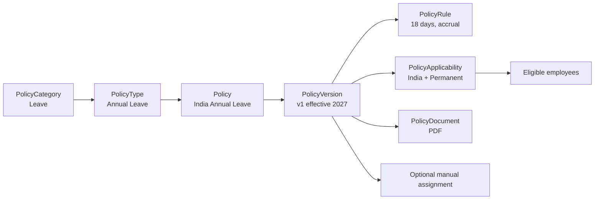
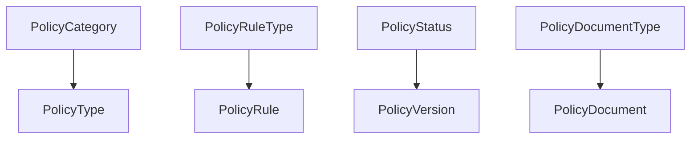
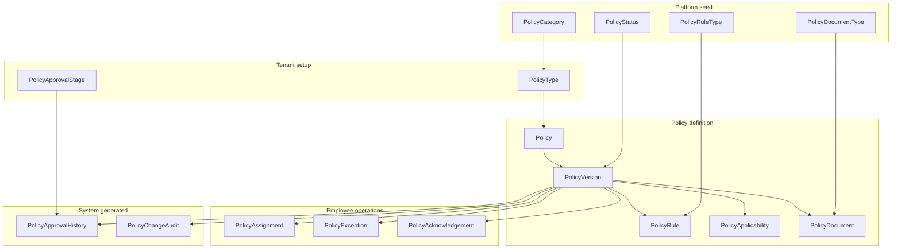
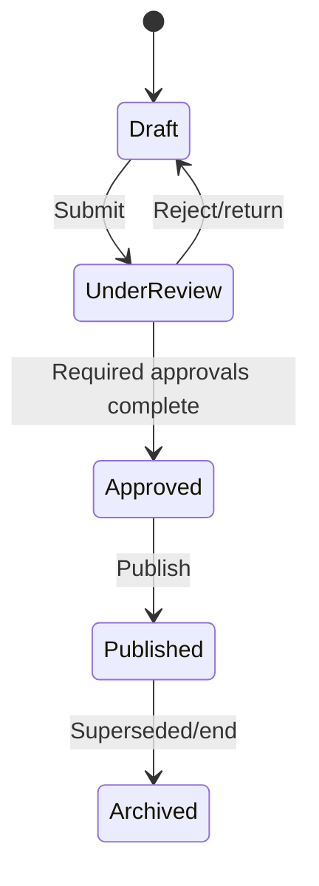
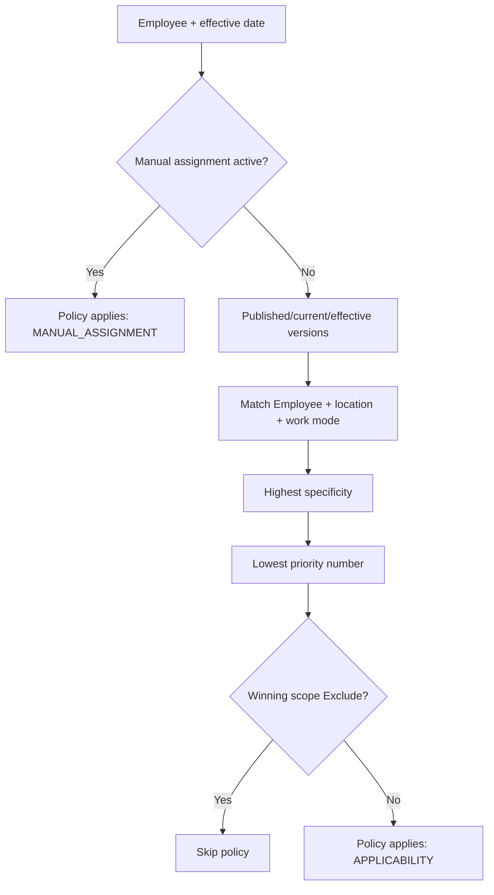
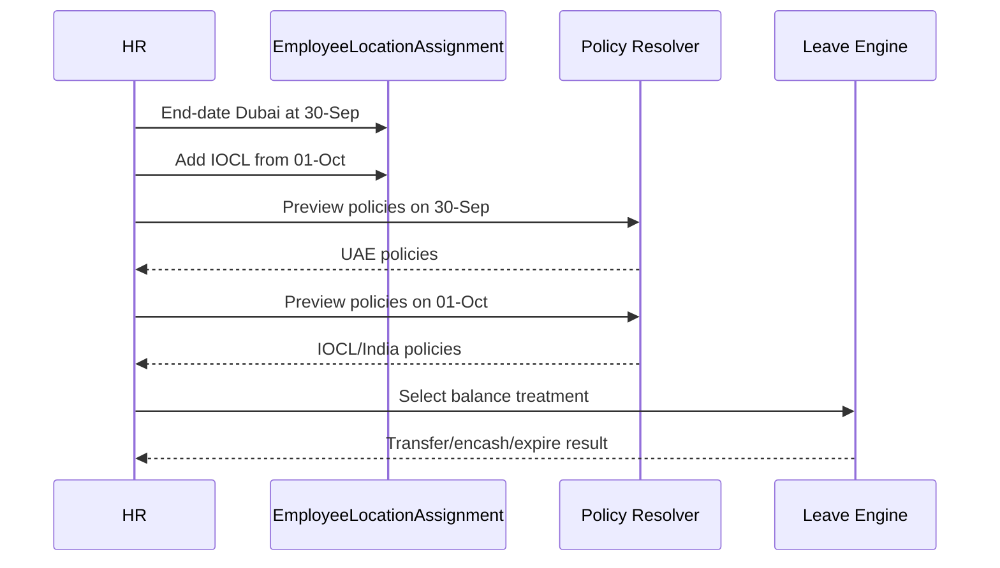
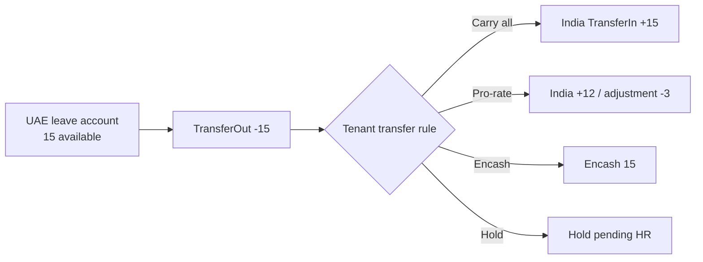
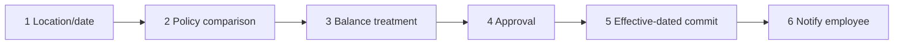
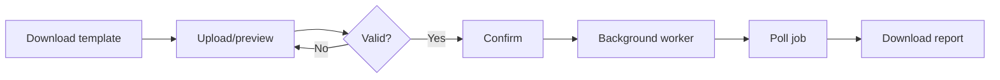
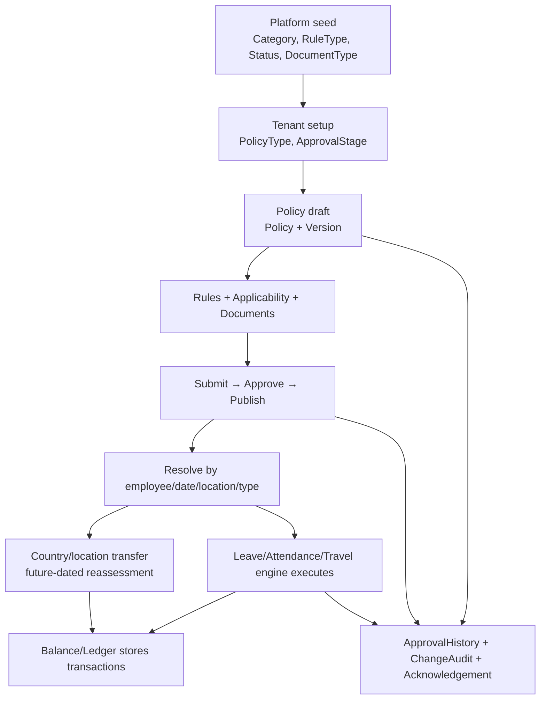

# Full Policy With Example

**Document role:** AxionPro generic policy framework ka single authoritative business guide  
**Last verified:** 20 September 2026  
**Audience:** Product owner, backend developer, UI developer, QA, HR/Policy administrator

> Is document ka purpose tables ko alag-alag samjhana nahi, balki ek policy ke janam se employee par apply hone aur balance transaction tak ka complete flow dikhana hai. Numeric IDs environment examples hain; UI ko current IDs API/menu se resolve karne hain.

---

## 1. Sabse pehle: Policy system asal mein kya karta hai?

Policy system chhah sawalon ka jawab deta hai:

1. Policy **kis subject** ki hai? — Leave, Attendance, Travel, Insurance.
2. Actual policy **kaun-si** hai? — India Annual Leave, IOCL Work Pattern.
3. Iske **rules** kya hain? — 18 days, six-day week, GPS mandatory.
4. Ye **kin employees** par apply hogi? — Country, location, EmployeeType etc.
5. Ye **kab se kab tak** effective hai? — PolicyVersion dates.
6. Kisi employee ko **special assignment/exception** chahiye? — PolicyAssignment/PolicyException.



### Bahut important boundary

- Generic Policy framework rule, scope, lifecycle, document, approval aur resolution handle karta hai.
- Actual leave accrual, consumption, remaining balance, encashment aur transfer ko Leave Engine/ledger handle karega.
- `PolicyAssignment` ke andar 15 remaining leaves save nahi hoti.

---

## 2. Tables ko paanch groups mein samjho

Image mein 16 generic policy tables hain. Inka matlab 16 UI screens nahi hai.

### 2.1 Platform seed tables

Ye platform-controlled lookup/master data hai. Tenant normally ise create nahi karega.

| Table | Responsibility | Example | Data nature |
|---|---|---|---|
| `PolicyCategory` | Broad domain | LEAVE, ATTENDANCE | Seed |
| `PolicyRuleType` | Rule ka semantic type | ENTITLEMENT, ACCRUAL | Seed |
| `PolicyStatus` | Version lifecycle | Draft, Published | Seed |
| `PolicyDocumentType` | Uploaded document classification | Policy PDF, Annexure | Seed |



### 2.2 Tenant setup tables

| Table | Responsibility | Example | Data nature |
|---|---|---|---|
| `PolicyType` | Category ke andar reusable subtype | Annual Leave, Casual Leave | Tenant master |
| `PolicyApprovalStage` | Approval chain configuration | HR Review → Legal | Tenant configuration |

`PolicyType` actual policy nahi hai. `Annual Leave` reusable type hai; `India Annual Leave 2027` actual policy hai.

### 2.3 Policy definition tables

| Table | Responsibility | Example |
|---|---|---|
| `Policy` | Stable identity | India Annual Leave |
| `PolicyVersion` | Time-bound edition | v1: 2027 onward |
| `PolicyRule` | Version ke executable/business rules | 18 days, monthly accrual |
| `PolicyApplicability` | Version kin employees par apply hogi | India + Permanent |
| `PolicyDocument` | Version ke documents | Approved PDF |

### 2.4 Employee-specific operational tables

| Table | Kab row banti hai? | Example |
|---|---|---|
| `PolicyAssignment` | Explicit employee assignment | Executive contractual benefit |
| `PolicyException` | Employee-specific temporary override | 60-day remote exception |
| `PolicyAcknowledgement` | Employee reads/accepts policy | Accepted at timestamp |

### 2.5 Workflow and audit tables

| Table | Responsibility | Direct UI CRUD? |
|---|---|---|
| `PolicyApprovalHistory` | Approve/reject action history | No |
| `PolicyChangeAudit` | Old/new value audit | No |



---

## 3. Current production DB snapshot

20 September 2026 ke read-only production query ke according:

- `PolicyCategory`: **12 total, 12 active**
- TenantId `8` `PolicyType`: **9 total, 9 active**
- TenantId `8` `Policy`: **8 total, 8 active**

### 3.1 Categories

| Code | Name |
|---|---|
| `LEAVE` | Leave |
| `ATTENDANCE` | Attendance |
| `WORK_ARRANGEMENT` | Work Arrangement |
| `TRAVEL` | Travel |
| `ACCOMMODATION` | Accommodation |
| `INSURANCE` | Insurance |
| `EXPENSE` | Expense and Reimbursement |
| `HOLIDAY` | Holiday and Calendar |
| `SHIFT` | Shift and Weekly Off |
| `EMPLOYMENT` | Employment Lifecycle |
| `BENEFIT` | Employee Benefit |
| `CUSTOM` | Custom |

### 3.2 Tenant 8 data-quality observation

Tenant 8 mein five `QA...` PolicyTypes hain. Teen policies semantically wrong `TRAVEL` type se mapped hain:

- China Leave Policy
- Hybrid Web Mobile Device Attendance Policy
- Employee Health Insurance Policy

In records ko production truth na maana jaaye. Dependency audit ke baad correct type/version migration ya deactivation chahiye; blind hard-delete nahi.

---

## 4. Complete policy creation example

### Requirement

Tenant ko India ke Permanent employees ke liye 18-day Annual Leave policy chahiye.

### Step 1 — Category select

```text
Category = Leave
```

- Read: `PolicyCategory`
- Write: none

### Step 2 — PolicyType select/create

```text
Policy Type = Annual Leave
Code = ANNUAL_LEAVE
Category = Leave
```

- Write: `PolicyType`
- Reusable across India, UAE, USA versions/policies.

### Step 3 — Policy identity create

```text
Policy Code = INDIA_ANNUAL_LEAVE
Policy Name = India Annual Leave Policy
PolicyType = Annual Leave
```

- Write: `Policy`
- Stable identity; yearly edits ke liye new Policy row zaroori nahi.

### Step 4 — Draft version create

```text
Version = 1
Status = Draft
EffectiveFrom = 2027-01-01
EffectiveTo = null
```

- Write: `PolicyVersion`

### Step 5 — Rules add

```json
[
  {
    "type": "ENTITLEMENT",
    "name": "Annual entitlement",
    "configuration": { "days": 18, "unit": "DAY" }
  },
  {
    "type": "ACCRUAL",
    "name": "Monthly accrual",
    "configuration": { "frequency": "MONTHLY", "days": 1.5 }
  },
  {
    "type": "CARRY_FORWARD",
    "name": "Year-end carry forward",
    "configuration": { "maximumDays": 10, "expiryMonths": 3 }
  }
]
```

- One row per rule in `PolicyRule`
- JSON user ko raw textarea ke roop mein nahi dikhana; UI form schema se banaye.

### Step 6 — Applicability add

```json
[
  {
    "applicabilityMode": 1,
    "countryId": 1,
    "employeeTypeId": 7,
    "priority": 100,
    "effectiveFrom": "2027-01-01"
  }
]
```

- Write: `PolicyApplicability`
- Meaning: India + EmployeeType 7 match karne wale employees.

### Step 7 — Document upload

```text
Title = India Annual Leave Guidelines
Type = Policy PDF
EmployeeVisible = true
ObjectKey = tenants/8/policies/101/versions/1/annual-leave.pdf
```

- Binary object storage/S3 mein.
- Metadata `PolicyDocument` mein.

### Step 8 — Submit, approve, publish



Writes:

- `PolicyVersion.PolicyStatusId`
- `PolicyApprovalHistory`
- `PolicyChangeAudit`

### Step 9 — Employee resolve

Resolver effective date par:

1. Published/current versions leta hai.
2. Version effective dates check karta hai.
3. Active EmployeeLocationAssignments leta hai.
4. Latest effective EmployeeWorkArrangement leta hai.
5. Employee master fields leta hai.
6. Manual assignment check karta hai.
7. Applicability Include/Exclude, specificity aur priority apply karta hai.
8. Matching policies return karta hai.

---

## 5. Applicability ko bilkul seedhe tarike se samjho

Filled fields `AND` conditions hain. Blank field ka meaning `Any` hai.

```text
Country = India
Location = IOCL Mumbai
EmployeeType = Contract
```

Meaning:

```text
Country India ho
AND active assigned location IOCL Mumbai ho
AND EmployeeType Contract ho
```

### Supported selectors

| Selector | Example |
|---|---|
| Country | India |
| State | Maharashtra |
| District | Mumbai Suburban |
| Locality | Andheri |
| TenantLocation | IOCL Client Site |
| EmployeeType | Permanent/Contract |
| Department | Engineering |
| Designation | Manager |
| Employee | Specific employee |
| Gender | Female |
| WorkArrangementType | Remote/Hybrid |
| EmploymentStatus | Active |
| MinimumServiceDays | 180 |
| Effective dates | 01-Jan onward |

### Include/Exclude

```text
Include: Country = India, EmployeeType = Permanent
Exclude: TenantLocation = IOCL
```

Meaning: India Permanent employees, except IOCL location.

### Current specificity order

Highest specificity wins:

1. Exact Employee — 700
2. TenantLocation/Locality — 600
3. District — 500
4. State — 400
5. Country — 300
6. EmployeeType — 200
7. Department/Designation — 100
8. Global — 0

Same specificity mein lower numeric `Priority` wins. Winning scope mein Exclude ho to policy apply nahi hoti.



### Current limitation

Resolver each policy independently resolve karta hai. Same benefit/type ki two different matching policies mein global single winner enforce nahi hota. Publish-time overlap validation ya downstream category/type winner rule required hai.

---

## 6. Employee ko policy assign karne ke do modes

### Automatic applicability — default approach

Normal workforce groups:

- Permanent employees
- India employees
- IOCL location employees
- Female employees
- Hybrid workers

Har employee ke liye `PolicyAssignment` row zaroori nahi.

### Manual assignment — exception approach

Use only for:

- Contractual special benefit
- Executive policy
- Grandfathered policy
- Temporary project assignment
- Applicability se cover na hone wala approved case

Manual assignment resolver mein applicability se pehle win karti hai. Isliye transfer par old manual assignment ko end-date karna mandatory operational rule hona chahiye.

---

## 7. IOCL client-location scenarios

### Scenario A — Sirf location badli, rules same

- EmployeeLocationAssignment IOCL se bind karo.
- Existing India Leave policy reuse karo.
- New leave policy mat banao.

### Scenario B — IOCL mein six working days

Policies separate responsibilities rakhein:

- Leave: India Annual Leave
- Work Pattern/Shift: IOCL Monday–Saturday
- Holiday Calendar: IOCL location calendar
- Attendance: IOCL biometric/geofence

Sirf six-day week ke liye Leave policy duplicate nahi.

### Scenario C — IOCL leave entitlement bhi different

```text
India Corporate Annual Leave = 18 days
IOCL Project Annual Leave = 15 days
```

Tab IOCL policy justified hai:

```json
{
  "tenantLocationId": 25,
  "employeeTypeId": 7,
  "effectiveFrom": "2026-10-01"
}
```

Corporate policy mein IOCL exclusion add karo, taaki overlap clear ho.

---

## 8. Dubai se India/IOCL transfer

### Effective-dated employee setup

```text
Dubai location assignment:
  EffectiveTo = 2026-09-30

IOCL India assignment:
  EffectiveFrom = 2026-10-01
  IsPrimary = true
```

Delete nahi; history preserve karo.



### Old and new date result

| Effective date | Active location | Expected policy set |
|---|---|---|
| 30-Sep-2026 | Dubai | UAE leave/calendar/work pattern |
| 01-Oct-2026 | IOCL | India/IOCL leave/calendar/six-day pattern |

Applicability-based policies automatically switch. Manual assignments must be end-dated and, if needed, recreated for new version.

---

## 9. Remaining 15 leaves ka complete handling

### Data ownership

- PolicyRule defines entitlement/calculation.
- `EmployeeLeavePolicyMapping` associates employee with leave type/rule.
- `EmployeeLeaveBalance` stores yearly aggregate.
- Recommended `LeaveBalanceTransaction` immutable movement history store kare.

Current `EmployeeLeaveBalance` fields include:

- `OpeningBalance`
- `Availed`
- `CurrentBalance`
- `CarryForwarded`
- `Encashed`
- `LeavesOnHold`
- `IsAllBalanceOnHold`
- `LeaveYear`

### Transfer choices

| Treatment | Dubai closing | India opening |
|---|---|---|
| Full carry | Transfer Out 15 | Transfer In/Opening 15 |
| Partial/pro-rated | Transfer Out 12, adjust 3 | Opening 12 |
| Encash | Encashed 15 | Opening 0 |
| Expire | Expired 15 | Opening 0 |
| Hold | Hold 15 pending approval | After approval |

### Recommended ledger transaction model

```text
EmployeeId
LeaveAccount/LeaveType
PolicyVersionId
TransactionType
Quantity
EffectiveDate
SourceTransactionId
TransferBatchId
Reason
ApprovedById
CreatedById/CreatedDateTime
```

Transaction types:

- Opening
- Accrual
- Availed
- Reversal
- CarryForward
- TransferOut
- TransferIn
- Encashment
- Expiry
- ManualAdjustment
- Hold/Release



Current generic policy framework alone cross-country balance transfer complete nahi karta. Leave Engine/ledger integration required hai.

---

## 10. Policy vs Version vs new Policy decision

| Change | Action |
|---|---|
| Same policy, future entitlement changes | New PolicyVersion |
| Document/rule effective next year | New PolicyVersion |
| Separate country entitlement | Separate Policy |
| Separate client-location entitlement | Separate Policy |
| Only employee location changed | EmployeeLocationAssignment update |
| Only working days changed | Work Pattern/Shift policy |
| Only holiday calendar changed | Location calendar |
| Temporary employee relaxation | PolicyException |
| Permanent individual contract | Manual PolicyAssignment |

Example:

```text
Policy: India Annual Leave
├── v1: 01-Jan-2026 to 31-Dec-2026 — 18 days
└── v2: 01-Jan-2027 onward — 20 days
```

---

## 11. Required UI — five main screens

### Screen 1 — Policy Types

Purpose: reusable subtypes manage karna.

UI:

- Category dropdown
- Code
- Name
- Description
- Default currency
- Active toggle
- Import/export actions

Tables: `PolicyCategory` read, `PolicyType` CRUD.

### Screen 2 — Policy List

Purpose: actual policies and current versions.

Columns:

- Policy name/code
- PolicyType/category
- Current version
- Status
- Effective dates
- Actions

Tables: `Policy`, `PolicyVersion`.

### Screen 3 — Policy Editor wizard

Steps:

1. Basic Information
2. Rules
3. Applicability
4. Documents
5. Review and Submit

Writes: `Policy`, `PolicyVersion`, `PolicyRule`, `PolicyApplicability`, `PolicyDocument`.

Raw JSON textarea final product UI nahi hona chahiye. RuleType-specific fields render hon.

### Screen 4 — Approval Inbox

- Pending policies
- Stage/progress
- Approve/reject comments
- History

Tables: `PolicyApprovalStage`, `PolicyApprovalHistory`, `PolicyVersion`.

### Screen 5 — Employee Policy View

- Automatically applicable policies
- Manual assignments
- Exceptions
- Acknowledgements
- Effective-date preview
- Resolution reason: applicability/manual

Tables/APIs: resolver plus `PolicyAssignment`, `PolicyException`, `PolicyAcknowledgement`.

### Recommended Screen 6 — Employee Transfer Wizard

1. Employee select
2. Old/new location and effective date
3. Old/new resolved policy comparison
4. Manual assignment end-dating
5. Leave balances and treatment
6. Approval
7. Commit and audit



---

## 12. API flow map

Dynamic `ModuleId`/`OperationId` authenticated menu se resolve honge.

### Screen load

1. `GET /api/Navigation/my-menu`
2. `GET /api/TenantPolicy/lookups`
3. `GET /api/TenantPolicy/types`
4. `GET /api/TenantPolicy`

### Create/edit lifecycle

```text
POST /api/TenantPolicy/types                 PolicyType create
POST /api/TenantPolicy                       Policy + draft version + rules + scopes
PUT  /api/TenantPolicy/{id}/draft            Draft update
POST /api/TenantPolicy/versions/{id}/transition
GET  /api/TenantPolicy/{id}                  Complete detail
```

### Employee operations

```text
POST /api/TenantPolicy/assign
POST /api/TenantPolicy/assign/remove
GET  /api/TenantPolicy/resolve
POST /api/TenantPolicy/exceptions
POST /api/TenantPolicy/acknowledge
```

### Bulk

```text
/api/TenantPolicy/bulk/types
/api/TenantPolicy/bulk/definitions
/api/TenantPolicy/bulk/assignments
```

Each durable bulk flow:



---

## 13. What should happen automatically?

| User action | Automatic persistence |
|---|---|
| Create policy draft | Policy + PolicyVersion + Rules + Applicability |
| Upload document | Object storage + PolicyDocument metadata |
| Submit | Version status + audit |
| Approve/reject | ApprovalHistory + status/audit |
| Publish | Published timestamp/actor + audit |
| Assign employee | PolicyAssignment |
| Add exception | PolicyException |
| Employee accepts | PolicyAcknowledgement |
| Update draft | PolicyChangeAudit |

User ko internal tables ke forms nahi bharne chahiye.

---

## 14. Validation rules jo confusion aur wrong data rokenge

1. Published policy must have at least one rule and one Include applicability.
2. `EffectiveTo >= EffectiveFrom`.
3. Location selected ho to it must belong to authenticated tenant.
4. EmployeeType/Department/Designation selected ho to same tenant ka ho.
5. District/State/Locality hierarchy valid ho.
6. Same policy version mein duplicate rule order reject ho.
7. Rule configuration selected RuleType schema se validate ho.
8. Same PolicyType/category ke overlapping scopes publish se pehle warning/error dein.
9. Manual assignment transfer date ke beyond open-ended ho to warning dein.
10. Published version immutable ho; edit via clone/new version.
11. Past-effective destructive change approval ke bina reject ho.
12. Country/location transfer preview mandatory ho.
13. Leave balance transfer debit-credit balanced ho.
14. Seed lookup rows tenant CRUD se modify na hon.

---

## 15. Multi-country pain-point checklist

A production-ready design ko ye cases cover karne chahiye:

- Multiple countries, states, districts, localities
- Multiple tenant/client locations
- EmployeeType-specific rules
- Department/designation-specific rules
- Gender/statutory benefits
- Minimum service/tenure
- Remote/hybrid/office work arrangements
- Different weekly-off/work patterns
- Location holiday calendars
- Mid-year country transfer
- Temporary deputation
- Concurrent/split assignment
- Manual contractual overrides
- Policy versioning and future dates
- Leave carry-forward, expiry, encashment
- Approval and employee acknowledgement
- Retroactive correction and audit
- Conflict/overlap detection
- Employee termination and rehire
- Tenant isolation
- Bulk import idempotency
- Effective-date simulation

---

## 16. Recommended implementation gaps

Existing generic framework provides strong policy definition, applicability, lifecycle and resolution. Following business capabilities still need explicit completion/verification before calling the whole HR policy system complete:

1. Immutable leave-balance transaction ledger.
2. Cross-policy/cross-country leave transfer service.
3. Same category/type overlap and winner validation.
4. Employee transfer preview/commit workflow.
5. RuleType-wise JSON schema and UI renderer metadata.
6. Policy-to-execution adapters: leave, attendance, travel, insurance engines.
7. Retroactive recalculation strategy.
8. Scheduled activation/expiry reconciliation.
9. Employee notifications and acknowledgement reminders.
10. QA/test-data cleanup for Tenant 8.

---

## 17. One-page summary



### Ek line mein har important table

```text
PolicyCategory      = broad subject
PolicyType          = reusable subtype
Policy              = actual named policy
PolicyVersion       = effective-dated edition
PolicyRule          = policy kya karti hai
PolicyApplicability = kin employees par lagegi
PolicyDocument      = legal/supporting file
PolicyAssignment    = specific employee ko explicit assignment
PolicyException     = employee-specific temporary override
PolicyAcknowledgement = employee acceptance
PolicyApprovalStage = approval design
PolicyApprovalHistory = actual approvals
PolicyChangeAudit   = complete change history
```

### Final rule

**Normal employees ko policy applicability se milni chahiye. Manual assignment exception hai. Policy rule entitlement define karta hai; employee balance ledger actual remaining quantity preserve karta hai. Location/country transfer effective-dated assignments se hota hai, aur balance movement separate audited transaction hota hai.**
